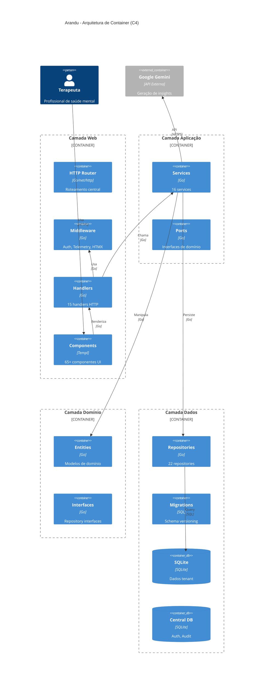
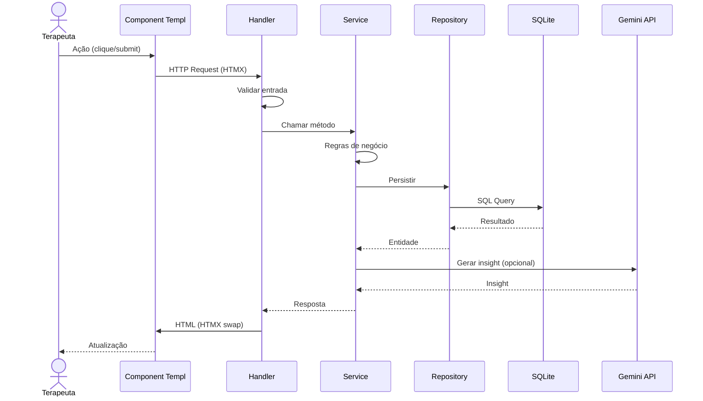
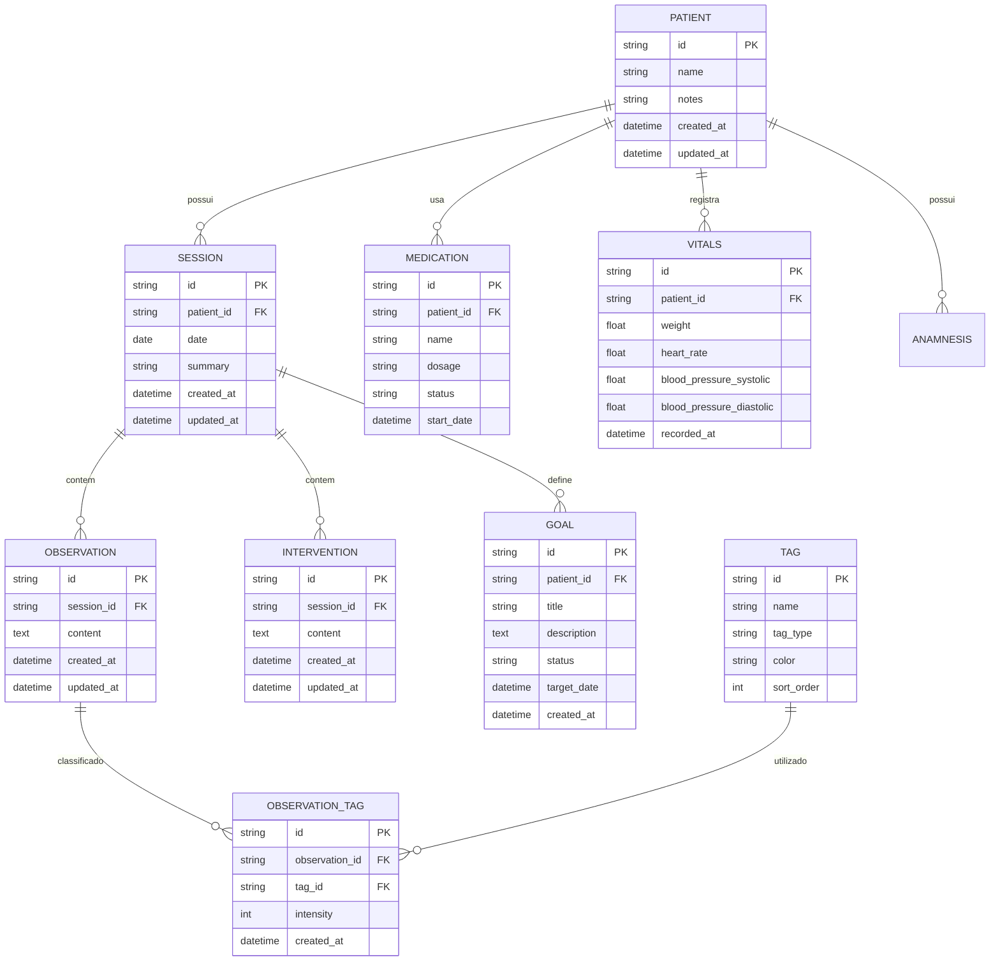
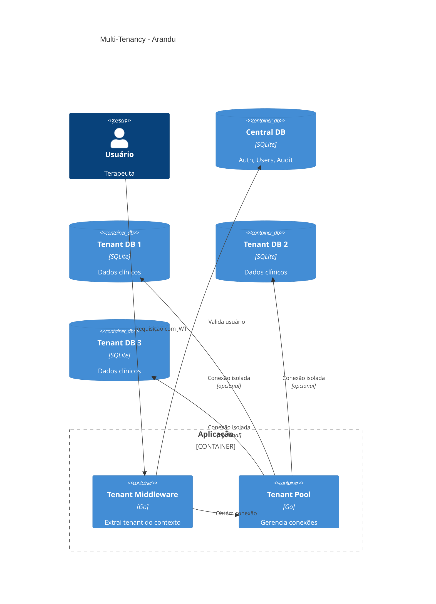
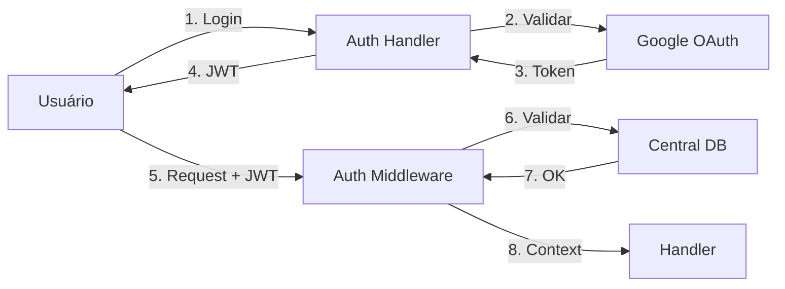

# Visão Geral da Arquitetura - Arandu

**Versão:** 1.0  
**Data:** 04/04/2026  
**Status:** Documentado

---

## 📐 Visão Arquitetural

O Arandu segue uma arquitetura em camadas inspirada em Clean Architecture e Domain-Driven Design, com ênfase em:

- **Separação de responsabilidades** entre camadas
- **Independência de frameworks** na camada de domínio
- **Testabilidade** através de interfaces e injeção de dependência
- **Multi-tenancy** para isolamento de dados

---

## 🏗️ Diagrama de Camadas



---

## 📋 Camadas Detalhadas

### 1. Camada Web (Presentation)

**Responsabilidade:** Receber requisições HTTP e renderizar respostas

```
internal/web/
├── handlers/           # 15 handlers
│   ├── patient_handler.go
│   ├── session_handler.go
│   ├── observation_handler.go
│   ├── intervention_handler.go
│   ├── classification_handler.go
│   ├── timeline_handler.go
│   ├── analysis_handler.go
│   ├── ai_handler.go
│   ├── auth_handler.go
│   ├── dashboard_handler.go
│   └── biopsychosocial_handler.go
```

**Componentes UI:**
```
web/components/
├── patient/           # 15 componentes
├── session/           # 10 componentes
├── classification/    # 6 componentes
├── timeline/          # 5 componentes
├── analysis/          # 5 componentes
├── layout/            # 4 componentes
├── dashboard/         # 3 componentes
├── ai/                # 2 componentes
└── auth/              # 2 componentes
```

**Tecnologias:**
- Go 1.21+
- Templ (templating)
- HTMX (interatividade)
- Tailwind CSS (estilos)

---

### 2. Camada Aplicação (Application)

**Responsabilidade:** Orquestrar casos de uso e regras de negócio

```
internal/application/services/
├── patient_service.go
├── session_service.go
├── observation_service.go
├── intervention_service.go
├── timeline_service.go
├── biopsychosocial_service.go
├── goal_service.go
├── insight_service.go
├── ai_service.go
├── audit_service.go
├── tenant_service.go
└── ...
```

**Padrão:** Cada service implementa uma interface (Port) definida no handler

```go
// Exemplo de interface (Port)
type PatientService interface {
    GetPatientByID(ctx context.Context, id string) (*patient.Patient, error)
    ListPatients(ctx context.Context) ([]*patient.Patient, error)
    CreatePatient(ctx context.Context, input CreatePatientInput) (*patient.Patient, error)
    // ...
}
```

---

### 3. Camada Domínio (Domain)

**Responsabilidade:** Modelar entidades e regras de domínio

```
internal/domain/
├── patient/
│   └── patient.go       # Entidade e regras
├── session/
│   └── session.go
├── observation/
│   ├── observation.go
│   └── tag.go
├── intervention/
│   └── intervention.go
├── timeline/
│   └── timeline.go
└── ...
```

**Princípio:** Camada independente de frameworks e infraestrutura

---

### 4. Camada Infraestrutura (Infrastructure)

**Responsabilidade:** Implementar detalhes técnicos (DB, APIs externas)

```
internal/infrastructure/
├── repository/
│   └── sqlite/
│       ├── patient_repository.go
│       ├── session_repository.go
│       ├── observation_repository.go
│       ├── intervention_repository.go
│       ├── timeline_repository.go
│       ├── goal_repository.go
│       ├── medication_repository.go
│       ├── vitals_repository.go
│       ├── tenant_pool.go
│       └── migrations/
├── ai/
│   └── gemini_client.go
└── auth/
    └── google_provider.go
```

---

## 🔄 Fluxo de Dados



---

## 🗄️ Modelo de Dados

### Entidades Principais



---

## 🏢 Multi-Tenancy

### Arquitetura



### Componentes

| Componente | Arquivo | Descrição |
|------------|---------|-----------|
| Tenant Pool | `internal/infrastructure/repository/sqlite/tenant_pool.go` | Pool de conexões |
| Context Wrapper | `internal/infrastructure/repository/sqlite/context_wrapper.go` | Extrai tenant do context |
| Central DB | `internal/infrastructure/repository/sqlite/central_db.go` | DB centralizado |

---

## 🔐 Segurança

### Autenticação



### Componentes
- `internal/web/handlers/auth_handler.go` - Login/logout
- `internal/platform/middleware/auth.go` - JWT validation

---

## 📡 APIs e Integrações

### APIs Internas

| Endpoint | Método | Descrição |
|----------|--------|-----------|
| `/patients` | GET/POST | CRUD pacientes |
| `/session/{id}` | GET/PUT | CRUD sessões |
| `/observations/{id}/classify` | POST | Classificar |
| `/tags` | GET | Listar tags |

### APIs Externas

| Serviço | Uso | Arquivo |
|---------|-----|---------|
| Google Gemini | Insights IA | `internal/infrastructure/ai/gemini_client.go` |
| Google OAuth | Autenticação | `internal/infrastructure/auth/google_provider.go` |

---

## 🧪 Testes

### Estrutura

```
tests/
├── e2e/                    # Testes end-to-end
│   ├── http_patient_flow_test.go
│   └── e2e_full_workflow_test.go
├── integration/              # Testes de integração
└── unit/                   # Testes unitários
```

### Cobertura

| Camada | Cobertura | Status |
|--------|-----------|--------|
| Handlers | - | 🟡 Aumentar |
| Services | - | 🟡 Aumentar |
| Repositories | - | 🟡 Aumentar |

---

## 🚀 Deployment

### Requisitos

- Go 1.21+
- SQLite 3
- Acesso à internet (Gemini API opcional)

### Estrutura de Diretórios

```
arandu/
├── cmd/arandu/            # Entry point
├── internal/              # Código privado
├── web/
│   ├── components/        # Templates Templ
│   └── static/           # Assets
├── storage/              # Dados SQLite
├── migrations/           # Migrações SQL
└── docs/                 # Documentação
```

---

## 📊 Tecnologias

| Camada | Tecnologia | Versão |
|--------|------------|--------|
| Linguagem | Go | 1.21+ |
| Template | Templ | 0.3.1001 |
| CSS | Tailwind | 3.x |
| HTMX | HTMX | 1.9.10 |
| Alpine.js | Alpine | 3.13.5 |
| DB | SQLite | 3.x |
| Auth | JWT / OAuth2 | - |
| AI | Google Gemini | API |

---

## 🎯 Princípios de Design

### 1. Clean Architecture

```
Domain (Independente)
    ↑
Application (Regras de uso)
    ↑
Infrastructure (Detalhes)
    ↑
Web (Framework)
```

### 2. Dependency Inversion

```go
// Handler depende de interface, não de implementação
type PatientService interface {
    GetPatientByID(ctx context.Context, id string) (*patient.Patient, error)
}

// Service implementa a interface
type PatientServiceImpl struct {
    repo PatientRepository
}
```

### 3. Multi-Tenancy

- Isolamento por database
- Context propagation
- Connection pooling

---

## 📈 Escalabilidade

### Horizontal
- Stateless handlers
- SQLite por tenant
- Pode migrar para PostgreSQL

### Vertical
- Go routines
- Connection pooling
- Caching (preparado)

---

## 🔗 Links Relacionados

- [Índice de Implementação](./IMPLEMENTATION_INDEX.md)
- [Roadmap](./ROADMAP.md)
- [Documentação de APIs](./architecture/ROUTE_CONVENTIONS.md)
- [Padrões de Layout](./architecture/standardized_layout_protocol.md)

---

## 📅 Histórico

| Data | Versão | Alterações |
|------|--------|------------|
| 04/04/2026 | 1.0 | Criação do documento |

---

**Arquitetura mantida por:** Arandu Team  
**Próxima revisão:** Mensal ou em mudanças significativas
