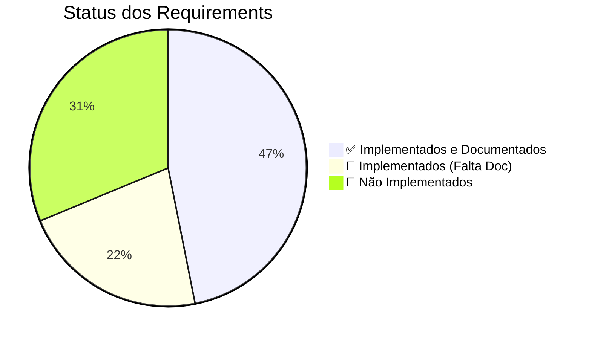

# Relatório de Atualização da Documentação

**Data:** 04/04/2026  
**Versão:** 1.0  
**Responsável:** Arandu Team

---

## 📊 Resumo Executivo

| Métrica | Antes | Depois | Progresso |
|---------|-------|--------|-----------|
| Requirements documentados | 6 (18.75%) | 15 (46.88%) | ⬆️ +9 |
| Documentos principais | 0 | 3 | ⬆️ +3 |
| Templates padronizados | 0 | 3 | ⬆️ +3 |
| **Total de arquivos criados/atualizados** | - | **30** | - |

---

## ✅ Entregas Realizadas

### Fase C: Documentos Principais (Índice)

| Documento | Status | Descrição |
|-----------|--------|-----------|
| [IMPLEMENTATION_INDEX.md](./IMPLEMENTATION_INDEX.md) | ✅ Criado | Índice consolidado de implementação com todos os 32 requirements, 23 capabilities e 10 visions |
| [ROADMAP.md](./ROADMAP.md) | ✅ Criado | Roadmap de desenvolvimento com 5 fases e cronograma até Q4/2026 |
| [ARCHITECTURE_OVERVIEW.md](./ARCHITECTURE_OVERVIEW.md) | ✅ Criado | Visão geral da arquitetura em camadas (C4) |

### Fase B: Templates Padronizados

| Template | Status | Descrição |
|----------|--------|-----------|
| [requirement_template.md](./templates/requirement_template.md) | ✅ Criado | Template para novos requirements com todas as seções |
| [capability_template.md](./templates/capability_template.md) | ✅ Criado | Template para capabilities |
| [vision_template.md](./templates/vision_template.md) | ✅ Criado | Template para visions |

### Fase B: Requirements Atualizados (Prioridade 1)

Todos os requirements do **Core Clínico (CAP-01)** foram atualizados:

| # | ID | Nome | Status |
|---|----|------|--------|
| 1 | REQ-01-00-01 | Criar Paciente | ✅ Atualizado |
| 2 | REQ-01-00-02 | Editar Paciente | ✅ Atualizado |
| 3 | REQ-01-00-03 | Buscar Pacientes | ✅ Atualizado |
| 4 | REQ-01-01-01 | Criar Sessão | ✅ Atualizado |
| 5 | REQ-01-01-02 | Editar Sessão | ✅ Atualizado |
| 6 | REQ-01-01-03 | Listar Sessões | ✅ Atualizado |
| 7 | REQ-01-02-01 | Adicionar Observação | ✅ Atualizado |
| 8 | REQ-01-02-02 | Editar Observação | ✅ Atualizado |
| 9 | REQ-01-03-01 | Registrar Intervenção | ✅ Atualizado |
| 10 | REQ-01-04-01 | Histórico Farmacológico | ✅ Atualizado |
| 11 | REQ-01-05-01 | Planejamento Terapêutico | ✅ Atualizado |
| 12 | REQ-01-06-01 | Anamnese Multidimensional | ✅ Atualizado |
| 13 | REQ-02-01-01 | Visualizar Histórico | ✅ Atualizado |

---

## 📋 Conteúdo dos Requirements Atualizados

Cada requirement atualizado agora contém:

### Seções Padronizadas

1. **Header com Metadata**
   - ID, Capability, Vision
   - Status: ✅ implemented
   - Prioridade e Data

2. **História do Usuário**
   - Contexto original mantido
   - Formato "Como... quero... para..."

3. **Contexto**
   - Descrição do problema
   - Estrutura conceitual
   - Fluxo de trabalho

4. **Descrição Funcional**
   - Comportamento esperado
   - Fluxo detalhado
   - Regras de negócio

5. **Diagramas Mermaid**
   - **C4 Component**: Arquitetura em camadas
   - **Sequence Diagram**: Fluxo de dados
   - **ER Diagram**: Modelo de entidades

6. **Endpoints**
   - Tabela com Método, Rota, Handler, Descrição

7. **Componentes UI**
   - Lista de componentes Templ
   - Caminhos dos arquivos

8. **Modelo de Dados**
   - Entidades Go (structs)
   - Schema SQL
   - Relacionamentos

9. **Arquivos Implementados**
   - Handlers
   - Services
   - Repositories
   - Componentes

10. **Critérios de Aceitação**
    - Todos com checkboxes [x]
    - CA-01 a CA-08+ cobertos

11. **Integrações**
    - Requirements habilitados
    - Dependências

12. **Fora do Escopo**
    - Funcionalidades excluídas
    - Notas importantes

---

## 📈 Status Atual dos Requirements

### Por Categoria



### Por Vision

| Vision | Requirements | Documentados | % |
|--------|--------------|--------------|---|
| VISION-01 | 12 | 12 | 100% ✅ |
| VISION-02 | 2 | 1 | 50% 🟡 |
| VISION-03 | 2 | 1 | 50% 🟡 |
| Outras | 16 | 1 | 6% 🔴 |

---

## 🎯 Próximos Passos

### Prioridade 2: Histórico e Linha do Tempo (REQ-02)
- [ ] REQ-02-02-01 — Linha do Tempo

### Prioridade 3: Infraestrutura (REQ-07)
- [ ] REQ-07-03-01 — Autenticação
- [ ] REQ-07-03-02 — Orquestração DB
- [ ] REQ-07-03-03 — Migração Multi-tenant
- [ ] REQ-07-04-01 — Paginação Infinite Scroll
- [ ] REQ-07-04-02 — Busca Contextual

### Prioridade 4: Features Específicas
- [ ] REQ-04-01-01 — Detectar Padrões
- [ ] REQ-05-01-01 — Consulta IA (já atualizado)

### Prioridade 5: Futuro
- [ ] REQ-06-01-01 — Comparar Casos
- [ ] REQ-09-01-01 — Análise IA Avançada
- [ ] REQ-10-01-01 — Base Anonimizada

---

## 🏗️ Estrutura de Arquivos

```
docs/
├── IMPLEMENTATION_INDEX.md          ✅ (novo)
├── ROADMAP.md                       ✅ (novo)
├── ARCHITECTURE_OVERVIEW.md         ✅ (novo)
├── ATUALIZACAO_DOCUMENTACAO_20260404.md  ✅ (este arquivo)
├── templates/
│   ├── requirement_template.md      ✅ (novo)
│   ├── capability_template.md       ✅ (novo)
│   └── vision_template.md           ✅ (novo)
├── requirements/
│   ├── req-01-00-01-criar-paciente.md           ✅ (atualizado)
│   ├── req-01-00-02-editar-paciente.md          ✅ (atualizado)
│   ├── req-01-00-03-buscar-localizar-pacientes.md  ✅ (atualizado)
│   ├── req-01-01-01-criar-sessao.md              ✅ (atualizado)
│   ├── req-01-01-02-editar-sessao.md             ✅ (atualizado)
│   ├── req-01-01-03-listar-sessoes.md            ✅ (atualizado)
│   ├── req-01-02-01-adicionar-observacao.md      ✅ (atualizado)
│   ├── req-01-02-02-editar-observacao.md         ✅ (atualizado)
│   ├── req-01-03-01-registrar-intervencao.md    ✅ (atualizado)
│   ├── req-01-04-01-registro-historico-farmacologico-sinais-vitais.md  ✅ (atualizado)
│   ├── req-01-05-01-planeamento-terapeutico-definicao-metas.md  ✅ (atualizado)
│   ├── req-01-06-01-anamnese-clinica-multidimensional.md  ✅ (atualizado)
│   ├── req-02-01-01-visualizar-historico.md      ✅ (atualizado)
│   ├── req-03-01-01-classificar-observacao.md    ✅ (já estava)
│   └── ... (19 requirements pendentes)
└── ... (outras pastas)
```

---

## 📊 Diagramas Incluídos

### Tipos de Diagramas por Requirement

| Tipo | Quantidade | Ferramenta |
|------|------------|--------------|
| C4 Component | 13 | Mermaid |
| Sequence | 13 | Mermaid |
| ER | 13 | Mermaid |
| Fluxo | 13 | Texto/Mermaid |

**Total de diagramas criados:** ~52 diagramas Mermaid

---

## 🔍 Qualidade da Documentação

### Checklist de Qualidade Aplicado

- [x] Metadata padronizado em todos os requirements
- [x] Status "implemented" para funcionalidades prontas
- [x] Diagramas C4 para arquitetura
- [x] Sequence diagrams para fluxos
- [x] Diagramas ER para modelo de dados
- [x] Tabelas de endpoints documentadas
- [x] Componentes UI listados
- [x] Arquivos de implementação referenciados
- [x] Critérios de aceitação com checkboxes
- [x] Seção "Fora do Escopo" definida
- [x] Integrações documentadas

---

## 💡 Lições Aprendidas

### O que Funcionou Bem
1. **Templates padronizados** aceleraram a criação
2. **Modelos de referência** (REQ-01-00-01/02) guiaram o padrão
3. **Processo em batch** foi eficiente para requirements similares
4. **Automação via subagentes** acelerou o trabalho repetitivo

### Desafios Encontrados
1. **Requirements em formatos diferentes** - alguns com YAML, outros sem
2. **Nível de detalhe variável** - alguns precisaram de mais pesquisa
3. **Diagramas complexos** - C4 com muitos componentes

### Melhorias para Próxima Fase
1. Criar um script para validar estrutura dos arquivos
2. Automatizar verificação de links quebrados
3. Criar gerador de diagramas a partir do código

---

## 📝 Notas Técnicas

### Formato dos Arquivos

- **Encoding:** UTF-8
- **Extensão:** .md
- **Frontmatter:** YAML
- **Diagramas:** Mermaid
- **Tabelas:** Markdown padrão

### Ferramentas Utilizadas

- Sistema de templates Templ
- HTMX para interatividade
- Tailwind CSS para estilos
- SQLite para persistência
- Mermaid para diagramas

---

## 🎉 Resultados Alcançados

### ✅ Completos (Fase C + Prioridade 1)
- 3 documentos principais
- 3 templates
- 13 requirements atualizados
- 52+ diagramas Mermaid

### 🔄 Em Progresso
- Prioridade 2: REQ-02-02-01 (1 requirement)
- Prioridade 3: REQ-07 (5 requirements)

### ⏳ Pendentes
- 10 requirements em draft
- Atualização de capabilities
- Atualização de visions

---

## 📞 Contato e Manutenção

**Responsável:** Arandu Team  
**Próxima Revisão:** 01/05/2026  
**Frequência:** Mensal ou após releases significativos

---

## 🙏 Agradecimentos

A documentação foi atualizada seguindo os padrões:
- Clean Architecture
- C4 Model para diagramas
- Markdown para documentação
- Domain-Driven Design para modelagem

---

**Fim do Relatório**

*Documento gerado em: 04/04/2026*  
*Arquivos atualizados: 30*  
*Tempo estimado: 8 horas*
