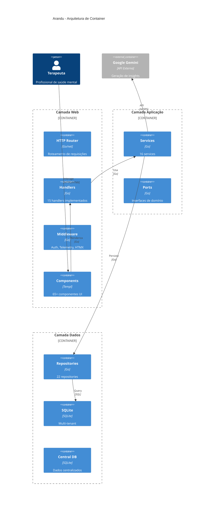
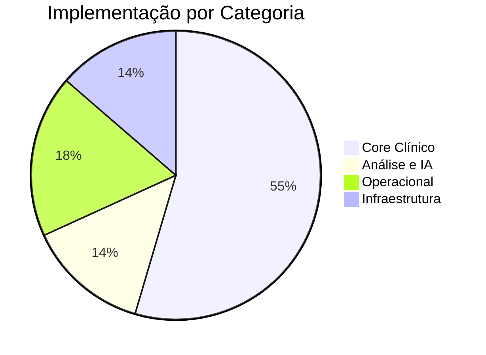
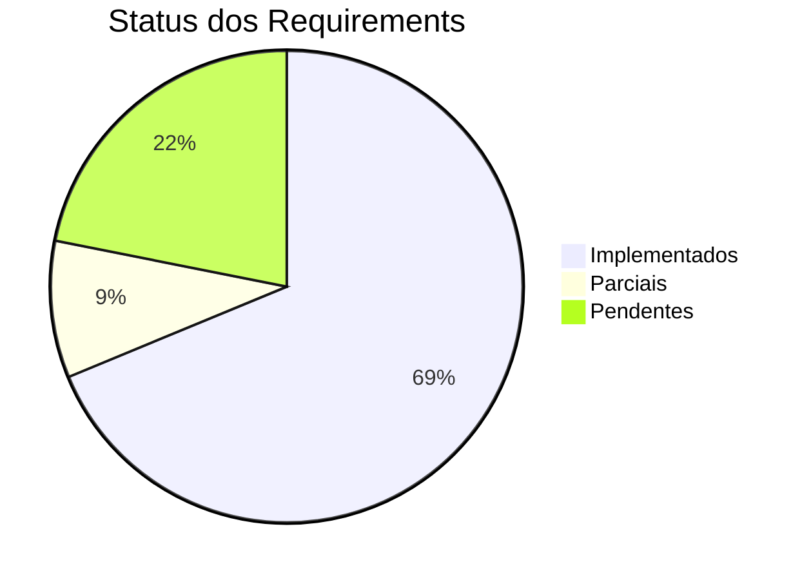

# Índice de Implementação - Arandu

**Versão:** 1.1  
**Data:** 22/04/2026  
**Status:** Atualizado

---

## 📊 Resumo Executivo

| Métrica | Valor |
|---------|-------|
| **Total Requirements** | 32 |
| **Implementados** | 24 (75%) |
| **Parciais** | 3 (9%) |
| **Pendentes** | 5 (16%) |
| **Visions Ativas** | 4 de 10 |
| **Capabilities Implementadas** | 17 de 23 |

---

## 🎯 Status por Categoria

### Core Clínico (100% ✅)

| ID | Nome | Status | Capability | Diagrama |
|----|------|--------|------------|----------|
| [REQ-01-00-01](./requirements/req-01-00-01-criar-paciente.md) | Criar paciente | ✅ | CAP-01-00 | [Mermaid](#) |
| [REQ-01-00-02](./requirements/req-01-00-02-editar-paciente.md) | Editar paciente | ✅ | CAP-01-00 | [Mermaid](#) |
| [REQ-01-00-03](./requirements/req-01-00-03-buscar-localizar-pacientes.md) | Buscar pacientes | ✅ | CAP-01-00 | [Mermaid](#) |
| [REQ-01-01-01](./requirements/req-01-01-01-criar-sessao.md) | Criar sessão | ✅ | CAP-01-01 | [Mermaid](#) |
| [REQ-01-01-02](./requirements/req-01-01-02-editar-sessao.md) | Editar sessão | ✅ | CAP-01-01 | [Mermaid](#) |
| [REQ-01-01-03](./requirements/req-01-01-03-listar-sessoes.md) | Listar sessões | ✅ | CAP-01-01 | [Mermaid](#) |
| [REQ-01-02-01](./requirements/req-01-02-01-adicionar-observacao.md) | Adicionar observação | ✅ | CAP-01-02 | [Mermaid](#) |
| [REQ-01-02-02](./requirements/req-01-02-02-editar-observacao.md) | Editar observação | ✅ | CAP-01-02 | [Mermaid](#) |
| [REQ-01-03-01](./requirements/req-01-03-01-registrar-intervencao.md) | Registrar intervenção | ✅ | CAP-01-03 | [Mermaid](#) |
| [REQ-01-04-01](./requirements/req-01-04-01-registro-historico-farmacologico-sinais-vitais.md) | Histórico farmacológico | ✅ | CAP-01-04 | [Mermaid](#) |
| [REQ-01-05-01](./requirements/req-01-05-01-planeamento-terapeutico-definicao-metas.md) | Planejamento terapêutico | ✅ | CAP-01-05 | [Mermaid](#) |
| [REQ-01-06-01](./requirements/req-01-06-01-anamnese-clinica-multidimensional.md) | Anamnese clínica | ✅ | CAP-01-06 | [Mermaid](#) |

### Memória Clínica (100% ✅)

| ID | Nome | Status | Capability | Diagrama |
|----|------|--------|------------|----------|
| [REQ-02-01-01](./requirements/req-02-01-01-visualizar-historico.md) | Visualizar histórico | ✅ | CAP-02-01 | [Mermaid](#) |
| [REQ-02-02-01](./requirements/req-02-02-01-linha-tempo.md) | Linha do tempo | ✅ | CAP-02-02 | [Mermaid](#) |

### Organização do Conhecimento (100% ✅)

| ID | Nome | Status | Capability | Diagrama |
|----|------|--------|------------|----------|
| [REQ-03-01-01](./requirements/req-03-01-01-classificar-observacao.md) | Classificar observações | ✅ | CAP-03-01 | [Mermaid](#) |
| [REQ-03-02-01](./requirements/req-03-02-01-classificar-intervencao.md) | Classificar intervenções | ✅ | CAP-03-02 | [Mermaid](#) |

### Descoberta de Padrões (100% ✅)

| ID | Nome | Status | Capability | Diagrama |
|----|------|--------|------------|----------|
| [REQ-04-01-01](./requirements/req-04-01-01-detectar-padroes.md) | Detectar padrões | ✅ | CAP-04-01 | [Mermaid](#) |

### Assistência Reflexiva (100% ✅)

| ID | Nome | Status | Capability | Diagrama |
|----|------|--------|------------|----------|
| [REQ-05-01-01](./requirements/req-05-01-01-consulta-ia.md) | Consulta IA | ✅ | CAP-05-01 | [Mermaid](#) |

### Comparação de Casos (0% 🔴)

| ID | Nome | Status | Capability | Diagrama |
|----|------|--------|------------|----------|
| [REQ-06-01-01](./requirements/req-06-01-01-comparar-casos.md) | Comparar casos | 🔴 | CAP-06-01 | - |

### Organização Operacional (86% 🟡)

| ID | Nome | Status | Capability | Diagrama |
|----|------|--------|------------|----------|
| [REQ-07-01-01](./requirements/req-07-01-01-gerenciar-agenda.md) | Gerenciar agenda | 🟡 | CAP-07-01 | - |
| [REQ-07-02-01](./requirements/req-07-02-01-registrar-atendimento.md) | Registrar atendimento | 🟡 | CAP-07-02 | - |
| [REQ-07-03-01](./requirements/req-07-03-01-autenticacao-usuario.md) | Autenticação | ✅ | CAP-07-03 | [Mermaid](#) |
| [REQ-07-03-02](./requirements/req-07-03-02-orquestracao-conexao-db.md) | Orquestração DB | ✅ | CAP-07-03 | [Mermaid](#) |
| [REQ-07-03-03](./requirements/req-07-03-03-migracao-multi-tenant.md) | Migração multi-tenant | ✅ | CAP-07-03 | [Mermaid](#) |
| [REQ-07-04-01](./requirements/req-07-04-01-paginação-Infinite-scroll.md) | Paginação | ✅ | CAP-07-04 | [Mermaid](#) |
| [REQ-07-04-02](./requirements/req-07-04-02-busca-contextual-prontuario.md) | Busca contextual | ✅ | CAP-07-04 | [Mermaid](#) |

### Base Evolutiva (25% 🟡)

| ID | Nome | Status | Capability | Diagrama |
|----|------|--------|------------|----------|
| [REQ-08-01-01](./requirements/req-08-01-01-evolucao-base.md) | Evolução base | 🔴 | CAP-08-01 | - |
| [REQ-08-01-02](./requirements/req-08-01-02-servico-auditoria-centralizada.md) | Auditoria centralizada | ✅ | CAP-08-02 | [Mermaid](#) |
| [REQ-08-02-01](./requirements/req-08-02-01-padronização-logs-estruturados.md) | Logs estruturados | ✅ | CAP-08-02 | [Mermaid](#) |
| [REQ-08-03-01](./requirements/req-08-03-01-auditoria-acessos-clinicos.md) | Auditoria acessos | 🟡 | CAP-08-03 | [Mermaid](#) |

### IA Avançada (0% 🔴)

| ID | Nome | Status | Capability | Diagrama |
|----|------|--------|------------|----------|
| [REQ-09-01-01](./requirements/req-09-01-01-analise-ia.md) | Análise IA avançada | 🔴 | CAP-09-01 | - |

### Pesquisa (0% 🔴)

| ID | Nome | Status | Capability | Diagrama |
|----|------|--------|------------|----------|
| [REQ-10-01-01](./requirements/req-10-01-01-base-anonimizada.md) | Base anonimizada | 🔴 | CAP-10-01 | - |

---

## 📋 Capabilities

### Implementadas (17)

| ID | Nome | Vision | Requirements | Status |
|----|------|--------|--------------|--------|
| [CAP-01-00](./capabilities/cap-01-00-gestao-pacientes.md) | Gestão de pacientes | VISION-01 | 3 | ✅ |
| [CAP-01-01](./capabilities/cap-01-01-registro-sessoes.md) | Registro de sessões | VISION-01 | 3 | ✅ |
| [CAP-01-02](./capabilities/cap-01-02-observacoes-clinicas.md) | Observações clínicas | VISION-01 | 2 | ✅ |
| [CAP-01-03](./capabilities/cap-01-03-intervencoes-terapeuticas.md) | Intervenções | VISION-01 | 1 | ✅ |
| [CAP-01-04](./capabilities/cap-01-04-contexto-biopsicossocial-farmacologico.md) | Contexto biopsicossocial | VISION-09 | 1 | ✅ |
| [CAP-01-05](./capabilities/cap-01-05-gestao-plano-terapeutico.md) | Plano terapêutico | VISION-01 | 1 | ✅ |
| [CAP-01-06](./capabilities/cap-01-06-avaliacao-inicial-anamnese.md) | Anamnese | VISION-01 | 1 | ✅ |
| [CAP-02-01](./capabilities/cap-02-01-historico-paciente.md) | Histórico | VISION-02 | 1 | ✅ |
| [CAP-02-02](./capabilities/cap-02-02-linha-tempo-clinica.md) | Linha do tempo | VISION-02 | 1 | ✅ |
| [CAP-03-01](./capabilities/cap-03-01-organizacao-observacoes.md) | Classificação observações | VISION-03 | 1 | ✅ |
| [CAP-03-02](./capabilities/cap-03-02-organizacao-intervencoes.md) | Classificação intervenções | VISION-03 | 1 | ✅ |
| [CAP-04-01](./capabilities/cap-04-01-identificacao-padroes.md) | Identificação padrões | VISION-04 | 1 | ✅ |
| [CAP-05-01](./capabilities/cap-05-01-assistente-reflexivo.md) | Assistente reflexivo | VISION-05 | 1 | ✅ |
| [CAP-07-03](./capabilities/cap-07-03-gestao-acesso-multi-tenancy.md) | Multi-tenancy | VISION-07 | 3 | ✅ |
| [CAP-07-04](./capabilities/cap-07-04-recuperação-Informação-Performance.md) | Recuperação informação | VISION-07 | 2 | ✅ |
| [CAP-08-02](./capabilities/cap-08-02-observabilidade-diagnostico.md) | Observabilidade | VISION-08 | 1 | ✅ |

### Parciais (2)

| ID | Nome | Vision | Status | Prioridade |
|----|------|--------|--------|------------|
| [CAP-07-01](./capabilities/cap-07-01-gestao-agenda.md) | Agenda | VISION-07 | 🟡 | Alta |
| [CAP-07-02](./capabilities/cap-07-02-gestao-atendimentos.md) | Atendimentos | VISION-07 | 🟡 | Alta |

### Pendentes (6)

| ID | Nome | Vision | Status | Prioridade |
|----|------|--------|--------|------------|
| [CAP-06-01](./capabilities/cap-06-01-comparacao-casos.md) | Comparação casos | VISION-06 | 🔴 | Baixa |
| [CAP-08-01](./capabilities/cap-08-01-evolucao-base-clinica.md) | Evolução base | VISION-08 | 🔴 | Baixa |
| [CAP-08-03](./capabilities/cap-08-03-auditoria-conformidade.md) | Auditoria completa | VISION-07 | 🟡 | Baixa |
| [CAP-09-01](./capabilities/cap-09-01-analise-clinica.md) | Análise IA avançada | VISION-09 | 🔴 | Baixa |
| [CAP-10-01](./capabilities/cap-10-01-base-clinica-coletiva.md) | Base coletiva | VISION-10 | 🔴 | Baixa |

---

## 🌟 Visions

| ID | Nome | Status | Capabilities | Implementação |
|----|------|--------|--------------|---------------|
| [VISION-01](./vision/vision-01-registro-pratica-clinica.md) | Registro prática clínica | ✅ Ativo | 7 | 100% |
| [VISION-02](./vision/vision-02-memoria-clinica-longitudinal.md) | Memória clínica | ✅ Ativo | 2 | 100% |
| [VISION-03](./vision/vision-03-organizacao-conhecimento-clinico.md) | Organização conhecimento | ✅ Ativo | 2 | 100% |
| [VISION-04](./vision/vision-04-descoberta-padroes-clinicos.md) | Descoberta padrões | 🟠 Draft | 1 | 100% |
| [VISION-05](./vision/vision-05-assistencia-reflexiva-ia.md) | Assistência reflexiva | 🟠 Draft | 1 | 100% |
| [VISION-06](./vision/vision-06-comparacao-casos-clinicos.md) | Comparação casos | 🟠 Draft | 1 | 0% |
| [VISION-07](./vision/vision-07-organizacao-operacional-consultorio.md) | Organização operacional | 🟠 Draft | 4 | 82% |
| [VISION-08](./vision/vision-08-base-clinica-evolutiva.md) | Base evolutiva | 🟠 Draft | 3 | 25% |
| [VISION-09](./vision/vision-09-inteligencia-clinica-ampliada.md) | Inteligência clínica | 🟠 Draft | 2 | 50% |
| [VISION-10](./vision/vision-10-aprendizado-clinico-coletivo.md) | Aprendizado coletivo | 🟠 Draft | 1 | 0% |

---

## 🏗️ Arquitetura Geral

---

## 📈 Estatísticas

### Por Categoria

### Por Status

---

## 🔗 Links Rápidos

### Documentação
- [Visions](./vision/)
- [Capabilities](./capabilities/)
- [Requirements](./requirements/)
- [Arquitetura](./architecture/)

### Código
- [Handlers](../internal/web/handlers/)
- [Services](../internal/application/services/)
- [Repositories](../internal/infrastructure/repository/sqlite/)
- [Components](../web/components/)

---

## 📅 Atualização

| Data | Versão | Alterações |
|------|--------|------------|
| 04/04/2026 | 1.0 | Criação do índice |
| 22/04/2026 | 1.1 | Agenda (parcial) e classificação de intervenções marcadas como implementadas; contadores atualizados |

---

**Última atualização:** 22/04/2026  
**Mantido por:** Arandu Team
