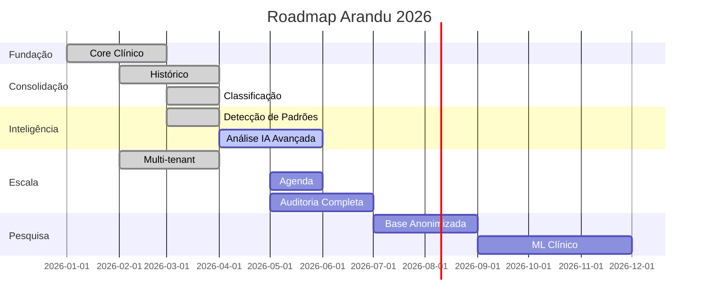
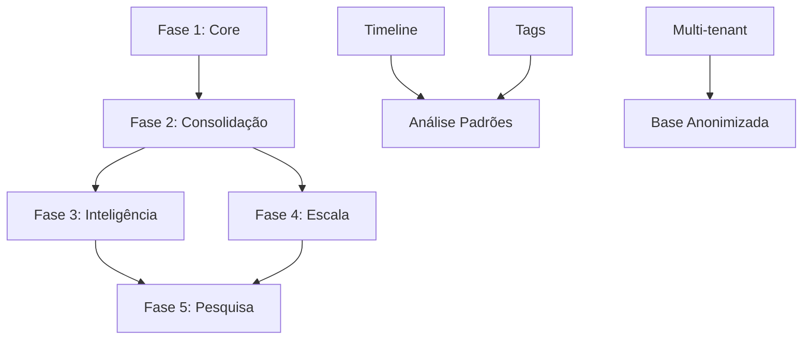

# Roadmap de Desenvolvimento - Arandu

**Versão:** 1.0  
**Data:** 04/04/2026  
**Horizonte:** 12 meses

---

## 🎯 Visão Geral

O Arandu está atualmente em **Fase 2** de desenvolvimento, com 69% dos requirements core implementados. Este roadmap define o caminho para completar as funcionalidades essenciais e expandir para capacidades avançadas de análise clínica.

---

## 📊 Status Atual

| Fase | Descrição | Progresso | Status |
|------|-----------|-----------|--------|
| **Fase 1: Fundação** | Core clínico básico | 100% | ✅ Completa |
| **Fase 2: Consolidação** | Histórico e organização | 100% | ✅ Completa |
| **Fase 3: Inteligência** | Análise e padrões | 50% | 🟠 Em execução |
| **Fase 4: Escala** | Multi-tenant e operacional | 75% | 🟠 Em execução |
| **Fase 5: Pesquisa** | Base coletiva | 0% | 🔴 Futura |

---

## 🗓️ Linha do Tempo

---

## 🎯 Fases Detalhadas

### ✅ Fase 1: Fundação (Concluída)
**Período:** Jan-Mar/2026  
**Objetivo:** Estabelecer o core clínico funcional

#### Entregues
- [x] Gestão de pacientes (CRUD completo)
- [x] Registro de sessões
- [x] Observações clínicas
- [x] Intervenções terapêuticas
- [x] Anamnese multidimensional
- [x] Contexto biopsicossocial (medicação, sinais vitais)
- [x] Plano terapêutico com metas

**Requirements:** 12 de 12 ✅

---

### ✅ Fase 2: Consolidação (Concluída)
**Período:** Fev-Abr/2026  
**Objetivo:** Construir memória clínica e organização do conhecimento

#### Entregues
- [x] Visualização de histórico (prontuário)
- [x] Linha do tempo clínica
- [x] Classificação de observações (tags)
- [x] Classificação de intervenções

#### Funcionalidades
| Feature | Status | Estimativa |
|---------|--------|------------|
| Timeline interativa | ✅ | Concluído |
| Filtros por tipo | ✅ | Concluído |
| Tags para observações | ✅ | Concluído |
| Tags para intervenções | ✅ | Concluído |

**Requirements:** 4 de 4 (100%) ✅

---

### 🔵 Fase 3: Inteligência (Planejada)
**Período:** Abr-Jun/2026  
**Objetivo:** Adicionar capacidades de análise e insights

#### Planejado
- [x] Detecção de padrões e temas ✅
- [ ] Análise clínica assistida por IA ⏳
- [ ] Insights automáticos ⏳
- [ ] Sugestões terapêuticas ⏳

#### Funcionalidades
| Feature | Status | Estimativa |
|---------|--------|------------|
| Nuvem de temas | ✅ | Concluído |
| Síntese IA | ✅ | Concluído |
| Análise avançada | 🔵 | Maio/2026 |
| Recomendações | 🔵 | Junho/2026 |

**Requirements:** 2 de 4 (50%) 🔵

---

### 🟠 Fase 4: Escala (Parcial)
**Período:** Mai-Set/2026  
**Objetivo:** Tornar o sistema operacionalmente robusto

#### Parcialmente Implementado
- [x] Multi-tenancy completo
- [x] Migrações automáticas
- [x] Paginação e busca
- [x] Logs estruturados
- [x] Serviço de auditoria (parcial)

#### Implementado
- [x] Multi-tenancy completo
- [x] Migrações automáticas
- [x] Paginação e busca
- [x] Logs estruturados
- [x] Serviço de auditoria (parcial)
- [x] Agenda clínica (backend + UI parcial) ✅
- [x] Registro de atendimentos (via agenda) 🟡

#### A Implementar
- [ ] UI completa da agenda (views diária/semanal/mensal)
- [ ] Auditoria completa de acessos ⏳
- [ ] Evolução da base clínica ⏳

#### Funcionalidades
| Feature | Status | Estimativa |
|---------|--------|------------|
| Auth multi-tenant | ✅ | Concluído |
| Tenant pool | ✅ | Concluído |
| Logs estruturados | ✅ | Concluído |
| Auditoria básica | ✅ | Concluído |
| Agenda (backend) | ✅ | Concluído |
| Agenda (UI completa) | 🟡 | Q2/2026 |
| Atendimentos (backend) | 🟡 | Concluído parcial |
| Auditoria completa | 🔵 | Q3/2026 |

**Requirements:** 8 de 10 (80%) 🟠

---

### 🔴 Fase 5: Pesquisa (Futura)
**Período:** Ago-Dez/2026  
**Objetivo:** Habilitar pesquisa clínica e aprendizado coletivo

#### Futuro
- [ ] Base clínica anonimizada ⏳
- [ ] Exportação para pesquisa ⏳
- [ ] Análises populacionais ⏳
- [ ] ML para padrões clínicos ⏳

#### Funcionalidades
| Feature | Status | Estimativa |
|---------|--------|------------|
| Anonimização | 🔴 | Setembro/2026 |
| Exportação | 🔴 | Outubro/2026 |
| Análise populacional | 🔴 | Novembro/2026 |
| ML clínico | 🔴 | Dezembro/2026 |

**Requirements:** 0 de 4 (0%) 🔴

---

## 🎯 Objetivos por Trimestre

### Q2/2026 (Abr-Jun)
**Foco:** Completar agenda, Sábio design system e iniciar IA avançada

#### Metas
- [x] ~~Completar Fase 2~~ — Concluída (classificação de intervenções ✅)
- [x] ~~Agenda clínica básica~~ — Backend implementado ✅
- [ ] UI completa da agenda (views diária/semanal/mensal)
- [ ] Análise IA avançada
- [ ] Insights automáticos

**Milestone:** Agenda operacional + design system Sábio unificado

---

### Q3/2026 (Jul-Set)
**Foco:** Operacionalização e robustez

#### Metas
- [ ] Completar Fase 4 (Escala)
  - [ ] Agenda completa
  - [ ] Registro de atendimentos
  - [ ] Auditoria completa
  - [ ] Evolução da base
- [ ] Preparar Fase 5 (Pesquisa)
  - [ ] Anonimização
  - [ ] Exportação

**Milestone:** Sistema pronto para produção multi-tenant

---

### Q4/2026 (Out-Dez)
**Foco:** Pesquisa e aprendizado coletivo

#### Metas
- [ ] Completar Fase 5 (Pesquisa)
  - [ ] Base anonimizada
  - [ ] Análises populacionais
  - [ ] ML para padrões clínicos
- [ ] Otimizações
  - [ ] Performance
  - [ ] Escalabilidade

**Milestone:** Sistema com capacidade de pesquisa clínica

---

## 📋 Backlog Priorizado

### Prioridade 1: Core (Concluído)
- [x] Pacientes, sessões, observações
- [x] Timeline, histórico
- [x] Tags para observações

### Prioridade 2: Essencial (Atual)
- [x] ~~Tags para intervenções~~ ✅
- [x] ~~Agenda clínica (backend)~~ ✅
- [ ] UI completa da agenda
- [ ] Auditoria completa

### Prioridade 3: Valor (Próximo)
- [ ] Análise IA avançada
- [ ] Sugestões terapêuticas
- [ ] Comparação de casos

### Prioridade 4: Expansão (Futuro)
- [ ] Base anonimizada
- [ ] Pesquisa clínica
- [ ] ML avançado

---

## 🏗️ Dependências

---

## 📊 Métricas de Sucesso

### Técnicas
| Métrica | Atual | Q2 | Q3 | Q4 |
|---------|-------|----|----|----|
| Cobertura de reqs | 69% | 80% | 90% | 100% |
| Testes unitários | - | 60% | 75% | 85% |
| Tempo de resposta | - | <500ms | <300ms | <200ms |

### Funcionais
| Métrica | Atual | Q2 | Q3 | Q4 |
|---------|-------|----|----|----|
| Features core | 100% | 100% | 100% | 100% |
| Features análise | 50% | 80% | 100% | 100% |
| Features avançadas | 0% | 20% | 50% | 100% |

---

## 🎯 Versionamento

### v1.0 (Lançamento) - Q3/2026
- Core clínico completo
- Análise de padrões
- Multi-tenant
- Agenda
- Auditoria

### v1.5 (Expansão) - Q4/2026
- IA avançada
- Pesquisa clínica
- ML

### v2.0 (Escala) - 2027
- Múltiplos profissionais
- Integrações
- Mobile app

---

## 🔗 Links Relacionados

- [Índice de Implementação](./IMPLEMENTATION_INDEX.md)
- [Arquitetura](./ARCHITECTURE_OVERVIEW.md)
- [Visions](./vision/)
- [Backlog](./BACKLOG.md) *(a criar)*

---

## 📅 Atualizações

| Data | Versão | Alterações |
|------|--------|------------|
| 04/04/2026 | 1.0 | Criação do roadmap |

---

**Última atualização:** 04/04/2026  
**Responsável:** Arandu Team  
**Próxima revisão:** 01/05/2026
