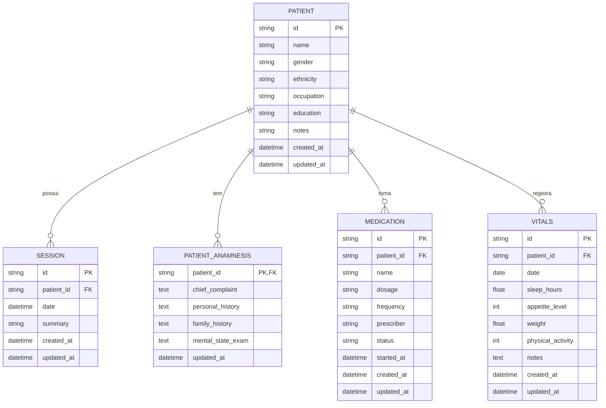

# REQ-01-00-01 — Criar Paciente

## Identificação

| Campo | Valor |
|-------|-------|
| **ID** | REQ-01-00-01 |
| **Capability** | CAP-01-00 Gestão de Pacientes |
| **Vision** | VISION-01 Registro da Prática Clínica |
| **Status** | ✅ implemented |
| **Prioridade** | Alta |
| **Data de Implementação** | 2024-01 |

---

## História do Usuário

Como **psicólogo clínico**,  
quero **registrar um novo paciente no sistema**,  
para **organizar meu acompanhamento terapêutico e registrar sessões associadas a esse paciente**.

---

## Contexto

Paciente é a **entidade raiz do domínio clínico do Arandu**.

Todos os registros clínicos dependem da existência de um paciente.

Estrutura conceitual:

```text
Paciente
└── Sessões
│   ├── Observações
│   └── Intervenções
├── Anamnese
├── Medicamentos
├── Sinais Vitais
└── Timeline de Eventos
```

Sem paciente não é possível:

- Registrar sessões
- Construir histórico clínico
- Analisar evolução terapêutica

Portanto, a criação de paciente é o **primeiro requisito funcional do sistema**.

---

## Descrição Funcional

O sistema permite que o profissional registre um novo paciente contendo **as informações mínimas necessárias para iniciar acompanhamento clínico**.

Após a criação:

- O paciente é persistido no banco SQLite
- O paciente aparece na lista de pacientes
- O paciente permite criação de sessões futuras
- O paciente possui anamnese associada
- O usuário é redirecionado para a página de detalhes do paciente

### Fluxo de Criação

```text
Usuário abre lista de pacientes
↓
Clica "Novo Paciente"
↓
Preenche formulário (nome obrigatório)
↓
Clica "Cadastrar Paciente"
↓
Sistema valida dados
↓
Sistema cria entidade de domínio (UUID + timestamps)
↓
Sistema persiste no banco
↓
Redireciona para /patients/{id}
```

---

## Campos do Formulário

### Campos Obrigatórios

| Campo | Tipo | Validação |
|-------|------|-----------|
| **Nome Completo** | Text | Máximo 255 caracteres, não vazio, caracteres válidos |

### Campos Opcionais

| Campo | Tipo | Validação |
|-------|------|-----------|
| Identidade de Gênero | Text | Máximo 100 caracteres |
| Etnia/Raça | Text | Máximo 100 caracteres |
| Ocupação | Text | Máximo 100 caracteres |
| Escolaridade | Text | Máximo 100 caracteres |
| Observações Iniciais | Textarea | Máximo 5000 caracteres |

### Campos Gerados Automaticamente

| Campo | Descrição |
|-------|-----------|
| `ID` | UUID v4 gerado pelo domínio |
| `CreatedAt` | Timestamp da criação |
| `UpdatedAt` | Timestamp da última atualização |

---

## Interface de Usuário

### Formulário de Cadastro

Localização: `/patients/new`

Componente: `web/components/patient/new_form.templ`

```
┌─────────────────────────────────────────────────┐
│ ←  Novo Paciente                                 │
│    Cadastre um novo paciente para iniciar...    │
├─────────────────────────────────────────────────┤
│                                                 │
│  Nome Completo *                                │
│  ┌─────────────────────────────────────────┐   │
│  │ Ex: Maria da Silva                      │   │
│  └─────────────────────────────────────────┘   │
│  Use o nome pelo qual o paciente deve ser...    │
│                                                 │
│  Identidade de Gênero       Etnia/Raça          │
│  ┌───────────────────┐     ┌──────────────────┐ │
│  │ Ex: Feminino      │     │ Ex: Branca       │ │
│  └───────────────────┘     └──────────────────┘ │
│                                                 │
│  Ocupação                   Escolaridade        │
│  ┌───────────────────┐     ┌──────────────────┐ │
│  │ Ex: Estudante     │     │ Ex: Superior     │ │
│  └───────────────────┘     └──────────────────┘ │
│                                                 │
│  Observações Iniciais                           │
│  ┌─────────────────────────────────────────┐   │
│  │                                         │   │
│  │                                         │   │
│  └─────────────────────────────────────────┘   │
│  Essas notas ficarão visíveis no perfil...      │
│                                                 │
│  [Cancelar]              [Cadastrar Paciente]   │
│                                                 │
└─────────────────────────────────────────────────┘
```

---

## Diagrama de Arquitetura C4 (Nível Componentes)

```mermaid
C4Component
    title Arquitetura de Criação de Paciente - Nível Componentes

    Container_Boundary(web, "Web Layer") {
        Component(patientHandler, "PatientHandler", "Go Handler", "Processa requisições HTTP")
        Component(newPatient, "NewPatient", "Method", "GET /patients/new")
        Component(createPatient, "CreatePatient", "Method", "POST /patients/create")
    }

    Container_Boundary(components, "UI Components") {
        Component(newForm, "NewPatientForm", "Templ Component", "Formulário de criação")
        Component(patientProfile, "PatientProfile", "Templ Component", "Perfil do paciente")
    }

    Container_Boundary(application, "Application Layer") {
        Component(patientService, "PatientService", "Service", "Lógica de negócio")
        Component(createInput, "CreatePatientInput", "DTO", "Dados validados")
    }

    Container_Boundary(domain, "Domain Layer") {
        Component(patientEntity, "Patient", "Entity", "Entidade de domínio")
        Component(uuidGen, "UUID Gen", "Util", "Gera identificador único")
    }

    Container_Boundary(infrastructure, "Infrastructure Layer") {
        Component(patientRepo, "PatientRepository", "Repository", "Persistência SQLite")
        Component(db, "SQLite DB", "Database", "Banco de dados")
    }

    Rel(web, patientHandler, "Usa")
    Rel(patientHandler, newPatient, "Chama para GET /patients/new")
    Rel(patientHandler, createPatient, "Chama para POST /patients/create")
    Rel(newPatient, newForm, "Renderiza")
    Rel(createPatient, patientService, "Chama")
    Rel(patientService, createInput, "Valida e sanitiza")
    Rel(patientService, patientEntity, "Cria")
    Rel(patientEntity, uuidGen, "Gera ID")
    Rel(patientService, patientRepo, "Persiste via")
    Rel(patientRepo, db, "Executa SQL")
    Rel(createPatient, patientProfile, "Redireciona para")

    UpdateLayoutConfig($c4ShapeInRow="3", $c4BoundaryInRow="1")
```

---

## Fluxo de Dados (Sequence Diagram)

```mermaid
sequenceDiagram
    actor Usuário
    participant Browser
    participant PatientHandler as PatientHandler\n(web/handlers)
    participant NewForm as NewPatientForm\n(components/patient)
    participant PatientService as PatientService\n(application/services)
    component CreateInput as CreatePatientInput\n(application/services)
    participant Patient as Patient\n(domain/patient)
    participant PatientRepo as PatientRepository\n(infrastructure/sqlite)
    participant SQLite as SQLite DB

    %% Fluxo GET /patients/new
    Usuário->>Browser: Clica "Novo Paciente"
    Browser->>PatientHandler: GET /patients/new
    PatientHandler->>NewForm: Render(NewPatientFormData)
    NewForm-->>Browser: HTML com formulário
    Browser-->>Usuário: Exibe formulário

    %% Fluxo POST /patients/create
    Usuário->>Browser: Preenche e submete formulário
    Browser->>PatientHandler: POST /patients/create (form data)
    PatientHandler->>PatientHandler: ParseForm()
    PatientHandler->>PatientService: CreatePatient(ctx, input)
    PatientService->>CreateInput: Sanitize()
    PatientService->>CreateInput: Validate()
    CreateInput-->>PatientService: ✓ Dados válidos
    PatientService->>Patient: NewPatient(name, gender, ...)
    Patient->>Patient: uuid.New()
    Patient->>Patient: time.Now() (CreatedAt/UpdatedAt)
    Patient-->>PatientService: *Patient
    PatientService->>PatientRepo: Save(ctx, patient)
    PatientRepo->>PatientRepo: validatePatientForSave()
    PatientRepo->>SQLite: INSERT INTO patients (...)
    SQLite-->>PatientRepo: ✓ Sucesso
    PatientRepo-->>PatientService: nil
    PatientService-->>PatientHandler: *Patient, nil
    PatientHandler->>Browser: HTTP 302 Redirect /patients/{id}
    Browser->>PatientHandler: GET /patients/{id}
    PatientHandler-->>Browser: Perfil do paciente
    Browser-->>Usuário: Exibe página do paciente criado
```

---

## Endpoints

| Método | Rota | Handler | Descrição |
|--------|------|---------|-----------|
| `GET` | `/patients` | `ListPatients` | Lista paginada de pacientes |
| `GET` | `/patients/new` | `NewPatient` | Formulário de criação |
| `POST` | `/patients/create` | `CreatePatient` | Cria novo paciente |
| `GET` | `/patients/{id}` | `Show` | Perfil do paciente |
| `GET` | `/patients/search` | `Search` | Busca de pacientes |

---

## Componentes UI

| Componente | Arquivo | Descrição |
|------------|---------|-----------|
| `NewPatientForm` | `web/components/patient/new_form.templ` | Formulário de criação de paciente |
| `PatientList` | `web/components/patient/list.templ` | Lista de pacientes |
| `PatientProfileView` | `web/components/patient/profile.templ` | Perfil do paciente |
| `Shell` | `web/components/layout/shell_layout.templ` | Layout principal |

---

## Modelo de Dados

### Entidade de Domínio (internal/domain/patient/patient.go)

```go
type Patient struct {
    ID          string    `json:"id"`
    Name        string    `json:"name"`
    Gender      string    `json:"gender"`
    Ethnicity   string    `json:"ethnicity"`
    Occupation  string    `json:"occupation"`
    Education   string    `json:"education"`
    Notes       string    `json:"notes"`
    CreatedAt   time.Time `json:"created_at"`
    UpdatedAt   time.Time `json:"updated_at"`
}
```

### SQL Schema (SQLite)

```sql
CREATE TABLE patients (
    id          TEXT PRIMARY KEY,
    name        TEXT NOT NULL,
    gender      TEXT,
    ethnicity   TEXT,
    occupation  TEXT,
    education   TEXT,
    notes       TEXT,
    created_at  DATETIME DEFAULT CURRENT_TIMESTAMP,
    updated_at  DATETIME DEFAULT CURRENT_TIMESTAMP
);

-- Índices
CREATE INDEX idx_patients_name ON patients(name);
CREATE INDEX idx_patients_created_at ON patients(created_at DESC);
```

---

## Diagrama ER



---

## Arquivos Implementados

| Caminho | Descrição |
|---------|-----------|
| `internal/web/handlers/patient_handler.go` | Handler HTTP com métodos NewPatient e CreatePatient |
| `internal/application/services/patient_service.go` | Serviço de aplicação com CreatePatient e validações |
| `internal/infrastructure/repository/sqlite/patient_repository.go` | Repositório SQLite com método Save |
| `internal/domain/patient/patient.go` | Entidade de domínio e factory NewPatient |
| `web/components/patient/new_form.templ` | Componente UI do formulário |
| `web/components/patient/list.templ` | Componente UI da lista de pacientes |
| `web/components/patient/profile.templ` | Componente UI do perfil |
| `cmd/arandu/main.go` | Registro das rotas (linhas 190-194) |

---

## Critérios de Aceitação

### CA-01: Criação com Nome Mínimo

- [x] O sistema deve permitir criar um paciente informando apenas o nome
- [x] O nome deve ser obrigatório (validação no handler e service)
- [x] Exibir mensagem de erro se nome estiver vazio

### CA-02: Geração de Identificador Único

- [x] O sistema deve gerar automaticamente um identificador único (UUID v4)
- [x] O ID deve ser gerado no domínio (entidade Patient)
- [x] O ID deve ser persistido no banco de dados

### CA-03: Persistência no Banco

- [x] O paciente deve ser persistido no banco SQLite
- [x] Deve usar a tabela `patients` com schema definido
- [x] Deve incluir timestamps de criação e atualização

### CA-04: Redirecionamento Após Criação

- [x] Após a criação, o usuário deve ser redirecionado para `/patients/{id}`
- [x] Deve retornar HTTP 302 (See Other)
- [x] A página de destino deve exibir o perfil do paciente criado

### CA-05: Visibilidade na Lista

- [x] O paciente recém-criado deve aparecer na lista de pacientes
- [x] Lista deve ser ordenada por data de criação (mais recentes primeiro)
- [x] Lista deve suportar paginação

### CA-06: Validação de Dados

- [x] Nome máximo 255 caracteres
- [x] Campos opcionais máximo 100 caracteres (exceto notes: 5000)
- [x] Sanitização de espaços em branco
- [x] Normalização de espaços múltiplos

### CA-07: Campos Adicionais

- [x] Suporte a gênero, etnia, ocupação, escolaridade
- [x] Campo de observações iniciais
- [x] Todos campos opcionais funcionam corretamente

### CA-08: Feedback Visual

- [x] Formulário com estilos consistentes
- [x] Indicador de campo obrigatório (*)
- [x] Textos de ajuda explicativos
- [x] Botões de ação claramente identificados

---

## Fora do Escopo

Este requisito **não inclui**:

- [ ] Edição de paciente (REQ-01-00-02)
- [ ] Exclusão de paciente (REQ-01-00-03)
- [ ] Upload de foto do paciente
- [ ] Classificação clínica automática
- [ ] Integração com IA

---

## Resultado Esperado

Após a implementação deste requisito, o sistema permite:

✅ Registrar pacientes com dados completos  
✅ Visualizar lista de pacientes  
✅ Acessar perfil individual do paciente  
✅ Preparar estrutura para registrar sessões clínicas

Isso estabelece a **base mínima necessária para o registro de sessões clínicas no Arandu**.

---

## Dependências

- Sistema de banco de SQLite configurado
- Sistema de templates Templ compilado
- Componente de layout Shell disponível

## Requisitos Habilitados

Este requisito habilita diretamente:

- REQ-01-01-01 Criar sessão
- REQ-01-01-03 Listar sessões
- REQ-02-01-01 Visualizar histórico
- REQ-01-02-01 Registrar anamnese
