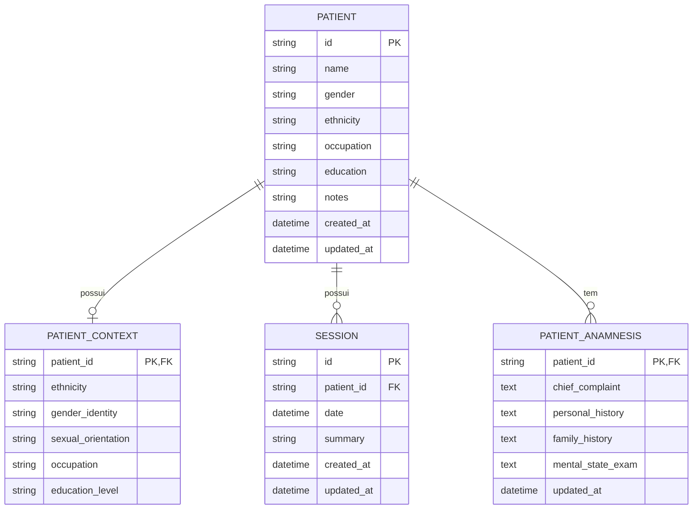

# REQ-01-00-02 — Editar Dados do Paciente (Identidade SOTA)

## Identificação

| Campo | Valor |
|-------|-------|
| **ID** | REQ-01-00-02 |
| **Capability** | CAP-01-00 Gestão de Pacientes |
| **Vision** | VISION-01 Registro da Prática Clínica |
| **Status** | ✅ implemented |
| **Prioridade** | Alta |
| **Data de Implementação** | 2024-01 |

---

## História do Usuário

Como **psicólogo clínico**,  
quero **alterar as informações cadastrais, notas iniciais ou o contexto biopsicossocial de um paciente**,  
para **manter os dados atualizados e refletir mudanças ou novas percepções sobre a identidade do sujeito fora do contexto de uma sessão específica**.

---

## Contexto

Os dados de um paciente não são estáticos. O prontuário é um documento vivo que deve acompanhar a evolução do sujeito (mudança de ocupação, atualização de identidade de gênero, refinamento da queixa principal).

A edição deve seguir o padrão de Tecnologia Silenciosa, ocorrendo preferencialmente de forma "inline" ou via fragmento, evitando formulários pesados que interrompam a fluidez da navegação clínica.

---

## Descrição Funcional

O sistema deve permitir a modificação de todos os campos da entidade Patient e da sua respectiva extensão PatientContext.

- **Interface de Gatilho**: Um botão ou ícone de "Editar" no perfil do paciente (`/patients/{id}`).
- **Modo de Edição**: Substituição dos dados estáticos por campos de entrada (input, select e textarea) via HTMX.
- **Persistência**: Atualização coordenada entre as tabelas `patients` e `patient_context` com registro automático do timestamp `updated_at`.

### Dados para Edição (Identidade SOTA)

#### Campos Administrativos
- Nome (Obrigatório)

#### Campos de Identidade e Contexto (SOTA/Opcionais)
- **Etnia/Raça**: Atualização baseada em padrões de saúde.
- **Identidade de Gênero e Orientação Sexual**: Fundamental para a clínica afirmativa.
- **Ocupação e Escolaridade**: Atualização de determinantes sociais de saúde.
- **Notas de Contexto Inicial**: Revisão da "Queixa Principal" ou percepções de triagem.

### Fluxo de Edição

```text
Usuário visualiza perfil do paciente
↓
Clica "Editar"
↓
Sistema retorna formulário de edição (HTMX)
↓
Usuário altera dados
↓
Clica "Salvar" ou "Cancelar"
↓
Salvar: Atualiza dados e retorna visualização
Cancelar: Descarta alterações
```

---

## Interface de Usuário

### Formulário de Edição

Localização: `/patients/{id}/edit` (fragmento HTMX)

Componente: `web/components/patient/edit_form.templ`

```
┌─────────────────────────────────────────────────┐
│ ← Editar Paciente                               │
│ Atualize as informações do paciente             │
├─────────────────────────────────────────────────┤
│                                                 │
│ Nome Completo *                                 │
│ ┌─────────────────────────────────────────┐     │
│ │ Maria da Silva                          │     │
│ └─────────────────────────────────────────┘     │
│                                                 │
│ Identidade de Gênero    Etnia/Raça              │
│ ┌─────────────────┐     ┌─────────────────┐     │
│ │ Feminino        │     │ Branca          │     │
│ └─────────────────┘     └─────────────────┘     │
│                                                 │
│ Ocupação                Escolaridade            │
│ ┌─────────────────┐     ┌─────────────────┐     │
│ │ Professora      │     │ Superior        │     │
│ └─────────────────┘     └─────────────────┘     │
│                                                 │
│ Notas de Contexto Inicial                       │
│ ┌─────────────────────────────────────────┐     │
│ │ Texto em tipografia serif               │     │
│ │ para leitura fluida...                  │     │
│ └─────────────────────────────────────────┘     │
│                                                 │
│ [Cancelar]  [Salvar Alterações]                 │
│                                                 │
└─────────────────────────────────────────────────┘
```

### Estilo (Tecnologia Silenciosa)

A edição deve ocorrer de forma integrada ao "papel" digital do prontuário:

- **Edição Inline**: Ao clicar em editar, o texto transforma-se em campo de entrada no mesmo local.
- **Tipografia**:
  - O campo "Notas" usa obrigatoriamente a fonte Source Serif 4 (text-xl) para manter a imersão.
  - O campo "Nome" e labels administrativos usam Inter (Sans).
- **Visual (Silent Input)**:
  - Inputs sem bordas agressivas (apenas border-b sutil).
  - Fundo bg-white para os campos ativos, destacando a área de edição sobre o fundo cinza papel do sistema.
  - Padding generoso para facilitar o toque e a leitura.

---

## Diagrama de Arquitetura C4 (Nível Componentes)

```mermaid
C4Component
title Arquitetura de Edição de Paciente - Nível Componentes

Container_Boundary(web, "Web Layer") {
    Component(patientHandler, "PatientHandler", "Go Handler", "Processa requisições HTTP")
    Component(editPatient, "UpdateAnamnesisSection", "Method", "PUT /patients/{id}")
    Component(showPatient, "Show", "Method", "GET /patients/{id}")
}

Container_Boundary(components, "UI Components") {
    Component(editForm, "PatientEditForm", "Templ Component", "Formulário de edição")
    Component(patientProfile, "PatientProfile", "Templ Component", "Perfil do paciente")
}

Container_Boundary(application, "Application Layer") {
    Component(patientService, "PatientService", "Service", "Lógica de negócio")
    Component(updateInput, "UpdatePatientInput", "DTO", "Dados validados")
}

Container_Boundary(domain, "Domain Layer") {
    Component(patientEntity, "Patient", "Entity", "Entidade de domínio")
    Component(contextEntity, "PatientContext", "Entity", "Contexto biopsicossocial")
}

Container_Boundary(infrastructure, "Infrastructure Layer") {
    Component(patientRepo, "PatientRepository", "Repository", "Persistência SQLite")
    Component(db, "SQLite DB", "Database", "Banco de dados")
}

Rel(web, patientHandler, "Usa")
Rel(patientHandler, editPatient, "Chama para PUT /patients/{id}")
Rel(patientHandler, showPatient, "Chama para GET /patients/{id}")
Rel(editPatient, editForm, "Renderiza inicialmente")
Rel(editPatient, patientService, "Chama para atualizar")
Rel(patientService, updateInput, "Valida e sanitiza")
Rel(patientService, patientEntity, "Atualiza")
Rel(patientService, contextEntity, "Atualiza contexto")
Rel(patientService, patientRepo, "Persiste via")
Rel(patientRepo, db, "Executa SQL")
Rel(editPatient, patientProfile, "Retorna após salvar")
Rel(showPatient, patientProfile, "Renderiza")

UpdateLayoutConfig($c4ShapeInRow="3", $c4BoundaryInRow="1")
```

---

## Fluxo de Dados (Sequence Diagram)

```mermaid
sequenceDiagram
    actor Usuário
    participant Browser
    participant PatientHandler as PatientHandler\n(web/handlers)
    participant EditForm as PatientEditForm\n(components/patient)
    participant PatientService as PatientService\n(application/services)
    component UpdateInput as UpdatePatientInput\n(application/services)
    participant Patient as Patient\n(domain/patient)
    participant PatientRepo as PatientRepository\n(infrastructure/sqlite)
    participant SQLite as SQLite DB

    %% Fluxo GET /patients/{id}/edit
    Usuário->>Browser: Clica "Editar"
    Browser->>PatientHandler: GET /patients/{id}/edit
    PatientHandler->>PatientService: GetPatientByID(ctx, id)
    PatientService->>PatientRepo: FindByID(ctx, id)
    PatientRepo->>SQLite: SELECT * FROM patients WHERE id = ?
    SQLite-->>PatientRepo: Row
    PatientRepo-->>PatientService: *Patient
    PatientService-->>PatientHandler: *Patient
    PatientHandler->>EditForm: Render(PatientEditFormData)
    EditForm-->>Browser: HTML com formulário
    Browser-->>Usuário: Exibe formulário de edição

    %% Fluxo PUT /patients/{id}
    Usuário->>Browser: Altera dados e clica "Salvar"
    Browser->>PatientHandler: PUT /patients/{id} (form data)
    PatientHandler->>PatientHandler: ParseForm()
    PatientHandler->>PatientService: UpdatePatient(ctx, id, input)
    PatientService->>UpdateInput: Sanitize()
    PatientService->>UpdateInput: Validate()
    UpdateInput-->>PatientService: ✓ Dados válidos
    PatientService->>Patient: Atualiza campos
    Patient->>Patient: Atualiza UpdatedAt
    Patient-->>PatientService: *Patient
    PatientService->>PatientRepo: Update(ctx, patient)
    PatientRepo->>PatientRepo: validatePatientForUpdate()
    PatientRepo->>SQLite: BEGIN TRANSACTION
    SQLite-->>PatientRepo: ✓
    PatientRepo->>SQLite: UPDATE patients SET ...
    PatientRepo->>SQLite: UPSERT INTO patient_context ...
    PatientRepo->>SQLite: COMMIT
    SQLite-->>PatientRepo: ✓ Sucesso
    PatientRepo-->>PatientService: nil
    PatientService-->>PatientHandler: *Patient, nil
    PatientHandler->>Browser: Fragmento atualizado (HTMX)
    Browser-->>Usuário: Exibe perfil com dados atualizados

    %% Fluxo Cancelar
    Usuário->>Browser: Clica "Cancelar"
    Browser->>PatientHandler: GET /patients/{id}
    PatientHandler->>PatientHandler: Show()
    PatientHandler-->>Browser: Fragmento de visualização
    Browser-->>Usuário: Restaura visão original
```

---

## Endpoints

| Método | Rota | Handler | Descrição |
|--------|------|---------|-----------|
| `GET` | `/patients/{id}` | `Show` | Perfil do paciente (visualização) |
| `GET` | `/patients/{id}/edit` | `UpdateAnamnesisSection` | Formulário de edição (fragmento HTMX) |
| `PUT` | `/patients/{id}` | `UpdateAnamnesisSection` | Atualiza paciente e retorna fragmento |

---

## Componentes UI

| Componente | Arquivo | Descrição |
|------------|---------|-----------|
| `PatientEditForm` | `web/components/patient/edit_form.templ` | Formulário de edição de paciente |
| `PatientProfileView` | `web/components/patient/profile.templ` | Perfil do paciente (modo visualização) |
| `PatientAnamnesisSection` | `web/components/patient/anamnesis_section.templ` | Seção de anamnese editável |
| `Shell` | `web/components/layout/shell_layout.templ` | Layout principal |

---

## Modelo de Dados

### Entidade de Domínio (internal/domain/patient/patient.go)

```go
type Patient struct {
    ID        string    `json:"id"`
    Name      string    `json:"name"`
    Gender    string    `json:"gender"`
    Ethnicity string    `json:"ethnicity"`
    Occupation string   `json:"occupation"`
    Education string    `json:"education"`
    Notes     string    `json:"notes"`
    CreatedAt time.Time `json:"created_at"`
    UpdatedAt time.Time `json:"updated_at"`
}

func (p *Patient) Update(name, gender, ethnicity, occupation, education, notes string) {
    p.Name = name
    p.Gender = gender
    p.Ethnicity = ethnicity
    p.Occupation = occupation
    p.Education = education
    p.Notes = notes
    p.UpdatedAt = time.Now()
}
```

### Entidade Contexto (internal/domain/patient/patient_context.go)

```go
type PatientContext struct {
    PatientID         string `json:"patient_id"`
    Ethnicity         string `json:"ethnicity"`
    GenderIdentity    string `json:"gender_identity"`
    SexualOrientation string `json:"sexual_orientation"`
    Occupation        string `json:"occupation"`
    EducationLevel    string `json:"education_level"`
}
```

### SQL Schema (SQLite)

```sql
-- Tabela principal
CREATE TABLE patients (
    id TEXT PRIMARY KEY,
    name TEXT NOT NULL,
    gender TEXT,
    ethnicity TEXT,
    occupation TEXT,
    education TEXT,
    notes TEXT,
    created_at DATETIME DEFAULT CURRENT_TIMESTAMP,
    updated_at DATETIME DEFAULT CURRENT_TIMESTAMP
);

-- Tabela de contexto
CREATE TABLE patient_context (
    patient_id TEXT PRIMARY KEY,
    ethnicity TEXT,
    gender_identity TEXT,
    sexual_orientation TEXT,
    occupation TEXT,
    education_level TEXT,
    FOREIGN KEY (patient_id) REFERENCES patients(id) ON DELETE CASCADE
);

-- Índices
CREATE INDEX idx_patients_name ON patients(name);
CREATE INDEX idx_patients_updated_at ON patients(updated_at DESC);
```

---

## Diagrama ER



---

## Arquivos Implementados

| Caminho | Descrição |
|---------|-----------|
| `internal/web/handlers/patient_handler.go` | Handler HTTP com métodos UpdateAnamnesisSection (GET/PUT) e Show |
| `internal/application/services/patient_service.go` | Serviço com método UpdatePatient e validações |
| `internal/infrastructure/repository/sqlite/patient_repository.go` | Repositório com métodos Update, FindByID e UpdateContext |
| `internal/domain/patient/patient.go` | Entidade de domínio com método Update |
| `internal/domain/patient/patient_context.go` | Entidade de contexto biopsicossocial |
| `web/components/patient/edit_form.templ` | Componente UI do formulário de edição |
| `web/components/patient/anamnesis_section.templ` | Seção de anamnese editável inline |
| `web/components/patient/profile.templ` | Componente UI do perfil (modo visualização) |

---

## Critérios de Aceitação

### CA-01: Pré-preenchimento do Formulário

- [x] O formulário de edição deve vir pré-preenchido com os dados atuais
- [x] Incluir campos da tabela `patient_context` (se existirem)
- [x] Campos devem refletir o estado atual do banco de dados

### CA-02: Atualização via HTMX

- [x] A edição deve ser realizada via HTMX
- [x] Atualizar apenas o "Main Canvas" do paciente
- [x] Não recarregar o Layout principal ou a Sidebar
- [x] Usar fragmentos para resposta

### CA-03: Validação de Dados

- [x] Validar que o campo "Nome" não fique vazio após a edição
- [x] Exibir mensagem de erro se validação falhar
- [x] Sanitização de espaços em branco
- [x] Manter validações existentes (tamanho máximo, caracteres válidos)

### CA-04: Timestamp de Atualização

- [x] O campo `updated_at` na tabela `patients` deve ser atualizado
- [x] Usar timestamp do momento do salvamento
- [x] Atualização automática via método Update da entidade

### CA-05: Transação Atômica

- [x] Persistência atômica entre `patients` e `patient_context`
- [x] Se atualização de `patient_context` falhar, alteração em `patients` não deve ser consolidada
- [x] Usar BEGIN TRANSACTION / COMMIT / ROLLBACK

### CA-06: Tipografia e Estilo

- [x] Campo "Notas de Contexto" deve usar Source Serif 4 (text-xl)
- [x] Estilo de "escrita fluida" mantido
- [x] Campos administrativos usam Inter (Sans)
- [x] Bordas sutis (border-b apenas)
- [x] Fundo bg-white para campos ativos

### CA-07: Fluxo de Cancelamento

- [x] Botão "Cancelar" deve descartar alterações
- [x] Restaurar visão original sem salvar
- [x] Retornar fragmento de visualização (não formulário)

### CA-08: Feedback Visual

- [x] Indicador visual durante edição (campos ativos)
- [x] Mensagem de sucesso após salvamento (opcional)
- [x] Estados dos botões (enabled/disabled)
- [x] Transições suaves entre modos (visualização ↔ edição)

---

## Integração com Outros Requisitos

- **REQ-01-00-01**: Criar Paciente (Origem dos dados)
- **CAP-01-04**: Contexto Biopsicossocial e Farmacológico (Consome estes dados)

---

## Fora do Escopo

Este requisito **não inclui**:

- [ ] Histórico de versões de cada edição (Audit Log/Versioning)
- [ ] Exclusão definitiva do paciente (REQ-01-00-04)
- [ ] Alteração manual do id (UUID imutável)
- [ ] Upload de foto do paciente
- [ ] Notificações de alteração

---

## Resultado Esperado

Após a implementação deste requisito, o sistema permite:

✅ Editar dados cadastrais do paciente  
✅ Atualizar contexto biopsicossocial  
✅ Manter prontuário atualizado ao longo do tempo  
✅ Editar de forma fluida via HTMX (sem reload)  
✅ Manter consistência tipográfica e visual

Isso garante que o **prontuário evolua junto com o paciente**, mantendo os dados sempre atualizados e refletindo as mudanças na identidade e contexto do sujeito.

---

## Dependências

- REQ-01-00-01 (Criar Paciente) implementado
- Sistema de banco SQLite configurado
- Sistema de templates Templ compilado
- HTMX configurado para atualizações parciais

## Requisitos Habilitados

Este requisito habilita diretamente:

- CAP-01-04 Contexto Biopsicossocial (atualização de dados)
- Fluxos clínicos que dependem de dados atualizados do paciente
