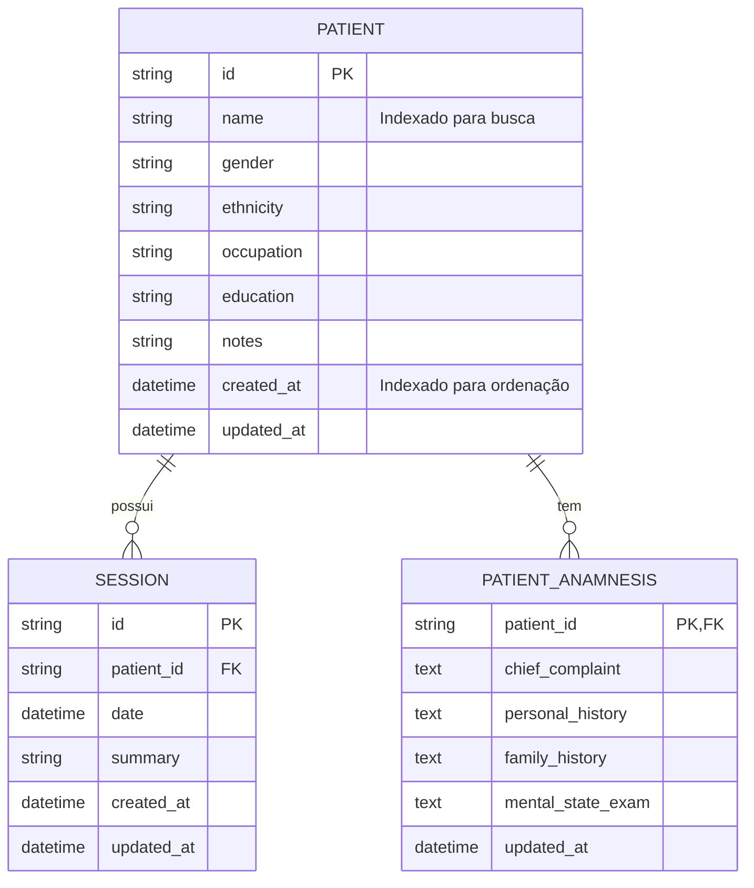

# REQ-01-00-03 — Busca e Localização de Pacientes

## Identificação

| Campo | Valor |
|-------|-------|
| **ID** | REQ-01-00-03 |
| **Capability** | CAP-07-04 Recuperação de Informação e Performance |
| **Vision** | VISION-07 Organização Operacional do Consultório |
| **Status** | ✅ implemented |
| **Prioridade** | Alta |
| **Data de Implementação** | 2024-01 |

---

## História do Usuário

Como **psicólogo clínico**,  
quero **localizar um paciente rapidamente através de uma barra de busca**,  
para **aceder ao seu prontuário sem ter de percorrer uma lista extensa e cansativa de nomes**.

---

## Contexto

Com o crescimento da base de dados para centenas de pacientes, a listagem total torna-se impraticável. Este requisito implementa o padrão "Command Bar" ou "Search First", onde a principal forma de navegação entre pacientes é através de uma busca ativa com feedback instantâneo (autocomplete).

---

## Descrição Funcional

O sistema deve permitir a filtragem de pacientes em tempo real.

- **Entrada de Busca**: Um campo de texto na Top Bar (Navegação Universal).
- **Autocomplete**: Os resultados devem ser atualizados conforme o utilizador digita.
- **Performance**: Implementar um delay (debounce) de 500ms para evitar chamadas excessivas ao banco de dados.
- **Paginação de Resultados**: Exibir inicialmente os 15 resultados mais relevantes. Se houver mais, permitir o carregamento via "Infinite Scroll" (REQ-07-04-01).
- **Navegação**: Ao clicar num resultado, o sistema deve navegar para o perfil do paciente via HTMX.

### Fluxo de Busca

```text
Usuário clica no campo de busca (Top Bar)
↓
Digita o nome (ex: "Jose")
↓
Delay de 500ms (debounce)
↓
Sistema busca pacientes com LIKE '%Jose%'
↓
Retorna fragmento com resultados
↓
Usuário clica em um resultado
↓
Navega para /patients/{id}
```

---

## Interface de Usuário

### Barra de Busca (Top Bar)

Localização: Integrada na Top Bar global, acessível em qualquer ecrã.

Componente: `web/components/layout/search_bar.templ`

```
┌────────────────────────────────────────────────────────────────┐
│ Arandu            🔍 Buscar paciente...            👤  ⚙️   🚪  │
│                   ┌─────────────────────────────────────┐        │
│                   │ Maria Silva                         │        │
│                   └─────────────────────────────────────┘        │
│                   ┌─────────────────────────────────────┐        │
│                   │ Ⓜ️ Maria Silva                       │        │
│                   │ Ⓜ️ Marcos Oliveira                   │        │
│                   │ Ⓜ️ Marina Santos                     │        │
│                   └─────────────────────────────────────┘        │
└────────────────────────────────────────────────────────────────┘
```

### Lista de Resultados

Componente: `web/components/patient/search_results.templ`

```
┌─────────────────────────────────────┐
│ Resultados da busca                 │
├─────────────────────────────────────┤
│                                     │
│ Ⓜ️ Maria Silva                      │
│    Criado em: 15/01/2024            │
│ ─────────────────────────────────   │
│ Ⓜ️ Marcos Oliveira                  │
│    Criado em: 10/01/2024            │
│ ─────────────────────────────────   │
│ Ⓜ️ Marina Santos                    │
│    Criado em: 05/01/2024            │
│                                     │
│ [Ver mais resultados...]            │
│                                     │
└─────────────────────────────────────┘
```

### Estilo (Padrão Arandu SOTA)

Seguindo a filosofia de Tecnologia Silenciosa:

- **Localização**: O campo de busca deve estar integrado na Top Bar global, acessível em qualquer ecrã.
- **Estética**:
  - Ícone de lupa sutil (Lucide search).
  - Fundo do input levemente acinzentado (bg-gray-100/50) que clareia no foco.
  - Sem bordas pesadas; foco realçado por uma sombra interna mínima.
- **Tipografia**: Resultados da busca usam Inter (Sans) para máxima clareza na identificação de nomes.

---

## Diagrama de Arquitetura C4 (Nível Componentes)

```mermaid
C4Component
title Arquitetura de Busca de Pacientes - Nível Componentes

Container_Boundary(web, "Web Layer") {
    Component(patientHandler, "PatientHandler", "Go Handler", "Processa requisições HTTP")
    Component(search, "Search", "Method", "GET /patients/search")
    Component(listPaginated, "ListPatientsPaginated", "Method", "GET /patients")
}

Container_Boundary(components, "UI Components") {
    Component(searchBar, "SearchBar", "Templ Component", "Barra de busca na Top Bar")
    Component(searchResults, "SearchResults", "Templ Component", "Lista de resultados")
    Component(patientList, "PatientList", "Templ Component", "Lista paginada")
}

Container_Boundary(application, "Application Layer") {
    Component(patientService, "PatientService", "Service", "Lógica de negócio")
    Component(searchCriteria, "SearchCriteria", "DTO", "Critérios de busca")
}

Container_Boundary(infrastructure, "Infrastructure Layer") {
    Component(patientRepo, "PatientRepository", "Repository", "Persistência SQLite")
    Component(db, "SQLite DB", "Database", "Banco de dados")
}

Rel(web, patientHandler, "Usa")
Rel(patientHandler, search, "Chama para GET /patients/search")
Rel(patientHandler, listPaginated, "Chama para GET /patients")
Rel(search, searchBar, "Renderiza")
Rel(search, patientService, "Chama SearchPatients")
Rel(listPaginated, patientService, "Chama ListPatientsPaginated")
Rel(search, searchResults, "Retorna fragmento")
Rel(listPaginated, patientList, "Retorna fragmento")
Rel(patientService, searchCriteria, "Valida critérios")
Rel(patientService, patientRepo, "Busca via")
Rel(patientRepo, db, "Executa SQL LIKE")

UpdateLayoutConfig($c4ShapeInRow="3", $c4BoundaryInRow="1")
```

---

## Fluxo de Dados (Sequence Diagram)

```mermaid
sequenceDiagram
    actor Usuário
    participant Browser
    participant PatientHandler as PatientHandler\n(web/handlers)
    participant SearchBar as SearchBar\n(components/layout)
    participant SearchResults as SearchResults\n(components/patient)
    participant PatientService as PatientService\n(application/services)
    component SearchCriteria as SearchCriteria\n(application/services)
    participant PatientRepo as PatientRepository\n(infrastructure/sqlite)
    participant SQLite as SQLite DB

    %% Fluxo GET /patients (Listagem Paginada)
    Usuário->>Browser: Acessa /patients
    Browser->>PatientHandler: GET /patients
    PatientHandler->>PatientService: ListPatientsPaginated(ctx, page, limit)
    PatientService->>PatientRepo: ListPaginated(ctx, offset, limit)
    PatientRepo->>SQLite: SELECT * FROM patients ORDER BY created_at DESC LIMIT ? OFFSET ?
    SQLite-->>PatientRepo: Rows
    PatientRepo-->>PatientService: []*Patient
    PatientService-->>PatientHandler: []*Patient, totalCount
    PatientHandler-->>Browser: HTML com lista paginada
    Browser-->>Usuário: Exibe lista de pacientes

    %% Fluxo GET /patients/search (Busca)
    Usuário->>Browser: Clica na barra de busca
    Browser->>SearchBar: Foco no input
    Usuário->>Browser: Digita "Jose" (com debounce 500ms)
    Browser->>PatientHandler: GET /patients/search?q=Jose
    PatientHandler->>PatientHandler: Parse query params
    PatientHandler->>PatientService: SearchPatients(ctx, query)
    PatientService->>SearchCriteria: Sanitize(query)
    PatientService->>SearchCriteria: Validate()
    SearchCriteria-->>PatientService: ✓ Critérios válidos
    PatientService->>PatientRepo: SearchByName(ctx, query, limit)
    PatientRepo->>SQLite: SELECT id, name FROM patients WHERE name LIKE ? ORDER BY name ASC LIMIT 15
    SQLite-->>PatientRepo: Rows
    PatientRepo-->>PatientService: []*Patient
    PatientService-->>PatientHandler: []*Patient
    PatientHandler->>SearchResults: Render(SearchResultsData)
    SearchResults-->>Browser: HTML fragment (resultados)
    Browser-->>Usuário: Exibe dropdown com resultados

    %% Fluxo Seleção
    Usuário->>Browser: Clica em resultado
    Browser->>PatientHandler: GET /patients/{id}
    PatientHandler-->>Browser: Perfil do paciente
    Browser-->>Usuário: Exibe prontuário do paciente
```

---

## Endpoints

| Método | Rota | Handler | Descrição |
|--------|------|---------|-----------|
| `GET` | `/patients` | `ListPatientsPaginated` | Lista paginada de pacientes |
| `GET` | `/patients/search` | `Search` | Busca de pacientes por nome |
| `GET` | `/patients/{id}` | `Show` | Perfil do paciente (destino da navegação) |

---

## Componentes UI

| Componente | Arquivo | Descrição |
|------------|---------|-----------|
| `SearchBar` | `web/components/layout/search_bar.templ` | Barra de busca na Top Bar |
| `SearchResults` | `web/components/patient/search_results.templ` | Dropdown de resultados da busca |
| `PatientList` | `web/components/patient/list.templ` | Lista paginada de pacientes |
| `PatientListItem` | `web/components/patient/list_item.templ` | Item individual da lista |
| `TopBar` | `web/components/layout/top_bar.templ` | Barra superior com busca integrada |
| `Shell` | `web/components/layout/shell_layout.templ` | Layout principal |

---

## Modelo de Dados

### Entidade de Domínio (internal/domain/patient/patient.go)

```go
type Patient struct {
    ID        string    `json:"id"`
    Name      string    `json:"name"`
    Gender    string    `json:"gender"`
    Ethnicity string    `json:"ethnicity"`
    Occupation string   `json:"occupation"`
    Education string    `json:"education"`
    Notes     string    `json:"notes"`
    CreatedAt time.Time `json:"created_at"`
    UpdatedAt time.Time `json:"updated_at"`
}
```

### SQL Schema (SQLite)

```sql
-- Tabela principal
CREATE TABLE patients (
    id TEXT PRIMARY KEY,
    name TEXT NOT NULL,
    gender TEXT,
    ethnicity TEXT,
    occupation TEXT,
    education TEXT,
    notes TEXT,
    created_at DATETIME DEFAULT CURRENT_TIMESTAMP,
    updated_at DATETIME DEFAULT CURRENT_TIMESTAMP
);

-- Índices para busca e ordenação
CREATE INDEX idx_patients_name ON patients(name);
CREATE INDEX idx_patients_created_at ON patients(created_at DESC);

-- Busca simples por nome (LIKE)
-- Futuro: FTS5 (Full Text Search)
```

### Queries de Busca

```sql
-- Busca por nome (parcial)
SELECT id, name, created_at 
FROM patients 
WHERE name LIKE ? 
ORDER BY name ASC 
LIMIT 15;

-- Lista paginada
SELECT * FROM patients 
ORDER BY created_at DESC 
LIMIT ? OFFSET ?;

-- Contagem total
SELECT COUNT(*) FROM patients;
```

---

## Diagrama ER



---

## Arquivos Implementados

| Caminho | Descrição |
|---------|-----------|
| `internal/web/handlers/patient_handler.go` | Handler HTTP com métodos Search e ListPatientsPaginated |
| `internal/application/services/patient_service.go` | Serviço com métodos SearchPatients e ListPatientsPaginated |
| `internal/infrastructure/repository/sqlite/patient_repository.go` | Repositório com métodos SearchByName e ListPaginated |
| `internal/domain/patient/patient.go` | Entidade de domínio Patient |
| `web/components/layout/search_bar.templ` | Componente da barra de busca |
| `web/components/patient/search_results.templ` | Componente de resultados da busca |
| `web/components/patient/list.templ` | Componente de lista paginada |
| `web/components/patient/list_item.templ` | Item da lista de pacientes |
| `web/components/layout/top_bar.templ` | Top Bar com busca integrada |
| `web/static/js/search.js` | JavaScript para debounce e HTMX triggers |

---

## Critérios de Aceitação

### CA-01: Busca Parcial

- [x] A busca deve retornar resultados parciais (ex: "Mar" deve retornar "Maria" e "Marcos")
- [x] Usar operador LIKE com wildcards (%)
- [x] Busca case-insensitive
- [x] Ordenar resultados alfabeticamente

### CA-02: Performance

- [x] Implementar debounce de 500ms no frontend
- [x] Tempo de resposta do backend inferior a 100ms
- [x] Limitar resultados a 15 inicialmente
- [x] Índices adequados na coluna `name`
- [x] Otimização de queries SQL

### CA-03: Mensagem de Resultado Vazio

- [x] Caso não existam resultados, exibir mensagem sutil
- [x] Texto: "Nenhum paciente encontrado com este nome"
- [x] Estilo discreto (cinza, itálico)
- [x] Não exibir erro ou alerta agressivo

### CA-04: Responsividade Mobile

- [x] Interface de busca funcional em dispositivos móveis
- [x] Ocupar largura total da Top Bar quando ativa
- [x] Dropdown de resultados adaptável a tela
- [x] Touch targets adequados (mínimo 44px)

### CA-05: Navegação por Teclado

- [x] Suporte a teclas de seta (cima/baixo) para navegar resultados
- [x] Tecla Enter para selecionar paciente destacado
- [x] Tecla Escape para fechar dropdown
- [x] Foco visível nos itens (acessibilidade)

### CA-06: Paginação da Lista

- [x] Lista principal suportar paginação
- [x] Parâmetros `page` e `limit` na URL
- [x] Botões "Anterior" e "Próximo"
- [x] Indicador de página atual
- [x] Suporte a infinite scroll (preparação para REQ-07-04-01)

### CA-07: Feedback Visual

- [x] Ícone de lupa sutil (Lucide search)
- [x] Fundo do input levemente acinzentado (bg-gray-100/50)
- [x] Clarear no foco
- [x] Sem bordas pesadas
- [x] Sombra interna mínima no foco
- [x] Loading state durante busca (opcional)

### CA-08: Navegação HTMX

- [x] Navegação para perfil via HTMX
- [x] Atualização parcial da página
- [x] Preservar estado da sidebar
- [x] URL atualizada corretamente

---

## Integração com Outros Requisitos

- **REQ-01-00-01**: Criar Paciente (fonte dos dados)
- **REQ-01-00-02**: Editar Paciente (mantém dados atualizados)
- **REQ-07-04-01**: Infinite Scroll (melhoria futura)
- **VISION-07**: Organização Operacional do Consultório

---

## Fora do Escopo

Este requisito **não inclui**:

- [ ] Busca por conteúdo dentro das sessões (será REQ-07-04-02)
- [ ] Filtros avançados por data de nascimento ou etiquetas (tags)
- [ ] Full Text Search (FTS5) - implementação futura
- [ ] Busca por CPF ou documentos
- [ ] Sugestões de busca baseadas em histórico
- [ ] Autocomplete inteligente (machine learning)

---

## Resultado Esperado

Após a implementação deste requisito, o sistema permite:

✅ Localizar pacientes rapidamente via barra de busca  
✅ Busca em tempo real com autocomplete  
✅ Performance otimizada com debounce  
✅ Lista paginada de pacientes  
✅ Navegação fluida via HTMX  
✅ Suporte a dispositivos móveis  
✅ Acessibilidade com navegação por teclado

Isso estabelece o **padrão "Search First"** de navegação, permitindo que o profissional acesse qualquer prontuário em segundos, independentemente do tamanho da base de pacientes.

---

## Dependências

- REQ-01-00-01 (Criar Paciente) implementado
- Sistema de banco SQLite configurado
- Sistema de templates Templ compilado
- HTMX configurado para atualizações parciais
- Índices de banco de dados otimizados

## Requisitos Habilitados

Este requisito habilita diretamente:

- Fluxo de navegação eficiente em bases grandes
- REQ-07-04-01 Infinite Scroll
- REQ-07-04-02 Busca em sessões
