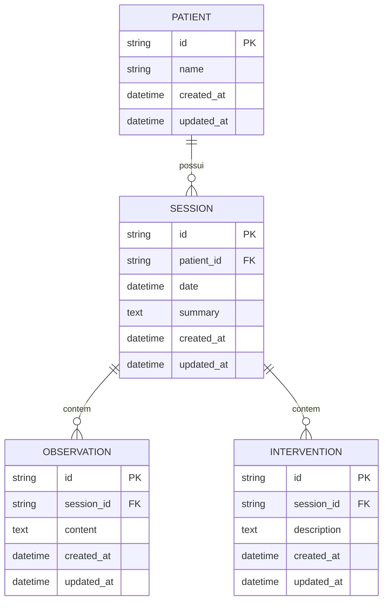

# REQ-01-01-01 — Criar Sessão

## Identificação

| Campo | Valor |
|-------|-------|
| **ID** | REQ-01-01-01 |
| **Capability** | CAP-01-01 Registro de Sessões |
| **Vision** | VISION-01 Registro da Prática Clínica |
| **Status** | ✅ implemented |
| **Prioridade** | Alta |
| **Data de Implementação** | 2024-01 |

---

## História do Usuário

Como **psicólogo clínico**,  
quero **registrar uma nova sessão terapêutica para um paciente**,  
para **documentar o encontro clínico e preservar informações relevantes para acompanhamento terapêutico**.

---

## Contexto

A sessão representa um **encontro terapêutico entre profissional e paciente**.

Ela é o principal elemento temporal do registro clínico no Arandu. Cada sessão registra o contexto onde ocorreram:

```text
Paciente
└── Sessão
    ├── Observações clínicas
    ├── Intervenções terapêuticas
    └── Reflexões do terapeuta
```

- Cada sessão pertence a **um único paciente**
- Um paciente pode possuir **múltiplas sessões ao longo do tempo**

---

## Descrição Funcional

O sistema deve permitir que o profissional registre uma nova sessão associada a um paciente.

A criação da sessão deve registrar:
- Paciente (via PatientID)
- Data da sessão
- Resumo da sessão (opcional)

Após a criação, a sessão deve aparecer no **histórico de sessões do paciente**.

### Fluxo de Criação

```text
Usuário abre página do paciente
↓
Clica "Nova sessão"
↓
Preenche data da sessão
↓
Opcionalmente registra resumo
↓
Clica "Salvar sessão"
↓
Sistema valida dados
↓
Sistema cria entidade de domínio (UUID + timestamps)
↓
Sistema persiste no SQLite
↓
Sessão aparece no histórico do paciente
↓
Redireciona para /sessions/{id}
```

---

## Dados da Sessão

### Campos Obrigatórios

| Campo | Tipo | Validação |
|-------|------|-----------|
| **PatientID** | UUID FK | Deve existir na tabela patients |
| **Date** | DATETIME | Data válida, não futura |

### Campos Opcionais

| Campo | Tipo | Validação |
|-------|------|-----------|
| **Summary** | TEXT | Máximo 5000 caracteres |

### Campos Gerados Automaticamente

| Campo | Descrição |
|-------|-----------|
| `ID` | UUID v4 gerado pelo domínio |
| `CreatedAt` | Timestamp da criação |
| `UpdatedAt` | Timestamp da última atualização |

---

## Interface de Usuário

### Formulário de Criação

Localização: `/patients/{id}/sessions/new` ou modal HTMX

Componente: `web/components/session/new_form.templ`

```
┌─────────────────────────────────────────────────┐
│ ← Nova Sessão                                   │
│ Registre um novo encontro clínico               │
├─────────────────────────────────────────────────┤
│                                                 │
│ Paciente: Maria Silva                           │
│                                                 │
│ Data da Sessão *                                │
│ ┌─────────────────────────────────────────┐     │
│ │ 20/03/2026                              │     │
│ └─────────────────────────────────────────┘     │
│                                                 │
│ Resumo da Sessão                                │
│ ┌─────────────────────────────────────────┐     │
│ │ Sessão inicial, apresentação do       │     │
│ │ paciente e discussão da queixa...     │     │
│ │                                       │     │
│ │                                       │     │
│ └─────────────────────────────────────────┘     │
│ Texto em tipografia serif para escrita fluida     │
│                                                 │
│ [Cancelar]  [Salvar Sessão]                     │
│                                                 │
└─────────────────────────────────────────────────┘
```

### Estilo (Tecnologia Silenciosa)

- **Tipografia**: Campo "Resumo" usa Source Serif 4 (text-xl) para imersão
- **Silent Input**: Inputs sem bordas agressivas (border-b sutil)
- **Foco**: Clarear fundo no foco (bg-white)
- **Ações**: Botões discretos e claros

---

## Diagrama de Arquitetura C4 (Nível Componentes)

```mermaid
C4Component
title Arquitetura de Criação de Sessão - Nível Componentes

Container_Boundary(web, "Web Layer") {
    Component(sessionHandler, "SessionHandler", "Go Handler", "Processa requisições HTTP")
    Component(newSession, "NewSession", "Method", "GET /patients/{id}/sessions/new")
    Component(createSession, "CreateSession", "Method", "POST /sessions")
}

Container_Boundary(components, "UI Components") {
    Component(newForm, "NewSessionForm", "Templ Component", "Formulário de criação")
    Component(sessionView, "SessionView", "Templ Component", "Visualização da sessão")
}

Container_Boundary(application, "Application Layer") {
    Component(sessionService, "SessionService", "Service", "Lógica de negócio")
    Component(createInput, "CreateSessionInput", "DTO", "Dados validados")
}

Container_Boundary(domain, "Domain Layer") {
    Component(sessionEntity, "Session", "Entity", "Entidade de domínio")
    Component(uuidGen, "UUID Gen", "Util", "Gera identificador único")
}

Container_Boundary(infrastructure, "Infrastructure Layer") {
    Component(sessionRepo, "SessionRepository", "Repository", "Persistência SQLite")
    Component(db, "SQLite DB", "Database", "Banco de dados")
}

Rel(web, sessionHandler, "Usa")
Rel(sessionHandler, newSession, "Chama para GET /patients/{id}/sessions/new")
Rel(sessionHandler, createSession, "Chama para POST /sessions")
Rel(newSession, newForm, "Renderiza")
Rel(createSession, sessionService, "Chama")
Rel(sessionService, createInput, "Valida e sanitiza")
Rel(sessionService, sessionEntity, "Cria")
Rel(sessionEntity, uuidGen, "Gera ID")
Rel(sessionService, sessionRepo, "Persiste via")
Rel(sessionRepo, db, "Executa SQL")
Rel(createSession, sessionView, "Redireciona para")

UpdateLayoutConfig($c4ShapeInRow="3", $c4BoundaryInRow="1")
```

---

## Fluxo de Dados (Sequence Diagram)

```mermaid
sequenceDiagram
    actor Usuário
    participant Browser
    participant SessionHandler as SessionHandler\n(web/handlers)
    participant NewForm as NewSessionForm\n(components/session)
    participant SessionService as SessionService\n(application/services)
    component CreateInput as CreateSessionInput\n(application/services)
    participant Session as Session\n(domain/session)
    participant SessionRepo as SessionRepository\n(infrastructure/sqlite)
    participant SQLite as SQLite DB

    %% Fluxo GET /patients/{id}/sessions/new
    Usuário->>Browser: Clica "Nova Sessão"
    Browser->>SessionHandler: GET /patients/{id}/sessions/new
    SessionHandler->>SessionHandler: Verifica patient_id
    SessionHandler->>NewForm: Render(NewSessionFormData{PatientID: id})
    NewForm-->>Browser: HTML com formulário
    Browser-->>Usuário: Exibe formulário

    %% Fluxo POST /sessions
    Usuário->>Browser: Preenche data e resumo, clica "Salvar"
    Browser->>SessionHandler: POST /sessions (form data)
    SessionHandler->>SessionHandler: ParseForm()
    SessionHandler->>SessionService: CreateSession(ctx, input)
    SessionService->>CreateInput: Sanitize()
    SessionService->>CreateInput: Validate()
    CreateInput-->>SessionService: ✓ Dados válidos
    SessionService->>Session: NewSession(patientID, date, summary)
    Session->>Session: uuid.New()
    Session->>Session: time.Now() (CreatedAt/UpdatedAt)
    Session-->>SessionService: *Session
    SessionService->>SessionRepo: Save(ctx, session)
    SessionRepo->>SessionRepo: validateSessionForSave()
    SessionRepo->>SQLite: INSERT INTO sessions (...)
    SQLite-->>SessionRepo: ✓ Sucesso
    SessionRepo-->>SessionService: nil
    SessionService-->>SessionHandler: *Session, nil
    SessionHandler->>Browser: HTTP 302 Redirect /sessions/{id}
    Browser->>SessionHandler: GET /sessions/{id}
    SessionHandler-->>Browser: Visualização da sessão
    Browser-->>Usuário: Exibe sessão criada
```

---

## Endpoints

| Método | Rota | Handler | Descrição |
|--------|------|---------|-----------|
| `GET` | `/patients/{id}/sessions/new` | `NewSession` | Formulário de criação |
| `POST` | `/sessions` | `CreateSession` | Cria nova sessão |
| `GET` | `/sessions/{id}` | `Show` | Visualização da sessão |
| `GET` | `/patients/{id}` | `Show` (PatientHandler) | Perfil do paciente (origem) |

---

## Componentes UI

| Componente | Arquivo | Descrição |
|------------|---------|-----------|
| `NewSessionForm` | `web/components/session/new_form.templ` | Formulário de criação de sessão |
| `SessionView` | `web/components/session/view.templ` | Visualização da sessão criada |
| `SessionList` | `web/components/session/list.templ` | Lista de sessões do paciente |
| `PatientProfile` | `web/components/patient/profile.templ` | Perfil do paciente (gatilho) |
| `Shell` | `web/components/layout/shell_layout.templ` | Layout principal |

---

## Modelo de Dados

### Entidade de Domínio (internal/domain/session/session.go)

```go
type Session struct {
    ID        string    `json:"id"`
    PatientID string    `json:"patient_id"`
    Date      time.Time `json:"date"`
    Summary   string    `json:"summary"`
    CreatedAt time.Time `json:"created_at"`
    UpdatedAt time.Time `json:"updated_at"`
}

func NewSession(patientID string, date time.Time, summary string) *Session {
    return &Session{
        ID:        uuid.New().String(),
        PatientID: patientID,
        Date:      date,
        Summary:   summary,
        CreatedAt: time.Now(),
        UpdatedAt: time.Now(),
    }
}
```

### SQL Schema (SQLite)

```sql
CREATE TABLE sessions (
    id TEXT PRIMARY KEY,
    patient_id TEXT NOT NULL,
    date DATETIME NOT NULL,
    summary TEXT,
    created_at DATETIME DEFAULT CURRENT_TIMESTAMP,
    updated_at DATETIME DEFAULT CURRENT_TIMESTAMP,
    FOREIGN KEY (patient_id) REFERENCES patients(id) ON DELETE CASCADE
);

-- Índices
CREATE INDEX idx_sessions_patient_id ON sessions(patient_id);
CREATE INDEX idx_sessions_date ON sessions(date DESC);
CREATE INDEX idx_sessions_created_at ON sessions(created_at DESC);
```

---

## Diagrama ER



---

## Arquivos Implementados

| Caminho | Descrição |
|---------|-----------|
| `internal/web/handlers/session_handler.go` | Handler HTTP com métodos NewSession e CreateSession |
| `internal/application/services/session_service.go` | Serviço com método CreateSession e validações |
| `internal/infrastructure/repository/sqlite/session_repository.go` | Repositório SQLite com método Save |
| `internal/domain/session/session.go` | Entidade de domínio Session e factory NewSession |
| `web/components/session/new_form.templ` | Componente UI do formulário de criação |
| `web/components/session/view.templ` | Componente UI da visualização da sessão |
| `web/components/session/list.templ` | Componente UI da lista de sessões |
| `cmd/arandu/main.go` | Registro das rotas |

---

## Critérios de Aceitação

### CA-01: Criação com Paciente Existente

- [x] O sistema deve permitir criar uma sessão associada a um paciente existente
- [x] Validar que o PatientID existe na tabela patients
- [x] Exibir erro se paciente não for encontrado

### CA-02: Data da Sessão

- [x] A sessão deve conter a data em que ocorreu
- [x] Campo "Date" é obrigatório
- [x] Data não pode ser futura (validação)
- [x] Formato de data consistente (YYYY-MM-DD ou localizado)

### CA-03: Geração de Identificador Único

- [x] O sistema deve gerar automaticamente um identificador único (UUID v4)
- [x] O ID deve ser gerado no domínio (entidade Session)
- [x] O ID deve ser persistido no banco de dados

### CA-04: Persistência no Banco

- [x] A sessão deve ser persistida no banco SQLite
- [x] Deve usar a tabela `sessions` com schema definido
- [x] Deve incluir timestamps de criação e atualização
- [x] Deve incluir chave estrangeira para patients

### CA-05: Visibilidade no Histórico

- [x] A sessão criada deve aparecer no histórico de sessões do paciente
- [x] Lista deve ser ordenada por data (mais recentes primeiro)
- [x] Deve incluir link para visualização detalhada

### CA-06: Resumo Opcional

- [x] Campo "Summary" é opcional
- [x] Quando preenchido, usar tipografia Source Serif
- [x] Limite de 5000 caracteres
- [x] Suportar quebras de linha

### CA-07: Feedback Visual

- [x] Formulário com estilos consistentes
- [x] Indicador de campo obrigatório (*)
- [x] Botões de ação claramente identificados
- [x] Mensagem de sucesso após criação (redirecionamento)

### CA-08: Redirecionamento

- [x] Após a criação, redirecionar para `/sessions/{id}`
- [x] Deve retornar HTTP 302 (See Other)
- [x] A página de destino deve exibir a sessão criada

---

## Integração com Outros Requisitos

### Requisitos Habilitados

Este requisito habilita diretamente:

- **REQ-01-02-01**: Adicionar observação (observações são registradas dentro de sessões)
- **REQ-01-03-01**: Registrar intervenção (intervenções são registradas dentro de sessões)
- **REQ-01-01-02**: Editar sessão (depende de sessão existente)
- **REQ-02-01-01**: Visualizar histórico (histórico mostra sessões)

### Requisitos que Dependem

- **REQ-01-00-01**: Criar Paciente (paciente deve existir)

---

## Fora do Escopo

Este requisito **não inclui**:

- [ ] Edição de sessão (REQ-01-01-02)
- [ ] Exclusão de sessão (REQ-01-01-04)
- [ ] Agenda de atendimentos
- [ ] Análise automática de sessões
- [ ] Integração com IA
- [ ] Notificações de sessão
- [ ] Recorrência de sessões

---

## Resultado Esperado

Após a implementação deste requisito, o sistema permite:

✅ Registrar sessões terapêuticas associadas a pacientes  
✅ Documentar encontros clínicos com data e resumo  
✅ Visualizar histórico cronológico de sessões  
✅ Preparar estrutura para registrar observações e intervenções

Isso estabelece a **base para registrar conteúdo clínico estruturado dentro das sessões**, permitindo a construção de um prontuário longitudinal e completo.

---

## Dependências

- REQ-01-00-01 (Criar Paciente) implementado
- Sistema de banco SQLite configurado
- Sistema de templates Templ compilado
- HTMX configurado

## Requisitos Habilitados

Este requisito habilita diretamente:

- REQ-01-02-01 Adicionar observação
- REQ-01-03-01 Registrar intervenção
- REQ-02-01-01 Visualizar histórico
