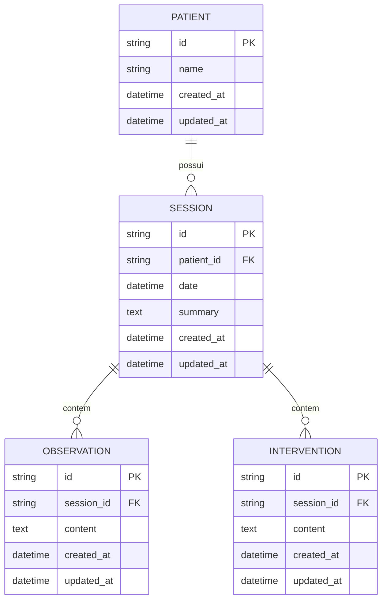

# REQ-01-01-02 — Editar Sessão Terapêutica

## Identificação

| Campo | Valor |
|-------|-------|
| **ID** | REQ-01-01-02 |
| **Capability** | CAP-01-01 Registro de Sessões |
| **Vision** | VISION-01 Registro da Prática Clínica |
| **Status** | ✅ implemented |
| **Prioridade** | Alta |
| **Data de Implementação** | 2024-01 |

---

## História do Usuário

Como **psicólogo clínico**,  
quero **editar uma sessão terapêutica já registrada**,  
para **corrigir informações, complementar o resumo ou ajustar a data do encontro clínico**.

---

## Contexto

A sessão é um elemento dinâmico da memória clínica. Muitas vezes, o terapeuta inicia um registro durante o atendimento e precisa refiná-lo ou corrigi-lo após um período de reflexão.

Este requisito garante que o registro clínico seja flexível o suficiente para acompanhar o processo de elaboração do profissional, sem perder a integridade da relação com o paciente. A edição deve seguir o padrão de Tecnologia Silenciosa, ocorrendo preferencialmente de forma "inline" ou via fragmento HTMX.

---

## Descrição Funcional

O sistema deve permitir a alteração dos dados de uma sessão existente. As modificações permitidas incluem:

- **Data da sessão**: Ajuste cronológico caso o registro tenha sido feito com data retroativa incorreta.
- **Resumo da sessão**: Atualização do conteúdo narrativo do encontro.

Ao salvar as alterações, o campo `updated_at` deve ser atualizado automaticamente para garantir a rastreabilidade da informação.

### Fluxo de Edição

```text
Usuário visualiza perfil do paciente ou detalhe da sessão
↓
Clica "Editar"
↓
Sistema retorna formulário de edição (HTMX)
↓
Usuário altera dados
↓
Clica "Salvar" ou "Cancelar"
↓
Salvar: Atualiza dados e retorna visualização
Cancelar: Descarta alterações
```

### Dados da Sessão (Edição)

#### Campos Editáveis
- **Date**: Deve ser uma data válida
- **Summary**: Campo de texto livre para o resumo clínico

#### Campos Imutáveis
- **ID**: O identificador único da sessão não muda
- **PatientID**: Uma sessão não pode ser movida de um paciente para outro
- **CreatedAt**: A data original de criação do registro deve ser preservada

---

## Interface de Usuário

### Formulário de Edição

Localização: `/sessions/{id}/edit` (fragmento HTMX)

Componente: `web/components/session/edit_form.templ`

```
┌─────────────────────────────────────────────────┐
│ ← Editar Sessão                                 │
│ Paciente: Maria da Silva                        │
├─────────────────────────────────────────────────┤
│                                                 │
│ Data da Sessão *                                │
│ ┌─────────────────────────────────────────┐     │
│ │ 15/01/2024                              │     │
│ └─────────────────────────────────────────┘     │
│                                                 │
│ Resumo da Sessão                                │
│ ┌─────────────────────────────────────────┐     │
│ │ Texto em tipografia serif para...       │     │
│ │ facilitar a leitura e escrita...        │     │
│ │ reflexiva do terapeuta.                 │     │
│ └─────────────────────────────────────────┘     │
│                                                 │
│ [Cancelar] [Salvar Alterações]                  │
│                                                 │
└─────────────────────────────────────────────────┘
```

### Estilo (Tecnologia Silenciosa)

A edição deve ocorrer de forma integrada ao prontuário:

- **Edição Inline**: Ao clicar em editar, o texto transforma-se em campo de entrada no mesmo local
- **Tipografia**: O campo "Resumo" usa obrigatoriamente a fonte Source Serif 4 (text-xl) para manter a imersão
- **Visual (Silent Input)**:
  - Inputs sem bordas agressivas (apenas border-b sutil)
  - Fundo bg-white para os campos ativos
  - Padding generoso para facilitar o toque e a leitura

---

## Diagrama de Arquitetura C4 (Nível Componentes)

```mermaid
C4Component
title Arquitetura de Edição de Sessão - Nível Componentes

Container_Boundary(web, "Web Layer") {
    Component(sessionHandler, "SessionHandler", "Go Handler", "Processa requisições HTTP")
    Component(editSession, "EditSession", "Method", "GET /sessions/{id}/edit")
    Component(updateSession, "UpdateSession", "Method", "PUT /sessions/{id}")
}

Container_Boundary(components, "UI Components") {
    Component(editForm, "SessionEditForm", "Templ Component", "Formulário de edição")
    Component(sessionView, "SessionView", "Templ Component", "Visualização da sessão")
}

Container_Boundary(application, "Application Layer") {
    Component(sessionService, "SessionService", "Service", "Lógica de negócio")
    Component(updateInput, "UpdateSessionInput", "DTO", "Dados validados")
}

Container_Boundary(domain, "Domain Layer") {
    Component(sessionEntity, "Session", "Entity", "Entidade de domínio")
}

Container_Boundary(infrastructure, "Infrastructure Layer") {
    Component(sessionRepo, "SessionRepository", "Repository", "Persistência SQLite")
    Component(db, "SQLite DB", "Database", "Banco de dados")
}

Rel(web, sessionHandler, "Usa")
Rel(sessionHandler, editSession, "Chama para GET /sessions/{id}/edit")
Rel(sessionHandler, updateSession, "Chama para PUT /sessions/{id}")
Rel(editSession, editForm, "Renderiza")
Rel(editSession, sessionService, "Chama para obter sessão")
Rel(updateSession, sessionService, "Chama para atualizar")
Rel(sessionService, updateInput, "Valida e sanitiza")
Rel(sessionService, sessionEntity, "Atualiza campos")
Rel(sessionService, sessionRepo, "Persiste via")
Rel(sessionRepo, db, "Executa SQL")
Rel(updateSession, sessionView, "Retorna após salvar")

UpdateLayoutConfig($c4ShapeInRow="3", $c4BoundaryInRow="1")
```

---

## Fluxo de Dados (Sequence Diagram)

```mermaid
sequenceDiagram
    actor Usuário
    participant Browser
    participant SessionHandler as SessionHandler\n(web/handlers)
    participant EditForm as SessionEditForm\n(components/session)
    participant SessionService as SessionService\n(application/services)
    component UpdateInput as UpdateSessionInput\n(application/services)
    participant Session as Session\n(domain/session)
    participant SessionRepo as SessionRepository\n(infrastructure/sqlite)
    participant SQLite as SQLite DB

    %% Fluxo GET /sessions/{id}/edit
    Usuário->>Browser: Clica "Editar"
    Browser->>SessionHandler: GET /sessions/{id}/edit
    SessionHandler->>SessionService: GetSessionByID(ctx, id)
    SessionService->>SessionRepo: FindByID(ctx, id)
    SessionRepo->>SQLite: SELECT * FROM sessions WHERE id = ?
    SQLite-->>SessionRepo: Row
    SessionRepo-->>SessionService: *Session
    SessionService-->>SessionHandler: *Session
    SessionHandler->>EditForm: Render(SessionEditFormData)
    EditForm-->>Browser: HTML com formulário
    Browser-->>Usuário: Exibe formulário de edição

    %% Fluxo PUT /sessions/{id}
    Usuário->>Browser: Altera dados e clica "Salvar"
    Browser->>SessionHandler: PUT /sessions/{id} (form data)
    SessionHandler->>SessionHandler: ParseForm()
    SessionHandler->>SessionService: UpdateSession(ctx, id, input)
    SessionService->>UpdateInput: Sanitize()
    SessionService->>UpdateInput: Validate()
    UpdateInput-->>SessionService: ✓ Dados válidos
    SessionService->>Session: Update(date, summary)
    Session->>Session: Atualiza UpdatedAt
    Session-->>SessionService: *Session
    SessionService->>SessionRepo: Update(ctx, session)
    SessionRepo->>SQLite: UPDATE sessions SET ...
    SQLite-->>SessionRepo: ✓ Sucesso
    SessionRepo-->>SessionService: nil
    SessionService-->>SessionHandler: *Session, nil
    SessionHandler->>Browser: Fragmento atualizado (HTMX)
    Browser-->>Usuário: Exibe sessão com dados atualizados

    %% Fluxo Cancelar
    Usuário->>Browser: Clica "Cancelar"
    Browser->>SessionHandler: GET /sessions/{id}
    SessionHandler->>SessionHandler: Show()
    SessionHandler-->>Browser: Fragmento de visualização
    Browser-->>Usuário: Restaura visão original
```

---

## Endpoints

| Método | Rota | Handler | Descrição |
|--------|------|---------|-----------|
| `GET` | `/sessions/{id}` | `Show` | Visualização da sessão |
| `GET` | `/sessions/{id}/edit` | `EditSession` | Formulário de edição (fragmento HTMX) |
| `PUT` | `/sessions/{id}` | `UpdateSession` | Atualiza sessão e retorna fragmento |

---

## Componentes UI

| Componente | Arquivo | Descrição |
|------------|---------|-----------|
| `SessionEditForm` | `web/components/session/edit_form.templ` | Formulário de edição de sessão |
| `SessionView` | `web/components/session/view.templ` | Visualização da sessão |
| `EditSessionWizard` | `web/components/session/edit_session_wizard.templ` | Wizard de edição passo a passo |
| `Shell` | `web/components/layout/shell_layout.templ` | Layout principal |

---

## Modelo de Dados

### Entidade de Domínio (internal/domain/session/session.go)

```go
type Session struct {
    ID        string    `json:"id"`
    PatientID string    `json:"patient_id"`
    Date      time.Time `json:"date"`
    Summary   string    `json:"summary"`
    CreatedAt time.Time `json:"created_at"`
    UpdatedAt time.Time `json:"updated_at"`
}

func (s *Session) Update(date time.Time, summary string) {
    s.Date = date
    s.Summary = summary
    s.UpdatedAt = time.Now()
}
```

### SQL Schema (SQLite)

```sql
-- Tabela principal
CREATE TABLE sessions (
    id TEXT PRIMARY KEY,
    patient_id TEXT NOT NULL,
    date DATETIME NOT NULL,
    summary TEXT,
    created_at DATETIME DEFAULT CURRENT_TIMESTAMP,
    updated_at DATETIME DEFAULT CURRENT_TIMESTAMP,
    FOREIGN KEY (patient_id) REFERENCES patients(id) ON DELETE CASCADE
);

-- Índices
CREATE INDEX idx_sessions_patient_id ON sessions(patient_id);
CREATE INDEX idx_sessions_date ON sessions(date DESC);
```

---

## Diagrama ER



---

## Arquivos Implementados

| Caminho | Descrição |
|---------|-----------|
| `internal/web/handlers/session_handler.go` | Handler HTTP com métodos EditSession (GET) e UpdateSession (PUT) |
| `internal/application/services/session_service.go` | Serviço com método UpdateSession e validações |
| `internal/infrastructure/repository/sqlite/session_repository.go` | Repositório com método Update |
| `internal/domain/session/session.go` | Entidade de domínio com método Update |
| `web/components/session/edit_form.templ` | Componente UI do formulário de edição |
| `web/components/session/edit_session_wizard.templ` | Wizard de edição de sessão |

---

## Critérios de Aceitação

### CA-01: Pré-preenchimento do Formulário

- [x] O formulário de edição deve vir pré-preenchido com os dados atuais da sessão
- [x] Campos devem refletir o estado atual do banco de dados

### CA-02: Atualização via HTMX

- [x] A edição deve ser realizada via HTMX
- [x] Atualizar apenas o componente da sessão
- [x] Não recarregar o Layout principal ou a Sidebar
- [x] Usar fragmentos para resposta

### CA-03: Validação de Dados

- [x] Validar que o campo "Data" seja uma data válida
- [x] Impedir alteração do `patient_id` (campos ocultos ou validação)
- [x] Exibir mensagem de erro se validação falhar

### CA-04: Timestamp de Atualização

- [x] O campo `updated_at` na tabela `sessions` deve ser atualizado
- [x] Usar timestamp do momento do salvamento
- [x] Atualização automática via método Update da entidade

### CA-05: Imutabilidade de Campos

- [x] O `ID` não pode ser alterado
- [x] O `patient_id` não pode ser alterado
- [x] O `created_at` deve ser preservado

### CA-06: Tipografia e Estilo

- [x] Campo "Resumo" deve usar Source Serif 4 (text-xl)
- [x] Estilo de "escrita fluida" mantido
- [x] Bordas sutis (border-b apenas)
- [x] Fundo bg-white para campos ativos

### CA-07: Fluxo de Cancelamento

- [x] Botão "Cancelar" deve descartar alterações
- [x] Restaurar visão original sem salvar
- [x] Retornar fragmento de visualização (não formulário)

### CA-08: Feedback Visual

- [x] Indicador visual durante edição (campos ativos)
- [x] Estados dos botões (enabled/disabled)
- [x] Transições suaves entre modos (visualização ↔ edição)

---

## Integração com Outros Requisitos

- **REQ-01-01-01**: Criar Sessão (Origem dos dados)
- **REQ-01-01-03**: Listar Sessões (Lista reflete alterações)
- **REQ-01-02-01**: Adicionar Observação (Observações vinculadas à sessão)
- **REQ-02-01-01**: Visualizar Histórico (Timeline reflete alterações)

---

## Fora do Escopo

Este requisito **não inclui**:

- [ ] Histórico de versões de cada edição (Audit Log/Versioning)
- [ ] Exclusão da sessão (REQ-01-01-04)
- [ ] Edição de observações ou intervenções vinculadas (REQ-01-02-02 e REQ-01-03-02)
- [ ] Notificações de alteração
- [ ] Edição em lote de múltiplas sessões

---

## Resultado Esperado

Após a implementação deste requisito, o sistema permite:

✅ Editar dados de sessões existentes  
✅ Corrigir informações cadastrais da sessão  
✅ Complementar o resumo clínico  
✅ Editar de forma fluida via HTMX (sem reload)  
✅ Manter consistência tipográfica e visual

Isso garante que o **registro clínico seja flexível** e acompanhe o processo de elaboração do profissional.

---

## Dependências

- REQ-01-00-01 (Criar Paciente) implementado
- REQ-01-01-01 (Criar Sessão) implementado
- Sistema de banco SQLite configurado
- Sistema de templates Templ compilado
- HTMX configurado para atualizações parciais

## Requisitos Habilitados

Este requisito habilita diretamente:

- Fluxos clínicos que dependem de dados atualizados das sessões
- Análise de evolução terapêutica com dados corretos
