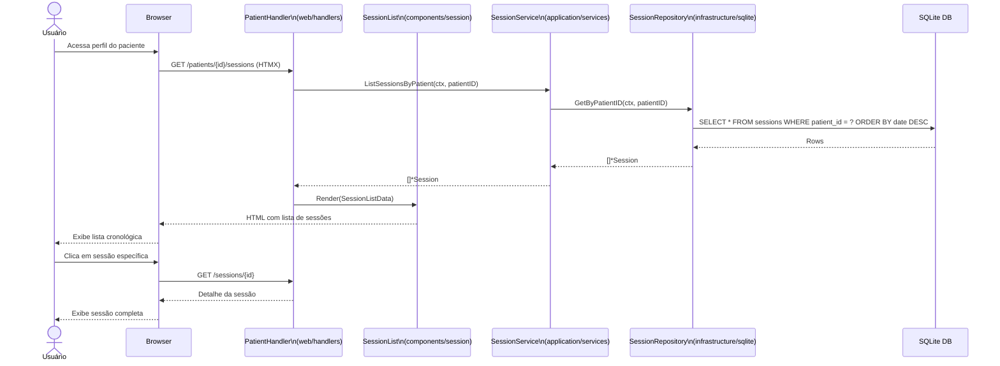
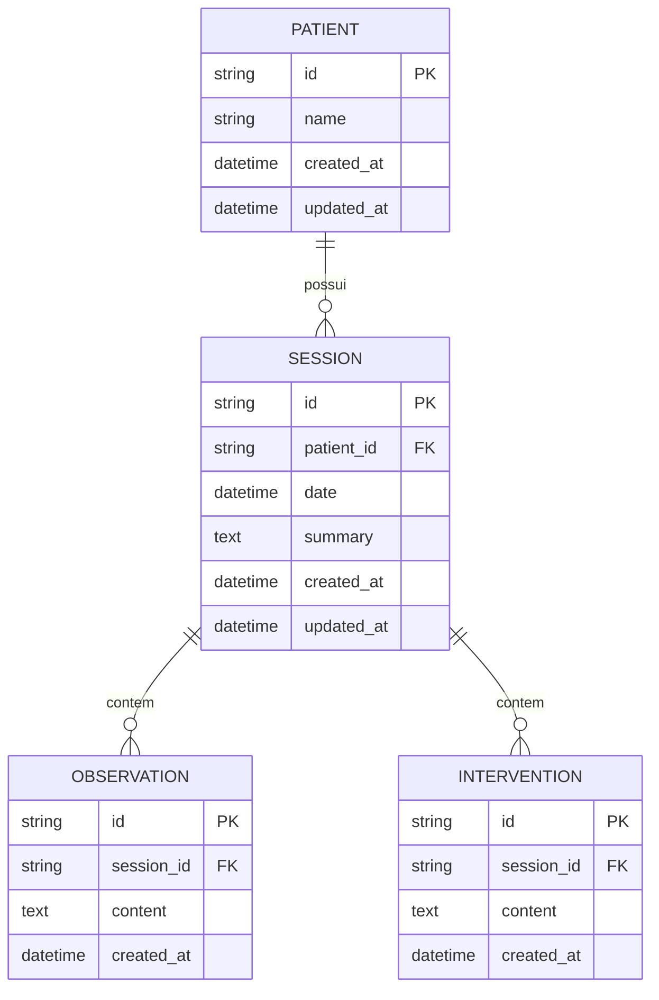

# REQ-01-01-03 — Listar Sessões de um Paciente

## Identificação

| Campo | Valor |
|-------|-------|
| **ID** | REQ-01-01-03 |
| **Capability** | CAP-01-01 Registro de Sessões |
| **Vision** | VISION-01 Registro da Prática Clínica |
| **Status** | ✅ implemented |
| **Prioridade** | Alta |
| **Data de Implementação** | 2024-01 |

---

## História do Usuário

Como **psicólogo clínico**,  
quero **visualizar uma lista cronológica das sessões de um paciente específico**,  
para **ter uma visão rápida da frequência dos atendimentos e selecionar uma sessão para consulta ou edição**.

---

## Contexto

Após selecionar um paciente na lista global, o terapeuta precisa de um "índice" de encontros. Esta lista não deve ser apenas uma tabela fria, mas uma linha do tempo sutil que prepare o profissional para a imersão na memória clínica longitudinal (VISION-02).

A lista serve como ponto de entrada para acessar o detalhamento de cada sessão e suas observações/intervenções associadas.

---

## Descrição Funcional

O sistema deve listar todas as sessões associadas a um `patient_id`.

- **Ordenação**: Por padrão, as sessões mais recentes aparecem primeiro (ordem cronológica inversa)
- **Dados exibidos**: Data da sessão, um pequeno resumo (se houver) e status (ex: finalizada, em aberto)
- **Interação**: Cada item da lista deve ser um link para o detalhe da sessão (`/sessions/{id}`)
- **HTMX**: O carregamento da lista deve ocorrer via HTMX ao abrir o perfil do paciente, sem recarregar a barra lateral

### Fluxo de Listagem

```text
Usuário acessa o perfil do paciente
↓
Sistema dispara hx-get para /patients/{id}/sessions
↓
Backend recupera as sessões do SQLite (via SessionRepository)
↓
Backend renderiza o fragmento SessionList via templ
↓
Fragmento é injetado na área principal do perfil do paciente
```

---

## Interface de Usuário

### Lista de Sessões

Localização: `/patients/{id}/sessions` (fragmento HTMX)

Componente: `web/components/session/session_list.templ`

```
┌─────────────────────────────────────────────────┐
│ Sessões                             [+ Nova]  │
├─────────────────────────────────────────────────┤
│                                                 │
│ ┌─────────────────────────────────────────┐     │
│ │ 📅 15/01/2024                           │     │
│ │ Sessão de follow-up sobre ansiedade...  │     │
│ │ └── 2 observações | 1 intervenção       │     │
│ └─────────────────────────────────────────┘     │
│                                                 │
│ ┌─────────────────────────────────────────┐     │
│ │ 📅 08/01/2024                           │     │
│ │ Primeira sessão após retorno de férias  │     │
│ │ └── 3 observações                       │     │
│ └─────────────────────────────────────────┘     │
│                                                 │
│ ┌─────────────────────────────────────────┐     │
│ │ 📅 01/01/2024                           │     │
│ │ Sem resumo                              │     │
│ │ └── 0 observações                       │     │
│ └─────────────────────────────────────────┘     │
│                                                 │
└─────────────────────────────────────────────────┘
```

### Estilo (Tecnologia Silenciosa)

Seguindo a filosofia de Tecnologia Silenciosa:

- **Tipografia**: As datas e resumos devem usar Inter (Sans) para clareza visual de índice
- **Design**: Lista limpa, com muito espaço em branco (p-4 ou p-6 entre itens)
- **Visual**: Uso de bordas inferiores sutis (`border-b border-gray-50`) para separar os encontros
- **Botão de Ação**: Deve haver um link claro de "Nova Sessão" no topo desta lista

---

## Diagrama de Arquitetura C4 (Nível Componentes)

```mermaid
C4Component
title Arquitetura de Listagem de Sessões - Nível Componentes

Container_Boundary(web, "Web Layer") {
    Component(sessionHandler, "SessionHandler", "Go Handler", "Processa requisições HTTP")
    Component(listSessions, "ListSessions", "Method", "GET /patients/{id}/sessions")
}

Container_Boundary(components, "UI Components") {
    Component(sessionList, "SessionList", "Templ Component", "Lista de sessões")
    Component(sessionListItem, "SessionListItem", "Templ Component", "Item individual")
}

Container_Boundary(application, "Application Layer") {
    Component(sessionService, "SessionService", "Service", "Lógica de negócio")
}

Container_Boundary(domain, "Domain Layer") {
    Component(sessionEntity, "Session", "Entity", "Entidade de domínio")
}

Container_Boundary(infrastructure, "Infrastructure Layer") {
    Component(sessionRepo, "SessionRepository", "Repository", "Persistência SQLite")
    Component(db, "SQLite DB", "Database", "Banco de dados")
}

Rel(web, sessionHandler, "Usa")
Rel(sessionHandler, listSessions, "Chama para GET /patients/{id}/sessions")
Rel(listSessions, sessionService, "Chama para listar")
Rel(sessionService, sessionRepo, "Busca via")
Rel(sessionRepo, db, "Executa SQL")
Rel(sessionRepo, sessionService, "Retorna []*Session")
Rel(sessionService, listSessions, "Retorna sessões")
Rel(listSessions, sessionList, "Renderiza")
Rel(sessionList, sessionListItem, "Renderiza itens")

UpdateLayoutConfig($c4ShapeInRow="3", $c4BoundaryInRow="1")
```

---

## Fluxo de Dados (Sequence Diagram)



---

## Endpoints

| Método | Rota | Handler | Descrição |
|--------|------|---------|-----------|
| `GET` | `/patients/{id}/sessions` | `ListSessions` | Lista sessões do paciente (fragmento HTMX) |
| `GET` | `/sessions/{id}` | `Show` | Visualização completa da sessão |

---

## Componentes UI

| Componente | Arquivo | Descrição |
|------------|---------|-----------|
| `SessionList` | `web/components/session/session_list.templ` | Lista completa de sessões de um paciente |
| `SessionListItem` | `web/components/session/session_list_item.templ` | Item individual da lista |
| `SessionCard` | `web/components/session/session_card.templ` | Card resumido da sessão |
| `Shell` | `web/components/layout/shell_layout.templ` | Layout principal |

---

## Modelo de Dados

### Entidade de Domínio (internal/domain/session/session.go)

```go
type Session struct {
    ID        string    `json:"id"`
    PatientID string    `json:"patient_id"`
    Date      time.Time `json:"date"`
    Summary   string    `json:"summary"`
    CreatedAt time.Time `json:"created_at"`
    UpdatedAt time.Time `json:"updated_at"`
}

func (s *Session) GetDisplaySummary() string {
    if s.Summary == "" {
        return "Sem resumo"
    }
    // Retorna resumo truncado para preview
    return Truncate(s.Summary, 100)
}
```

### SQL Schema (SQLite)

```sql
-- Tabela principal
CREATE TABLE sessions (
    id TEXT PRIMARY KEY,
    patient_id TEXT NOT NULL,
    date DATETIME NOT NULL,
    summary TEXT,
    created_at DATETIME DEFAULT CURRENT_TIMESTAMP,
    updated_at DATETIME DEFAULT CURRENT_TIMESTAMP,
    FOREIGN KEY (patient_id) REFERENCES patients(id) ON DELETE CASCADE
);

-- Índices otimizados para listagem
CREATE INDEX idx_sessions_patient_id ON sessions(patient_id);
CREATE INDEX idx_sessions_date ON sessions(date DESC);
CREATE INDEX idx_sessions_patient_date ON sessions(patient_id, date DESC);
```

---

## Diagrama ER



---

## Arquivos Implementados

| Caminho | Descrição |
|---------|-----------|
| `internal/web/handlers/session_handler.go` | Handler HTTP com método ListSessions |
| `internal/application/services/session_service.go` | Serviço com método ListSessionsByPatient |
| `internal/infrastructure/repository/sqlite/session_repository.go` | Repositório com método GetByPatientID |
| `internal/domain/session/session.go` | Entidade de domínio Session |
| `web/components/session/session_list.templ` | Componente UI da lista de sessões |
| `web/components/session/session_list_item.templ` | Componente UI do item da lista |

---

## Critérios de Aceitação

### CA-01: Ordenação Cronológica

- [x] A lista deve exibir todas as sessões do paciente em ordem decrescente de data
- [x] Sessões mais recentes aparecem no topo
- [x] Ordenação por `date DESC`, com fallback para `created_at DESC`

### CA-02: Estado Vazio

- [x] Se o paciente não tiver sessões, exibir mensagem amigável
- [x] Mensagem: "Nenhuma sessão registrada"
- [x] Incluir convite para criar a primeira sessão
- [x] Botão visível para iniciar nova sessão

### CA-03: Navegação HTMX

- [x] A navegação para o detalhe da sessão deve ser instantânea
- [x] Usar hx-boost ou hx-get para transições suaves
- [x] Manter estado da sidebar durante navegação

### CA-04: Responsividade

- [x] Interface adaptar densidade da lista para dispositivos móveis
- [x] Touch targets adequados (mínimo 44px)
- [x] Scroll suave em listas longas

### CA-05: Preservação de Estado

- [x] O carregamento da lista não deve quebrar o estado da Sidebar
- [x] Lista carregada via HTMX como fragmento
- [x] Atualização parcial do Main Canvas apenas

### CA-06: Preview de Conteúdo

- [x] Exibir resumo truncado (preview) quando disponível
- [x] Indicar contagem de observações por sessão
- [x] Indicar contagem de intervenções por sessão
- [x] Badge de status quando aplicável

### CA-07: Feedback Visual

- [x] Hover effects sutis nos itens da lista
- [x] Indicador visual de sessão selecionada
- [x] Loading state durante carregamento HTMX

---

## Integração com Outros Requisitos

- **REQ-01-00-01**: Criar Paciente (Paciente deve existir)
- **REQ-01-01-01**: Criar Sessão (Origem das sessões listadas)
- **REQ-01-01-02**: Editar Sessão (Acesso à edição via lista)
- **REQ-01-02-01**: Adicionar Observação (Observações contadas na lista)
- **REQ-02-01-01**: Visualizar Histórico (Timeline integra dados da lista)

---

## Fora do Escopo

Este requisito **não inclui**:

- [ ] Filtros por intervalo de datas (será tratado em REQ-02-02-01)
- [ ] Paginação (inicialmente, carregar todas; paginação será adicionada se houver > 50 sessões)
- [ ] Exportação da lista (REQ-07-02-01)
- [ ] Busca dentro das sessões do paciente
- [ ] Agrupamento por mês/ano
- [ ] Estatísticas de frequência

---

## Resultado Esperado

Após a implementação deste requisito, o sistema permite:

✅ Visualizar lista cronológica de sessões de um paciente  
✅ Acessar rapidamente o detalhe de cada sessão  
✅ Identificar sessões com mais ou menos conteúdo  
✅ Navegar fluidamente entre sessões sem recarregar  
✅ Iniciar nova sessão a partir da lista

Isso estabelece a **visão de índice** necessária para o acompanhamento terapêutico longitudinal.

---

## Dependências

- REQ-01-00-01 (Criar Paciente) implementado
- REQ-01-01-01 (Criar Sessão) implementado
- Sistema de banco SQLite configurado
- Sistema de templates Templ compilado
- HTMX configurado para atualizações parciais

## Requisitos Habilitados

Este requisito habilita diretamente:

- REQ-01-01-02 (Editar Sessão) - Acesso via lista
- REQ-02-01-01 (Visualizar Histórico) - Consome mesmos dados
- Fluxos de navegação clínica do dia a dia
