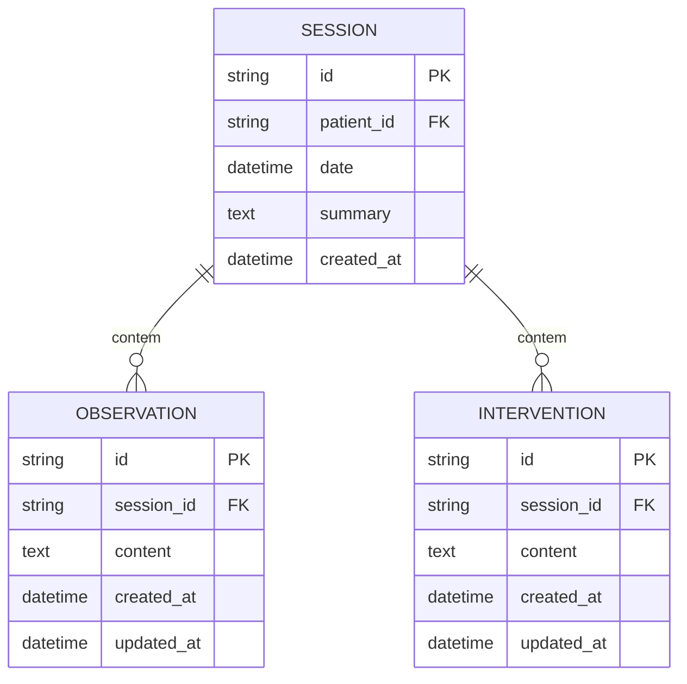

# REQ-01-02-01 — Adicionar Observação Clínica

## Identificação

| Campo | Valor |
|-------|-------|
| **ID** | REQ-01-02-01 |
| **Capability** | CAP-01-02 Registro de Observações Clínicas |
| **Vision** | VISION-01 Registro da Prática Clínica |
| **Status** | ✅ implemented |
| **Prioridade** | Alta |
| **Data de Implementação** | 2024-01 |

---

## História do Usuário

Como **psicólogo clínico**,  
quero **registrar uma percepção clínica específica durante ou após uma sessão**,  
para **documentar padrões e insights que serão usados na análise da evolução do paciente**.

---

## Contexto

Diferente do resumo da sessão (que é narrativo), a observação clínica é uma unidade atômica de percepção técnica. Ela deve ser registrada de forma rápida para não interromper o fluxo de pensamento do terapeuta.

No banco de dados, ela pertence a uma `Session`. Cada observação é um registro independente que compõe o prontuário longitudinal do paciente.

---

## Descrição Funcional

O sistema deve permitir a adição de múltiplas observações em uma única sessão.

- **Entrada**: Texto livre descrevendo a percepção clínica
- **Comportamento HTMX**: A adição de uma observação deve ser feita via `POST` assíncrono, atualizando apenas a lista de observações na tela, sem recarregar a página
- **Feedback**: O campo de texto deve ser limpo após o envio bem-sucedido
- **Posicionamento**: Novas observações aparecem no topo da lista (mais recentes primeiro)

### Fluxo de Adição

```text
Terapeuta está na tela de uma Sessão ativa
↓
Digita a percepção no campo "Nova Observação"
↓
Pressiona "Adicionar" (ou atalho de teclado)
↓
Sistema valida o conteúdo e persiste no SQLite
↓
Nova observação aparece no topo da lista via HTMX
↓
Campo de entrada é limpo automaticamente
```

### Dados da Observação

#### Campos Obrigatórios
- **SessionID**: Vínculo com a sessão atual
- **Content**: O texto da observação clínica

#### Campos Gerados Automaticamente
- **ID**: UUID único
- **CreatedAt**: Data e hora do registro
- **UpdatedAt**: Timestamp para rastreabilidade de edições

---

## Interface de Usuário

### Formulário de Observação

Localização: Embutido na visualização da sessão

Componentes: `web/components/session/observation_form.templ`, `web/components/session/observation_form_inline.templ`

```
┌─────────────────────────────────────────────────┐
│ Observações Clínicas                            │
├─────────────────────────────────────────────────┤
│                                                 │
│ ┌─────────────────────────────────────────┐     │
│ │ 💭 Digite a observação clínica...      │     │
│ │                                         │     │
│ │                                         │     │
│ └─────────────────────────────────────────┘     │
│                                     [Adicionar] │
│                                                 │
│ ━━━━━━━━━━━━━━━━━━━━━━━━━━━━━━━━━━━━━━━━━━━━━━━ │
│                                                 │
│ ┌─────────────────────────────────────────┐     │
│ │ 👁️ Paciente demonstrou aumento de     │     │
│ │    ansiedade ao falar sobre trabalho   │     │
│ │    • Agora • Editar                    │     │
│ └─────────────────────────────────────────┘     │
│                                                 │
│ ┌─────────────────────────────────────────┐     │
│ │ 👁️ Mantém contato visual consistente    │     │
│ │    durante as intervenções             │     │
│ │    • 15 min atrás • Editar             │     │
│ └─────────────────────────────────────────┘     │
│                                                 │
└─────────────────────────────────────────────────┘
```

### Estilo (Tecnologia Silenciosa)

Seguindo o Design System:

- **Tipografia**: O campo de digitação (textarea) deve usar a fonte **Source Serif** para promover a imersão clínica
- **Localização**: Bloco lateral ou inferior dentro da visualização da sessão
- **Estilo**: "Input silent" — sem bordas pesadas, assemelhando-se a uma folha de papel
- **Observações Existentes**: Renderizadas com ícone de olho (👁️) e tipografia Source Serif

---

## Diagrama de Arquitetura C4 (Nível Componentes)

```mermaid
C4Component
title Arquitetura de Adição de Observação - Nível Componentes

Container_Boundary(web, "Web Layer") {
    Component(sessionHandler, "SessionHandler", "Go Handler", "Processa requisições HTTP")
    Component(createObservation, "CreateObservation", "Method", "POST /sessions/{id}/observations")
}

Container_Boundary(components, "UI Components") {
    Component(obsForm, "ObservationForm", "Templ Component", "Formulário de observação")
    Component(obsFormInline, "ObservationFormInline", "Templ Component", "Formulário inline")
    Component(obsItem, "ObservationItem", "Templ Component", "Item de observação")
}

Container_Boundary(application, "Application Layer") {
    Component(obsService, "ObservationService", "Service", "Lógica de negócio")
    Component(createInput, "CreateObservationInput", "DTO", "Dados validados")
}

Container_Boundary(domain, "Domain Layer") {
    Component(obsEntity, "Observation", "Entity", "Entidade de domínio")
    Component(sessionEntity, "Session", "Entity", "Sessão pai")
}

Container_Boundary(infrastructure, "Infrastructure Layer") {
    Component(obsRepo, "ObservationRepository", "Repository", "Persistência SQLite")
    Component(db, "SQLite DB", "Database", "Banco de dados")
}

Rel(web, sessionHandler, "Usa")
Rel(sessionHandler, createObservation, "Chama para POST /sessions/{id}/observations")
Rel(createObservation, obsService, "Chama para criar")
Rel(obsService, createInput, "Valida e sanitiza")
Rel(obsService, obsEntity, "Cria nova")
Rel(obsEntity, sessionEntity, "Vinculada a")
Rel(obsService, obsRepo, "Persiste via")
Rel(obsRepo, db, "Executa SQL")
Rel(createObservation, obsItem, "Retorna fragmento")

UpdateLayoutConfig($c4ShapeInRow="3", $c4BoundaryInRow="1")
```

---

## Fluxo de Dados (Sequence Diagram)

```mermaid
sequenceDiagram
    actor Usuário
    participant Browser
    participant SessionHandler as SessionHandler\n(web/handlers)
    participant ObsForm as ObservationForm\n(components/session)
    participant ObsService as ObservationService\n(application/services)
    component CreateInput as CreateObservationInput\n(application/services)
    participant Observation as Observation\n(domain/observation)
    participant ObsRepo as ObservationRepository\n(infrastructure/sqlite)
    participant SQLite as SQLite DB

    %% Fluxo POST /sessions/{id}/observations
    Usuário->>Browser: Digita observação e clica "Adicionar"
    Browser->>SessionHandler: POST /sessions/{id}/observations (form data)
    SessionHandler->>SessionHandler: ParseForm()
    SessionHandler->>SessionHandler: Extrai session_id da URL
    SessionHandler->>ObsService: CreateObservation(ctx, sessionID, input)
    ObsService->>CreateInput: Sanitize()
    ObsService->>CreateInput: Validate()
    CreateInput-->>ObsService: ✓ Dados válidos
    ObsService->>Observation: NewObservation(sessionID, content)
    Observation->>Observation: uuid.New()
    Observation->>Observation: time.Now() (CreatedAt/UpdatedAt)
    Observation-->>ObsService: *Observation
    ObsService->>ObsRepo: Save(ctx, observation)
    ObsRepo->>SQLite: INSERT INTO observations (...)
    SQLite-->>ObsRepo: ✓ Sucesso
    ObsRepo-->>ObsService: nil
    ObsService-->>SessionHandler: *Observation, nil
    SessionHandler->>ObsForm: Render(ObservationItemData)
    ObsForm-->>Browser: HTML do novo item (fragmento)
    Browser-->>Browser: hx-swap="afterbegin" na lista
    Browser-->>Browser: Limpa campo de entrada
    Browser-->>Usuário: Exibe nova observação no topo da lista
```

---

## Endpoints

| Método | Rota | Handler | Descrição |
|--------|------|---------|-----------|
| `POST` | `/sessions/{id}/observations` | `CreateObservation` | Cria nova observação (HTMX) |
| `GET` | `/sessions/{id}` | `Show` | Visualização da sessão com lista de observações |

---

## Componentes UI

| Componente | Arquivo | Descrição |
|------------|---------|-----------|
| `ObservationForm` | `web/components/session/observation_form.templ` | Formulário completo de observação |
| `ObservationFormInline` | `web/components/session/observation_form_inline.templ` | Formulário inline para adição rápida |
| `ObservationItem` | `web/components/session/observation_item.templ` | Item individual de observação |
| `ObservationList` | `web/components/session/observation_list.templ` | Lista de observações da sessão |

---

## Modelo de Dados

### Entidade de Domínio (internal/domain/observation/observation.go)

```go
type Observation struct {
    ID        string    `json:"id"`
    SessionID string    `json:"session_id"`
    Content   string    `json:"content"`
    CreatedAt time.Time `json:"created_at"`
    UpdatedAt time.Time `json:"updated_at"`
}

func NewObservation(sessionID, content string) *Observation {
    return &Observation{
        ID:        uuid.New().String(),
        SessionID: sessionID,
        Content:   content,
        CreatedAt: time.Now(),
        UpdatedAt: time.Now(),
    }
}

func (o *Observation) Update(content string) {
    o.Content = content
    o.UpdatedAt = time.Now()
}
```

### SQL Schema (SQLite)

```sql
-- Tabela de observações
CREATE TABLE observations (
    id TEXT PRIMARY KEY,
    session_id TEXT NOT NULL,
    content TEXT NOT NULL,
    created_at DATETIME DEFAULT CURRENT_TIMESTAMP,
    updated_at DATETIME DEFAULT CURRENT_TIMESTAMP,
    FOREIGN KEY (session_id) REFERENCES sessions(id) ON DELETE CASCADE
);

-- Índices
CREATE INDEX idx_observations_session_id ON observations(session_id);
CREATE INDEX idx_observations_created_at ON observations(created_at DESC);
```

---

## Diagrama ER



---

## Arquivos Implementados

| Caminho | Descrição |
|---------|-----------|
| `internal/web/handlers/session_handler.go` | Handler HTTP com método CreateObservation |
| `internal/application/services/observation_service.go` | Serviço com método CreateObservation |
| `internal/infrastructure/repository/sqlite/observation_repository.go` | Repositório com método Save |
| `internal/domain/observation/observation.go` | Entidade de domínio e factory NewObservation |
| `web/components/session/observation_form.templ` | Componente UI do formulário de observação |
| `web/components/session/observation_form_inline.templ` | Componente UI do formulário inline |
| `web/components/session/observation_item.templ` | Componente UI do item de observação |
| `web/components/session/observation_list.templ` | Componente UI da lista de observações |

---

## Critérios de Aceitação

### CA-01: Vínculo com Sessão

- [x] A observação deve ser salva com sucesso vinculada ao `SessionID` correto
- [x] O vínculo é obrigatório (FK constraint no banco)
- [x] Sessão deve existir antes de criar observação

### CA-02: Validação de Conteúdo

- [x] Não deve ser possível salvar uma observação vazia
- [x] Conteúdo sanitizado (trim de espaços)
- [x] Limite de caracteres aplicado (se definido)

### CA-03: Atualização HTMX

- [x] A lista de observações deve ser atualizada instantaneamente via HTMX
- [x] Usar hx-swap="afterbegin" para adicionar no topo
- [x] Apenas a lista é atualizada, não a página inteira
- [x] Sidebar mantém seu estado

### CA-04: Limpeza do Campo

- [x] O campo de texto deve ser limpo automaticamente após sucesso
- [x] Transição suave de limpeza
- [x] Foco retorna ao campo para nova entrada

### CA-05: Tipografia

- [x] O campo de digitação deve usar obrigatoriamente a fonte **Source Serif**
- [x] Itens de observação exibidos em Source Serif
- [x] Tamanho de fonte adequado para leitura (text-lg ou text-xl)

### CA-06: Persistência

- [x] O registro deve ser persistido na tabela `observations` do SQLite
- [x] Timestamps gerados automaticamente
- [x] UUID gerado no domínio

### CA-07: Ordenação

- [x] Novas observações aparecem no topo da lista
- [x] Ordenação por `created_at DESC`
- [x] Relativo temporal amigável ("Agora", "5 min atrás")

---

## Integração com Outros Requisitos

- **REQ-01-01-01**: Criar Sessão (Sessão pai deve existir)
- **REQ-01-01-02**: Editar Sessão (Contexto de edição)
- **REQ-01-02-02**: Editar Observação (Ciclo de vida completo)
- **REQ-02-01-01**: Visualizar Histórico (Observações aparecem na timeline)
- **VISION-05**: Assistência Reflexiva (IA utiliza observações para insights)

---

## Fora do Escopo

Este requisito **não inclui**:

- [ ] Edição de observações (REQ-01-02-02)
- [ ] Exclusão de observações (REQ-01-02-03)
- [ ] Categorização ou tagging de observações
- [ ] Anexos ou mídia nas observações
- [ ] Observações privadas/ públicas
- [ ] Templates de observação pré-definidos
- [ ] Classificação automática por IA

---

## Resultado Esperado

Após a implementação deste requisito, o sistema permite:

✅ Registrar observações clínicas de forma rápida  
✅ Vincular observações à sessão correta  
✅ Visualizar lista de observações em tempo real  
✅ Manter fluidez do fluxo clínico (sem reloads)  
✅ Compor o prontuário longitudinal do paciente

Isso estabelece a **capacidade de registro atômico de percepções clínicas**, base para análise posterior.

---

## Dependências

- REQ-01-01-01 (Criar Sessão) implementado
- Sistema de banco SQLite configurado
- Sistema de templates Templ compilado
- HTMX configurado para atualizações parciais

## Requisitos Habilitados

Este requisito habilita diretamente:

- REQ-01-02-02 (Editar Observação)
- REQ-02-01-01 (Visualizar Histórico) - Consome observações
- VISION-05 (Assistência Reflexiva) - Dados para IA analisar
