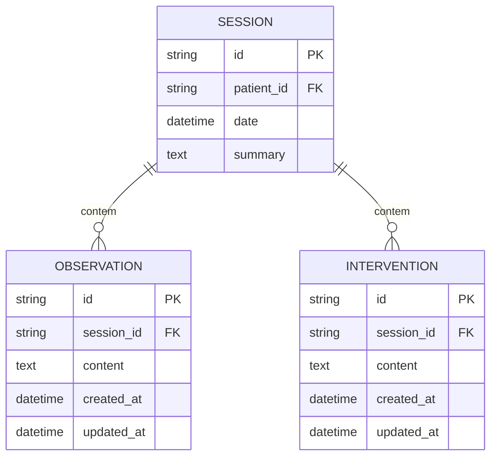

# REQ-01-02-02 — Editar Observação Clínica

## Identificação

| Campo | Valor |
|-------|-------|
| **ID** | REQ-01-02-02 |
| **Capability** | CAP-01-02 Registro de Observações Clínicas |
| **Vision** | VISION-01 Registro da Prática Clínica |
| **Status** | ✅ implemented |
| **Prioridade** | Alta |
| **Data de Implementação** | 2024-01 |

---

## História do Usuário

Como **psicólogo clínico**,  
quero **editar uma observação clínica registrada anteriormente**,  
para **corrigir erros de digitação, ajustar a terminologia técnica ou complementar uma percepção clínica**.

---

## Contexto

As observações são unidades atômicas de conhecimento. Embora devam ser registradas rapidamente para não interromper o fluxo clínico, o terapeuta deve ter a liberdade de "limpar" ou expandir essas notas durante o período de reflexão pós-sessão.

A edição deve ser fluida e ocorrer preferencialmente de forma "inline", mantendo o usuário no contexto da sessão.

---

## Descrição Funcional

O sistema deve permitir a alteração do conteúdo de uma observação existente.

- **Interface**: Ao clicar em editar, o texto da observação deve ser substituído por um campo de edição (textarea) no mesmo local
- **Persistência**: O sistema deve atualizar o conteúdo no SQLite e registrar o timestamp de modificação
- **Comportamento HTMX**: A troca entre o modo "leitura" e o modo "edição" deve ocorrer via troca de fragmentos HTMX, sem recarregamento de página

### Fluxo de Edição

```text
O usuário visualiza a lista de observações dentro de uma sessão
↓
Clica no ícone ou botão de "Editar" em uma observação específica
↓
HTMX (GET): O sistema substitui o componente ObservationItem pelo fragmento ObservationEditForm
↓
O usuário altera o texto
↓
O usuário clica em "Salvar"
↓
HTMX (PUT): O sistema envia os dados, atualiza o banco e retorna o fragmento ObservationItem atualizado
↓
A interface volta ao modo de leitura com o novo conteúdo
```

### Dados da Observação (Edição)

#### Campos Editáveis
- **Content**: O texto técnico da observação

#### Campos Imutáveis
- **ID**: O identificador único
- **SessionID**: A observação não pode ser movida para outra sessão por este requisito
- **CreatedAt**: A data original de criação deve ser preservada

---

## Interface de Usuário

### Formulário de Edição

Localização: `/observations/{id}/edit` (fragmento HTMX)

Componente: `web/components/session/observation_edit_form.templ`

```
┌─────────────────────────────────────────────────┐
│ 👁️ Editando Observação                          │
├─────────────────────────────────────────────────┤
│                                                 │
│ ┌─────────────────────────────────────────┐     │
│ │ Paciente demonstrou aumento de         │     │
│ │ ansiedade ao falar sobre trabalho.     │     │
│ │ Notar padrão de esquiva quando o       │     │
│ │ assunto é mencionado.                  │     │
│ └─────────────────────────────────────────┘     │
│                                                 │
│ [Cancelar]           [Salvar Alterações]        │
│                                                 │
└─────────────────────────────────────────────────┘
```

### Estilo (Tecnologia Silenciosa)

Seguindo o Design System Arandu:

- **Tipografia**: O campo de edição deve usar a fonte Source Serif 4 para manter a imersão na escrita clínica
- **Modo Edição**: O componente de edição deve ser discreto, removendo bordas desnecessárias (Silent Input)
- **Ações**: Botões pequenos e claros de "Salvar" e "Cancelar"
- **Transição**: Troca suave entre modo leitura e edição via HTMX

---

## Diagrama de Arquitetura C4 (Nível Componentes)

```mermaid
C4Component
title Arquitetura de Edição de Observação - Nível Componentes

Container_Boundary(web, "Web Layer") {
    Component(observationHandler, "ObservationHandler", "Go Handler", "Processa requisições HTTP")
    Component(getEditForm, "GetObservationEditForm", "Method", "GET /observations/{id}/edit")
    Component(updateObservation, "UpdateObservation", "Method", "PUT /observations/{id}")
}

Container_Boundary(components, "UI Components") {
    Component(editForm, "ObservationEditForm", "Templ Component", "Formulário de edição")
    Component(obsItem, "ObservationItem", "Templ Component", "Item de visualização")
}

Container_Boundary(application, "Application Layer") {
    Component(obsService, "ObservationService", "Service", "Lógica de negócio")
    Component(updateInput, "UpdateObservationInput", "DTO", "Dados validados")
}

Container_Boundary(domain, "Domain Layer") {
    Component(obsEntity, "Observation", "Entity", "Entidade de domínio")
}

Container_Boundary(infrastructure, "Infrastructure Layer") {
    Component(obsRepo, "ObservationRepository", "Repository", "Persistência SQLite")
    Component(db, "SQLite DB", "Database", "Banco de dados")
}

Rel(web, observationHandler, "Usa")
Rel(observationHandler, getEditForm, "Chama para GET /observations/{id}/edit")
Rel(observationHandler, updateObservation, "Chama para PUT /observations/{id}")
Rel(getEditForm, obsService, "Chama para obter observação")
Rel(getEditForm, editForm, "Renderiza")
Rel(updateObservation, obsService, "Chama para atualizar")
Rel(obsService, updateInput, "Valida e sanitiza")
Rel(obsService, obsEntity, "Atualiza")
Rel(obsService, obsRepo, "Persiste via")
Rel(obsRepo, db, "Executa SQL")
Rel(updateObservation, obsItem, "Retorna após salvar")

UpdateLayoutConfig($c4ShapeInRow="3", $c4BoundaryInRow="1")
```

---

## Fluxo de Dados (Sequence Diagram)

```mermaid
sequenceDiagram
    actor Usuário
    participant Browser
    participant ObservationHandler as ObservationHandler\n(web/handlers)
    participant EditForm as ObservationEditForm\n(components/session)
    participant ObsService as ObservationService\n(application/services)
    component UpdateInput as UpdateObservationInput\n(application/services)
    participant Observation as Observation\n(domain/observation)
    participant ObsRepo as ObservationRepository\n(infrastructure/sqlite)
    participant SQLite as SQLite DB

    %% Fluxo GET /observations/{id}/edit
    Usuário->>Browser: Clica "Editar" em observação
    Browser->>ObservationHandler: GET /observations/{id}/edit
    ObservationHandler->>ObsService: GetObservationByID(ctx, id)
    ObsService->>ObsRepo: FindByID(ctx, id)
    ObsRepo->>SQLite: SELECT * FROM observations WHERE id = ?
    SQLite-->>ObsRepo: Row
    ObsRepo-->>ObsService: *Observation
    ObsService-->>ObservationHandler: *Observation
    ObservationHandler->>EditForm: Render(ObservationEditFormData)
    EditForm-->>Browser: HTML com formulário de edição
    Browser-->>Usuário: Exibe campo de edição inline

    %% Fluxo PUT /observations/{id}
    Usuário->>Browser: Altera texto e clica "Salvar"
    Browser->>ObservationHandler: PUT /observations/{id} (form data)
    ObservationHandler->>ObservationHandler: ParseForm()
    ObservationHandler->>ObsService: UpdateObservation(ctx, id, input)
    ObsService->>UpdateInput: Sanitize()
    ObsService->>UpdateInput: Validate()
    UpdateInput-->>ObsService: ✓ Dados válidos
    ObsService->>Observation: Update(content)
    Observation->>Observation: Atualiza UpdatedAt
    Observation-->>ObsService: *Observation
    ObsService->>ObsRepo: Update(ctx, observation)
    ObsRepo->>SQLite: UPDATE observations SET ...
    SQLite-->>ObsRepo: ✓ Sucesso
    ObsRepo-->>ObsService: nil
    ObsService-->>ObservationHandler: *Observation, nil
    ObservationHandler-->>Browser: Fragmento ObservationItem atualizado
    Browser-->>Usuário: Exibe observação em modo de leitura

    %% Fluxo Cancelar
    Usuário->>Browser: Clica "Cancelar"
    Browser->>ObservationHandler: GET /observations/{id}
    ObservationHandler->>ObsService: GetObservationByID(ctx, id)
    ObsService-->>ObservationHandler: *Observation
    ObservationHandler-->>Browser: Fragmento ObservationItem original
    Browser-->>Usuário: Restaura visualização sem alterações
```

---

## Endpoints

| Método | Rota | Handler | Descrição |
|--------|------|---------|-----------|
| `GET` | `/observations/{id}` | `GetObservation` | Visualização da observação |
| `GET` | `/observations/{id}/edit` | `GetObservationEditForm` | Formulário de edição (fragmento HTMX) |
| `PUT` | `/observations/{id}` | `UpdateObservation` | Atualiza observação e retorna fragmento |

---

## Componentes UI

| Componente | Arquivo | Descrição |
|------------|---------|-----------|
| `ObservationEditForm` | `web/components/session/observation_edit_form.templ` | Formulário de edição inline |
| `ObservationItem` | `web/components/session/observation_item.templ` | Item de visualização da observação |
| `ObservationList` | `web/components/session/observation_list.templ` | Lista contendo observações |
| `Shell` | `web/components/layout/shell_layout.templ` | Layout principal |

---

## Modelo de Dados

### Entidade de Domínio (internal/domain/observation/observation.go)

```go
type Observation struct {
    ID        string    `json:"id"`
    SessionID string    `json:"session_id"`
    Content   string    `json:"content"`
    CreatedAt time.Time `json:"created_at"`
    UpdatedAt time.Time `json:"updated_at"`
}

func (o *Observation) Update(content string) {
    o.Content = content
    o.UpdatedAt = time.Now()
}
```

### SQL Schema (SQLite)

```sql
-- Tabela de observações
CREATE TABLE observations (
    id TEXT PRIMARY KEY,
    session_id TEXT NOT NULL,
    content TEXT NOT NULL,
    created_at DATETIME DEFAULT CURRENT_TIMESTAMP,
    updated_at DATETIME DEFAULT CURRENT_TIMESTAMP,
    FOREIGN KEY (session_id) REFERENCES sessions(id) ON DELETE CASCADE
);

-- Índices
CREATE INDEX idx_observations_session_id ON observations(session_id);
CREATE INDEX idx_observations_updated_at ON observations(updated_at DESC);
```

---

## Diagrama ER



---

## Arquivos Implementados

| Caminho | Descrição |
|---------|-----------|
| `internal/web/handlers/observation_handler.go` | Handler HTTP com métodos UpdateObservation e GetObservationEditForm |
| `internal/application/services/observation_service.go` | Serviço com método UpdateObservation |
| `internal/infrastructure/repository/sqlite/observation_repository.go` | Repositório com métodos Update e FindByID |
| `internal/domain/observation/observation.go` | Entidade de domínio com método Update |
| `web/components/session/observation_edit_form.templ` | Componente UI do formulário de edição |
| `web/components/session/observation_item.templ` | Componente UI do item de visualização |

---

## Critérios de Aceitação

### CA-01: Pré-preenchimento do Formulário

- [x] O sistema deve carregar o conteúdo original da observação corretamente no campo de edição
- [x] Campos devem refletir o estado atual do banco de dados

### CA-02: Atualização via HTMX

- [x] A edição deve ser realizada via HTMX
- [x] Atualizar apenas o componente específico na lista de observações
- [x] Não recarregar a página inteira ou a sessão
- [x] Usar fragmentos para resposta

### CA-03: Timestamp de Atualização

- [x] O campo `updated_at` na tabela `observations` deve ser atualizado no banco de dados SQLite
- [x] Usar timestamp do momento do salvamento
- [x] Atualização automática via método Update da entidade

### CA-04: Validação e Limites

- [x] O campo de edição deve respeitar a tipografia Source Serif
- [x] Limite de caracteres definido no domínio (5000 caracteres)
- [x] Não permitir conteúdo vazio após sanitização

### CA-05: Imutabilidade de Campos

- [x] O `ID` não pode ser alterado
- [x] O `session_id` não pode ser alterado
- [x] O `created_at` deve ser preservado

### CA-06: Fluxo de Cancelamento

- [x] Se o usuário clicar em "Cancelar", o fragmento de edição deve ser substituído de volta pelo fragmento de visualização original
- [x] Nenhuma alteração deve ser persistida
- [x] Transição suave de volta ao modo leitura

### CA-07: Feedback Visual

- [x] Indicador visual durante edição (campo ativo destacado)
- [x] Estados dos botões (enabled/disabled durante processamento)
- [x] Transições suaves entre modos (leitura ↔ edição)

---

## Integração com Outros Requisitos

- **REQ-01-01-01**: Criar Sessão (Contexto da sessão pai)
- **REQ-01-02-01**: Adicionar Observação (Ciclo de vida completo)
- **REQ-01-01-02**: Editar Sessão (Contexto de edição da sessão)
- **REQ-02-01-01**: Visualizar Histórico (Observações editadas aparecem na timeline)
- **VISION-05**: Assistência Reflexiva (IA utiliza versão mais refinada da observação)

---

## Fora do Escopo

Este requisito **não inclui**:

- [ ] Exclusão de observação (REQ-01-02-03)
- [ ] Histórico de versões (log de alterações) da observação
- [ ] Edição de observações em lote
- [ ] Mover observação para outra sessão
- [ ] Observações compartilhadas entre sessões
- [ ] Comentários ou notas em observações

---

## Resultado Esperado

Após a implementação deste requisito, o sistema permite:

✅ Editar observações clínicas existentes  
✅ Corrigir erros de digitação ou terminologia  
✅ Complementar percepções com novas reflexões  
✅ Editar de forma fluida via HTMX inline  
✅ Manter consistência tipográfica e visual

Isso complementa o **ciclo de vida do registro clínico**, garantindo que as observações possam ser refinadas ao longo do tempo.

---

## Dependências

- REQ-01-01-01 (Criar Sessão) implementado
- REQ-01-02-01 (Adicionar Observação) implementado
- Sistema de banco SQLite configurado
- Sistema de templates Templ compilado
- HTMX configurado para atualizações parciais

## Requisitos Habilitados

Este requisito habilita diretamente:

- VISION-05 (Assistência Reflexiva) - IA usa versão refinada
- Análise de evolução com dados corretos
- Prontuário de qualidade com notas revisadas
