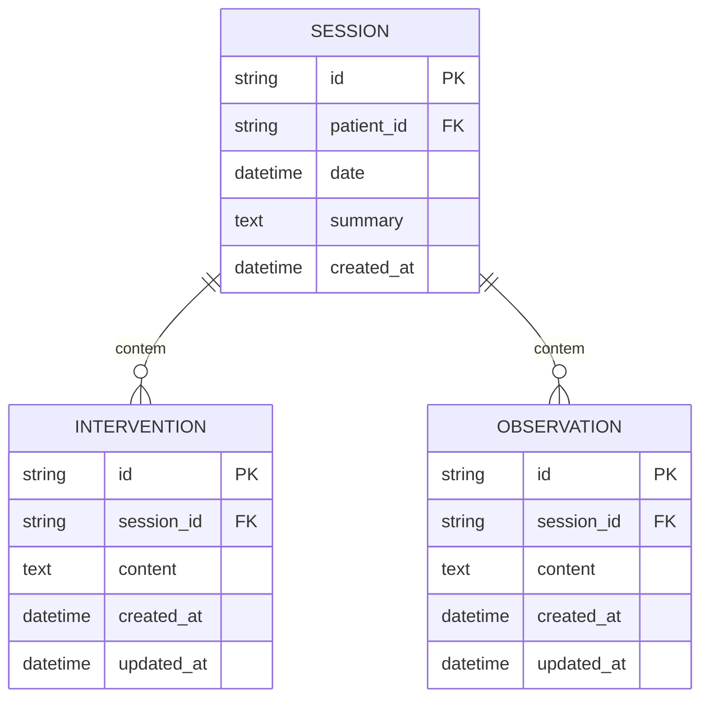

# REQ-01-03-01 — Registrar Intervenção Terapêutica

## Identificação

| Campo | Valor |
|-------|-------|
| **ID** | REQ-01-03-01 |
| **Capability** | CAP-01-03 Registro de Intervenções Terapêuticas |
| **Vision** | VISION-01 Registro da Prática Clínica |
| **Status** | ✅ implemented |
| **Prioridade** | Alta |
| **Data de Implementação** | 2024-01 |

---

## História do Usuário

Como **psicólogo clínico**,  
quero **registrar intervenções específicas realizadas durante o encontro**,  
para **documentar a conduta técnica e facilitar a análise posterior da evolução do paciente**.

---

## Contexto

Diferente das observações (percepções do terapeuta), as intervenções são as ações ativas realizadas pelo terapeuta (ex: "Realizada técnica de exposição", "Feito questionamento socrático sobre a crença X").

O registro deve ocorrer preferencialmente dentro do contexto da sessão, utilizando a mesma infraestrutura de fragmentos dinâmicos das observações para manter a fluidez do prontuário.

---

## Descrição Funcional

O sistema deve permitir o registro de intervenções vinculadas a uma sessão.

- **Entrada**: Texto narrativo curto ou longo descrevendo a ação
- **Comportamento HTMX**: Envio assíncrono (POST) que adiciona a intervenção ao topo da lista sem recarregar a barra lateral ou o layout principal
- **Feedback**: Limpeza automática do campo após o sucesso
- **Posicionamento**: Novas intervenções aparecem no topo da lista (mais recentes primeiro)

### Fluxo de Registro

```text
O terapeuta acessa uma sessão ativa ou histórico
↓
Localiza a seção "Intervenções"
↓
Digita a conduta técnica realizada
↓
Submete o formulário
↓
HTMX: O backend processa o serviço, salva no SQLite e retorna o fragmento da nova intervenção
↓
A lista é atualizada via hx-swap="afterbegin"
↓
Campo é limpo automaticamente
```

### Dados da Intervenção

#### Campos Obrigatórios
- **SessionID**: Vínculo com a sessão
- **Content**: Descrição da intervenção realizada

#### Campos Gerados Automaticamente
- **ID**: UUID gerado no backend
- **CreatedAt / UpdatedAt**: Timestamps para rastreabilidade cronológica

---

## Interface de Usuário

### Formulário de Intervenção

Localização: Embutido na visualização da sessão

Componentes: `web/components/session/intervention_form.templ`, `web/components/session/intervention_form_inline.templ`

```
┌─────────────────────────────────────────────────┐
│ Intervenções Terapêuticas              [+ Nova]│
├─────────────────────────────────────────────────┤
│                                                 │
│ ┌─────────────────────────────────────────┐     │
│ │ 🛠️ Descreva a intervenção realizada...  │     │
│ │                                         │     │
│ │                                         │     │
│ └─────────────────────────────────────────┘     │
│                                     [Registrar] │
│                                                 │
│ ━━━━━━━━━━━━━━━━━━━━━━━━━━━━━━━━━━━━━━━━━━━━━━━ │
│                                                 │
│ ┌─────────────────────────────────────────┐     │
│ │ 🛠️ Realizada técnica de exposição      │     │
│ │    gradual para situações sociais com  │     │
│ │    hierarquia de ansiedade elaborada   │     │
│ │    • Agora • Editar                    │     │
│ └─────────────────────────────────────────┘     │
│                                                 │
│ ┌─────────────────────────────────────────┐     │
│ │ 🛠️ Questionamento socrático sobre     │     │
│ │    crenças disfuncionais de desastre   │     │
│ │    • 10 min atrás • Editar             │     │
│ └─────────────────────────────────────────┘     │
│                                                 │
└─────────────────────────────────────────────────┘
```

### Estilo (Tecnologia Silenciosa)

Seguindo as regras do Canvas:

- **Tipografia Clínica**: O campo de texto e a exibição da intervenção DEVEM usar a fonte Source Serif 4
- **Visual**: O bloco de intervenção deve ser visualmente distinto das observações (ex: borda lateral cinza escuro ou ícone específico 🛠️), mas manter a estética minimalista
- **Input**: Estilo "Silent Input" sem bordas pesadas
- **Componentização**: Implementado via componente .templ dedicado

---

## Diagrama de Arquitetura C4 (Nível Componentes)

```mermaid
C4Component
title Arquitetura de Registro de Intervenção - Nível Componentes

Container_Boundary(web, "Web Layer") {
    Component(sessionHandler, "SessionHandler", "Go Handler", "Processa requisições HTTP")
    Component(createIntervention, "CreateIntervention", "Method", "POST /sessions/{id}/interventions")
}

Container_Boundary(components, "UI Components") {
    Component(intForm, "InterventionForm", "Templ Component", "Formulário de intervenção")
    Component(intFormInline, "InterventionFormInline", "Templ Component", "Formulário inline")
    Component(intItem, "InterventionItem", "Templ Component", "Item de intervenção")
}

Container_Boundary(application, "Application Layer") {
    Component(intService, "InterventionService", "Service", "Lógica de negócio")
    Component(createInput, "CreateInterventionInput", "DTO", "Dados validados")
}

Container_Boundary(domain, "Domain Layer") {
    Component(intEntity, "Intervention", "Entity", "Entidade de domínio")
    Component(sessionEntity, "Session", "Entity", "Sessão pai")
}

Container_Boundary(infrastructure, "Infrastructure Layer") {
    Component(intRepo, "InterventionRepository", "Repository", "Persistência SQLite")
    Component(db, "SQLite DB", "Database", "Banco de dados")
}

Rel(web, sessionHandler, "Usa")
Rel(sessionHandler, createIntervention, "Chama para POST /sessions/{id}/interventions")
Rel(createIntervention, intService, "Chama para criar")
Rel(intService, createInput, "Valida e sanitiza")
Rel(intService, intEntity, "Cria nova")
Rel(intEntity, sessionEntity, "Vinculada a")
Rel(intService, intRepo, "Persiste via")
Rel(intRepo, db, "Executa SQL")
Rel(createIntervention, intItem, "Retorna fragmento")

UpdateLayoutConfig($c4ShapeInRow="3", $c4BoundaryInRow="1")
```

---

## Fluxo de Dados (Sequence Diagram)

```mermaid
sequenceDiagram
    actor Usuário
    participant Browser
    participant SessionHandler as SessionHandler\n(web/handlers)
    participant IntForm as InterventionForm\n(components/session)
    participant IntService as InterventionService\n(application/services)
    component CreateInput as CreateInterventionInput\n(application/services)
    participant Intervention as Intervention\n(domain/intervention)
    participant IntRepo as InterventionRepository\n(infrastructure/sqlite)
    participant SQLite as SQLite DB

    %% Fluxo POST /sessions/{id}/interventions
    Usuário->>Browser: Digita intervenção e clica "Registrar"
    Browser->>SessionHandler: POST /sessions/{id}/interventions (form data)
    SessionHandler->>SessionHandler: ParseForm()
    SessionHandler->>SessionHandler: Extrai session_id da URL
    SessionHandler->>IntService: CreateIntervention(ctx, sessionID, input)
    IntService->>CreateInput: Sanitize()
    IntService->>CreateInput: Validate()
    CreateInput-->>IntService: ✓ Dados válidos
    IntService->>Intervention: NewIntervention(sessionID, content)
    Intervention->>Intervention: uuid.New()
    Intervention->>Intervention: time.Now() (CreatedAt/UpdatedAt)
    Intervention-->>IntService: *Intervention
    IntService->>IntRepo: Save(ctx, intervention)
    IntRepo->>SQLite: INSERT INTO interventions (...)
    SQLite-->>IntRepo: ✓ Sucesso
    IntRepo-->>IntService: nil
    IntService-->>SessionHandler: *Intervention, nil
    SessionHandler->>IntForm: Render(InterventionItemData)
    IntForm-->>Browser: HTML do novo item (fragmento)
    Browser-->>Browser: hx-swap="afterbegin" na lista
    Browser-->>Browser: Limpa campo de entrada
    Browser-->>Usuário: Exibe nova intervenção no topo da lista
```

---

## Endpoints

| Método | Rota | Handler | Descrição |
|--------|------|---------|-----------|
| `POST` | `/sessions/{id}/interventions` | `CreateIntervention` | Cria nova intervenção (HTMX) |
| `GET` | `/sessions/{id}` | `Show` | Visualização da sessão com lista de intervenções |

---

## Componentes UI

| Componente | Arquivo | Descrição |
|------------|---------|-----------|
| `InterventionForm` | `web/components/session/intervention_form.templ` | Formulário completo de intervenção |
| `InterventionFormInline` | `web/components/session/intervention_form_inline.templ` | Formulário inline para registro rápido |
| `InterventionItem` | `web/components/session/intervention_item.templ` | Item individual de intervenção |
| `InterventionList` | `web/components/session/intervention_list.templ` | Lista de intervenções da sessão |

---

## Modelo de Dados

### Entidade de Domínio (internal/domain/intervention/intervention.go)

```go
type Intervention struct {
    ID        string    `json:"id"`
    SessionID string    `json:"session_id"`
    Content   string    `json:"content"`
    CreatedAt time.Time `json:"created_at"`
    UpdatedAt time.Time `json:"updated_at"`
}

func NewIntervention(sessionID, content string) *Intervention {
    return &Intervention{
        ID:        uuid.New().String(),
        SessionID: sessionID,
        Content:   content,
        CreatedAt: time.Now(),
        UpdatedAt: time.Now(),
    }
}

func (i *Intervention) Update(content string) {
    i.Content = content
    i.UpdatedAt = time.Now()
}
```

### SQL Schema (SQLite)

```sql
-- Tabela de intervenções
CREATE TABLE interventions (
    id TEXT PRIMARY KEY,
    session_id TEXT NOT NULL,
    content TEXT NOT NULL,
    created_at DATETIME DEFAULT CURRENT_TIMESTAMP,
    updated_at DATETIME DEFAULT CURRENT_TIMESTAMP,
    FOREIGN KEY (session_id) REFERENCES sessions(id) ON DELETE CASCADE
);

-- Índices
CREATE INDEX idx_interventions_session_id ON interventions(session_id);
CREATE INDEX idx_interventions_created_at ON interventions(created_at DESC);
```

---

## Diagrama ER



---

## Arquivos Implementados

| Caminho | Descrição |
|---------|-----------|
| `internal/web/handlers/session_handler.go` | Handler HTTP com método CreateIntervention |
| `internal/application/services/intervention_service.go` | Serviço com método CreateIntervention |
| `internal/infrastructure/repository/sqlite/intervention_repository.go` | Repositório com método Save |
| `internal/domain/intervention/intervention.go` | Entidade de domínio e factory NewIntervention |
| `web/components/session/intervention_form.templ` | Componente UI do formulário de intervenção |
| `web/components/session/intervention_form_inline.templ` | Componente UI do formulário inline |
| `web/components/session/intervention_item.templ` | Componente UI do item de intervenção |
| `web/components/session/intervention_list.templ` | Componente UI da lista de intervenções |

---

## Critérios de Aceitação

### CA-01: Persistência Correta

- [x] A intervenção deve ser persistida corretamente na tabela `interventions`
- [x] Vínculo obrigatório com `session_id` (FK constraint)
- [x] Timestamps gerados automaticamente
- [x] UUID gerado no domínio

### CA-02: Limpeza do Campo

- [x] O campo de texto deve ser limpo imediatamente após o sucesso do HTMX
- [x] Transição suave de limpeza
- [x] Foco retorna ao campo para nova entrada

### CA-03: Tipografia

- [x] O conteúdo clínico deve obrigatoriamente ser renderizado com a fonte Source Serif 4
- [x] Campo de digitação em Source Serif
- [x] Itens exibidos em Source Serif

### CA-04: Validação de Conteúdo

- [x] O sistema deve validar que o conteúdo não está vazio antes de salvar
- [x] Sanitização de espaços em branco
- [x] Limite de caracteres aplicado (se definido)

### CA-05: Preservação de Estado

- [x] A interface deve manter o estado da sidebar (aberta/fechada) durante o processo de registro
- [x] Apenas a lista de intervenções é atualizada
- [x] Layout principal não recarrega

### CA-06: Diferenciação Visual

- [x] Intervenções devem ser visualmente distintas das observações
- [x] Ícone específico (🛠️) ou borda lateral diferente
- [x] Estética minimalista mantida

### CA-07: Ordenação

- [x] Novas intervenções aparecem no topo da lista
- [x] Ordenação por `created_at DESC`
- [x] Relativo temporal amigável

---

## Integração com Outros Requisitos

- **REQ-01-01-01**: Criar Sessão (Sessão pai deve existir)
- **REQ-01-02-01**: Adicionar Observação (Infraestrutura compartilhada)
- **REQ-02-01-01**: Visualizar Histórico (Intervenções aparecem na timeline)
- **VISION-03**: Síntese de Evidências (Categorização automática de intervenções)
- **VISION-04**: Análise de Padrões (Intervenções vs. resultados)

---

## Fora do Escopo

Este requisito **não inclui**:

- [ ] Categorização automática de intervenções (VISION-03)
- [ ] Associação de intervenções a metas terapêuticas (VISION-04)
- [ ] Edição de intervenções (REQ-01-03-02)
- [ ] Exclusão de intervenções (REQ-01-03-03)
- [ ] Templates de intervenção pré-definidos
- [ ] Protocolos ou manuais de intervenção
- [ ] Análise de eficácia de intervenções

---

## Resultado Esperado

Após a implementação deste requisito, o sistema permite:

✅ Registrar intervenções terapêuticas de forma rápida  
✅ Documentar a conduta técnica em cada sessão  
✅ Distinguir visualmente intervenções de observações  
✅ Manter fluidez do fluxo clínico (sem reloads)  
✅ Compor o registro completo da prática clínica

Isso estabelece a **capacidade de documentação da conduta técnica**, essencial para análise de evolução e supervisão clínica.

---

## Dependências

- REQ-01-01-01 (Criar Sessão) implementado
- Sistema de banco SQLite configurado
- Sistema de templates Templ compilado
- HTMX configurado para atualizações parciais

## Requisitos Habilitados

Este requisito habilita diretamente:

- REQ-02-01-01 (Visualizar Histórico) - Consome intervenções
- VISION-03 (Síntese de Evidências) - Dados para categorização
- VISION-04 (Análise de Padrões) - Correlação intervenções-resultados
