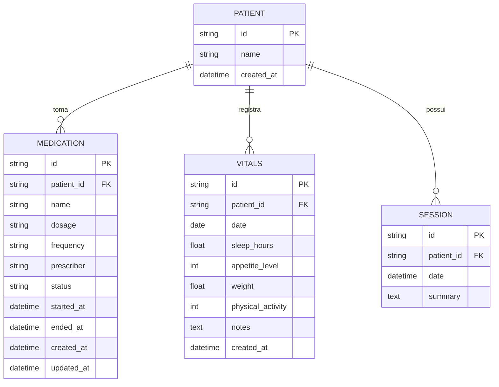

# REQ-01-04-01 — Registro de Histórico Farmacológico e Sinais Vitais

## Identificação

| Campo | Valor |
|-------|-------|
| **ID** | REQ-01-04-01 |
| **Capability** | CAP-01-04 Contexto Biopsicossocial e Farmacológico |
| **Vision** | VISION-09 Inteligência Clínica Ampliada |
| **Status** | ✅ implemented |
| **Prioridade** | Alta |
| **Data de Implementação** | 2024-01 |

---

## História do Usuário

Como **psicólogo clínico**,  
quero **registrar e acompanhar a medicação atual e indicadores fisiológicos (sono, apetite, peso) do paciente**,  
para **compreender como fatores biológicos e farmacológicos influenciam o processo psíquico e o humor**.

---

## Contexto

Na clínica moderna (SOTA), o psicólogo não ignora o corpo. Medicamentos psiquiátricos alteram a cognição, e a qualidade do sono é um biomarcador crítico de recaída.

Este requisito permite que o Arandu monitore esses dados de forma estruturada, preparando o terreno para que a IA identifique correlações (ex: "A ansiedade aumenta quando o paciente relata menos de 6h de sono").

---

## Descrição Funcional

O sistema deve prover seções específicas dentro do perfil do paciente para:

### 1. Histórico Farmacológico

- **Cadastro de Medicação**: Nome do fármaco, dosagem, frequência e médico prescritor
- **Status**: Indicar se o uso é "Ativo", "Suspenso" ou "Finalizado"
- **Reconciliação**: Durante a sessão, o terapeuta deve poder marcar rapidamente se houve mudança na medicação

### 2. Sinais Vitais e Hábitos (Time-series)

- **Sono**: Registro de horas ou qualidade percebida (1-10)
- **Apetite/Peso**: Monitoramento de mudanças bruscas
- **Atividade Física**: Frequência semanal

### Fluxo de Registro

```text
Terapeuta abre o painel "Contexto Biológico" no perfil do paciente
↓
Para medicação: POST /patients/{id}/medications
↓
Para sinais vitais: POST /patients/{id}/vitals
↓
Sistema persiste dados e atualiza a interface via HTMX
↓
Lista de medicamentos e widget de sinais vitais são atualizados
```

---

## Interface de Usuário

### Painel Biopsicossocial

Localização: `/patients/{id}` (aba Contexto Biológico)

Componentes: `web/components/patient/medication_list.templ`, `web/components/patient/vitals_widget.templ`, `web/components/patient/biopsychosocial_panel.templ`

```
┌─────────────────────────────────────────────────┐
│ Contexto Biológico                            │
├─────────────────────────────────────────────────┤
│                                                 │
│ 💊 Medicações                                   │
│ ┌─────────────────────────────────────────┐     │
│ │ 🟢 Sertralina 50mg - 1x/dia            │     │
│ │    Prescrito por: Dr. Silva            │     │
│ │    Status: Ativo • Início: 01/2024    │     │
│ └─────────────────────────────────────────┘     │
│ ┌─────────────────────────────────────────┐     │
│ │ ⚪ Lorazepam 1mg - SOS                 │     │
│ │    Status: Suspenso • Fim: 12/2023     │     │
│ └─────────────────────────────────────────┘     │
│ [+ Adicionar Medicação]                         │
│                                                 │
│ ━━━━━━━━━━━━━━━━━━━━━━━━━━━━━━━━━━━━━━━━━━━━━━━ │
│                                                 │
│ 📊 Sinais Vitais (Última semana)                │
│ ┌─────────────────────────────────────────┐     │
│ │ 😴 Sono: Média 6.5h/noche             │     │
│ │ 🍽️  Apetite: 7/10                      │     │
│ │ ⚖️  Peso: 72kg                         │     │
│ │ 🏃 Atividade: 3x/semana                │     │
│ └─────────────────────────────────────────┘     │
│ [Registrar Hoje]                                │
│                                                 │
└─────────────────────────────────────────────────┘
```

### Estilo (Tecnologia Silenciosa)

Seguindo a filosofia de Tecnologia Silenciosa:

- **Visibilidade Progressiva**: Esses dados não devem poluir a tela principal. Residem em um "Painel Biopsicossocial" lateral ou em uma aba dedicada
- **Edição Rápida**: Uso de micro-formulários HTMX que salvam sem recarregar a página
- **Visualização**: Medicamentos ativos devem ter um destaque sutil (cor verde Arandu pálida); suspensos devem aparecer riscados ou em cinza claro
- **Tipografia**: Inter para dados técnicos, Source Serif para observações farmacológicas

---

## Diagrama de Arquitetura C4 (Nível Componentes)

```mermaid
C4Component
title Arquitetura de Biopsicossocial - Nível Componentes

Container_Boundary(web, "Web Layer") {
    Component(biopsyHandler, "BiopsychosocialHandler", "Go Handler", "Processa requisições HTTP")
    Component(addMedication, "AddMedication", "Method", "POST /patients/{id}/medications")
    Component(recordVitals, "RecordVitals", "Method", "POST /patients/{id}/vitals")
    Component(updateMedStatus, "UpdateMedicationStatus", "Method", "PUT /patients/{id}/medications/{med_id}/status")
}

Container_Boundary(components, "UI Components") {
    Component(medList, "MedicationList", "Templ Component", "Lista de medicações")
    Component(vitalsWidget, "VitalsWidget", "Templ Component", "Widget de sinais vitais")
    Component(bioPanel, "BiopsychosocialPanel", "Templ Component", "Painel completo")
}

Container_Boundary(application, "Application Layer") {
    Component(bioService, "BiopsychosocialService", "Service", "Lógica de negócio")
    Component(medInput, "MedicationInput", "DTO", "Dados de medicação")
    Component(vitalsInput, "VitalsInput", "DTO", "Dados de sinais vitais")
}

Container_Boundary(domain, "Domain Layer") {
    Component(medEntity, "Medication", "Entity", "Entidade medicação")
    Component(vitalsEntity, "Vitals", "Entity", "Entidade sinais vitais")
}

Container_Boundary(infrastructure, "Infrastructure Layer") {
    Component(medRepo, "MedicationRepository", "Repository", "Persistência medicações")
    Component(vitalsRepo, "VitalsRepository", "Repository", "Persistência sinais vitais")
    Component(db, "SQLite DB", "Database", "Banco de dados")
}

Rel(web, biopsyHandler, "Usa")
Rel(biopsyHandler, addMedication, "Chama para POST /patients/{id}/medications")
Rel(biopsyHandler, recordVitals, "Chama para POST /patients/{id}/vitals")
Rel(biopsyHandler, updateMedStatus, "Chama para PUT status")
Rel(addMedication, bioService, "Chama")
Rel(recordVitals, bioService, "Chama")
Rel(bioService, medInput, "Valida")
Rel(bioService, vitalsInput, "Valida")
Rel(bioService, medEntity, "Cria/atualiza")
Rel(bioService, vitalsEntity, "Cria")
Rel(bioService, medRepo, "Persiste via")
Rel(bioService, vitalsRepo, "Persiste via")
Rel(medRepo, db, "Executa SQL")
Rel(vitalsRepo, db, "Executa SQL")
Rel(addMedication, medList, "Retorna fragmento")
Rel(recordVitals, vitalsWidget, "Retorna fragmento")

UpdateLayoutConfig($c4ShapeInRow="3", $c4BoundaryInRow="1")
```

---

## Fluxo de Dados (Sequence Diagram)

```mermaid
sequenceDiagram
    actor Usuário
    participant Browser
    participant BiopsyHandler as BiopsychosocialHandler\n(web/handlers)
    participant MedList as MedicationList\n(components/patient)
    participant BioService as BiopsychosocialService\n(application/services)
    component MedInput as MedicationInput\n(application/services)
    participant Medication as Medication\n(domain/medication)
    participant MedRepo as MedicationRepository\n(infrastructure/sqlite)
    participant SQLite as SQLite DB

    %% Fluxo POST /patients/{id}/medications
    Usuário->>Browser: Abre painel Contexto Biológico
    Usuário->>Browser: Preenche formulário de medicação
    Browser->>BiopsyHandler: POST /patients/{id}/medications
    BiopsyHandler->>BiopsyHandler: ParseForm()
    BiopsyHandler->>BioService: AddMedication(ctx, patientID, input)
    BioService->>MedInput: Sanitize() & Validate()
    MedInput-->>BioService: ✓ Dados válidos
    BioService->>Medication: NewMedication(patientID, name, dosage, ...)
    Medication->>Medication: uuid.New()
    Medication->>Medication: Define status e timestamps
    Medication-->>BioService: *Medication
    BioService->>MedRepo: Save(ctx, medication)
    MedRepo->>SQLite: INSERT INTO patient_medications (...)
    SQLite-->>MedRepo: ✓ Sucesso
    MedRepo-->>BioService: nil
    BioService-->>BiopsyHandler: *Medication, nil
    BiopsyHandler->>MedList: Render(MedicationListData)
    MedList-->>Browser: HTML atualizado (fragmento)
    Browser-->>Usuário: Exibe nova medicação na lista

    %% Fluxo PUT /patients/{id}/medications/{med_id}/status
    Usuário->>Browser: Altera status de medicação
    Browser->>BiopsyHandler: PUT /patients/{id}/medications/{med_id}/status
    BiopsyHandler->>BioService: UpdateMedicationStatus(ctx, medID, status)
    BioService->>Medication: UpdateStatus(status)
    Medication->>Medication: Atualiza UpdatedAt
    BioService->>MedRepo: Update(ctx, medication)
    MedRepo->>SQLite: UPDATE patient_medications SET status = ? ...
    SQLite-->>MedRepo: ✓ Sucesso
    MedRepo-->>BioService: nil
    BioService-->>BiopsyHandler: *Medication, nil
    BiopsyHandler-->>Browser: Fragmento atualizado
    Browser-->>Usuário: Exibe status atualizado com visual diferenciado
```

---

## Endpoints

| Método | Rota | Handler | Descrição |
|--------|------|---------|-----------|
| `POST` | `/patients/{id}/medications` | `AddMedication` | Adiciona nova medicação |
| `GET` | `/patients/{id}/medications` | `ListMedications` | Lista medicações do paciente |
| `PUT` | `/patients/{id}/medications/{med_id}` | `UpdateMedication` | Atualiza dados da medicação |
| `PUT` | `/patients/{id}/medications/{med_id}/status` | `UpdateMedicationStatus` | Atualiza status (reconciliação rápida) |
| `POST` | `/patients/{id}/vitals` | `RecordVitals` | Registra sinais vitais do dia |
| `GET` | `/patients/{id}/vitals` | `GetVitalsHistory` | Histórico de sinais vitais |

---

## Componentes UI

| Componente | Arquivo | Descrição |
|------------|---------|-----------|
| `MedicationList` | `web/components/patient/medication_list.templ` | Lista de medicações do paciente |
| `MedicationItem` | `web/components/patient/medication_item.templ` | Item individual de medicação |
| `MedicationForm` | `web/components/patient/medication_form.templ` | Formulário de cadastro de medicação |
| `VitalsWidget` | `web/components/patient/vitals_widget.templ` | Widget de sinais vitais |
| `VitalsForm` | `web/components/patient/vitals_form.templ` | Formulário de registro de sinais vitais |
| `BiopsychosocialPanel` | `web/components/patient/biopsychosocial_panel.templ` | Painel completo de contexto biológico |

---

## Modelo de Dados

### Entidade Medicação (internal/domain/medication/medication.go)

```go
type Medication struct {
    ID          string     `json:"id"`
    PatientID   string     `json:"patient_id"`
    Name        string     `json:"name"`
    Dosage      string     `json:"dosage"`
    Frequency   string     `json:"frequency"`
    Prescriber  string     `json:"prescriber"`
    Status      string     `json:"status"` // active, suspended, finished
    StartedAt   time.Time  `json:"started_at"`
    EndedAt     *time.Time `json:"ended_at,omitempty"`
    CreatedAt   time.Time  `json:"created_at"`
    UpdatedAt   time.Time  `json:"updated_at"`
}

func (m *Medication) UpdateStatus(status string) {
    m.Status = status
    m.UpdatedAt = time.Now()
    if status == "finished" || status == "suspended" {
        now := time.Now()
        m.EndedAt = &now
    }
}
```

### Entidade Sinais Vitais (internal/domain/vitals/vitals.go)

```go
type Vitals struct {
    ID               string    `json:"id"`
    PatientID        string    `json:"patient_id"`
    Date             time.Time `json:"date"`
    SleepHours       float64   `json:"sleep_hours"`
    AppetiteLevel    int       `json:"appetite_level"` // 1-10
    Weight           float64   `json:"weight"`
    PhysicalActivity int       `json:"physical_activity"` // dias/semana
    Notes            string    `json:"notes"`
    CreatedAt        time.Time `json:"created_at"`
}
```

### SQL Schema (SQLite)

```sql
-- Tabela de medicações
CREATE TABLE IF NOT EXISTS patient_medications (
    id TEXT PRIMARY KEY,
    patient_id TEXT NOT NULL,
    name TEXT NOT NULL,
    dosage TEXT,
    frequency TEXT,
    prescriber TEXT,
    status TEXT DEFAULT 'active', -- active, suspended, finished
    started_at DATETIME,
    ended_at DATETIME,
    created_at DATETIME DEFAULT CURRENT_TIMESTAMP,
    updated_at DATETIME DEFAULT CURRENT_TIMESTAMP,
    FOREIGN KEY (patient_id) REFERENCES patients(id) ON DELETE CASCADE
);

-- Tabela de sinais vitais (série temporal)
CREATE TABLE IF NOT EXISTS patient_vitals (
    id TEXT PRIMARY KEY,
    patient_id TEXT NOT NULL,
    date DATETIME NOT NULL,
    sleep_hours REAL,
    appetite_level INTEGER, -- 1 a 10
    weight REAL,
    physical_activity INTEGER,
    notes TEXT,
    created_at DATETIME DEFAULT CURRENT_TIMESTAMP,
    FOREIGN KEY (patient_id) REFERENCES patients(id) ON DELETE CASCADE
);

-- Índices
CREATE INDEX idx_medications_patient_id ON patient_medications(patient_id);
CREATE INDEX idx_medications_status ON patient_medications(status);
CREATE INDEX idx_vitals_patient_id ON patient_vitals(patient_id);
CREATE INDEX idx_vitals_date ON patient_vitals(date DESC);
```

---

## Diagrama ER



---

## Arquivos Implementados

| Caminho | Descrição |
|---------|-----------|
| `internal/web/handlers/biopsychosocial_handler.go` | Handler HTTP com métodos AddMedication, RecordVitals, UpdateMedicationStatus |
| `internal/application/services/biopsychosocial_service.go` | Serviço de domínio biopsicossocial |
| `internal/infrastructure/repository/sqlite/medication_repository.go` | Repositório de medicações |
| `internal/infrastructure/repository/sqlite/vitals_repository.go` | Repositório de sinais vitais |
| `internal/domain/medication/medication.go` | Entidade de domínio Medication |
| `internal/domain/vitals/vitals.go` | Entidade de domínio Vitals |
| `web/components/patient/medication_list.templ` | Componente UI da lista de medicações |
| `web/components/patient/medication_form.templ` | Componente UI do formulário de medicação |
| `web/components/patient/vitals_widget.templ` | Componente UI do widget de sinais vitais |
| `web/components/patient/biopsychosocial_panel.templ` | Componente UI do painel completo |

---

## Critérios de Aceitação

### CA-01: Listagem de Medicações

- [x] O sistema deve permitir listar todos os medicamentos ativos do paciente
- [x] Diferenciação visual entre ativos (verde) e suspensos/finalizados (cinza/riscado)
- [x] Ordenação por data de início (mais recentes primeiro)

### CA-02: Mudanças de Status

- [x] Mudanças de status devem ser registradas com data automática
- [x] Ao suspender/finalizar, campo `ended_at` é preenchido automaticamente
- [x] Reconciliação rápida via botão de toggle de status

### CA-03: Sinais Vitais

- [x] O registro deve permitir entrada de sono, apetite, peso e atividade
- [x] Visualização de média recente (última semana)
- [x] Histórico acessível para análise temporal

### CA-04: Tipografia

- [x] Interface deve respeitar a tipografia Inter para dados técnicos
- [x] Source Serif para observações farmacológicas (campo notes)
- [x] Consistência visual com o resto do sistema

### CA-05: Isolamento de Dados

- [x] Os dados devem ser isolados por tenant_id (multi-tenancy)
- [x] Cada profissional vê apenas dados de seus pacientes
- [x] SQLite individual por usuário

### CA-06: Integração com Sessões

- [x] Painel biopsicossocial deve ser acessível durante o registro de sessão
- [x] Dados visíveis em contexto para o terapeuta
- [x] Não interrompe o fluxo de documentação

### CA-07: HTMX

- [x] Registro de medicação via HTMX sem reload
- [x] Atualização de status via HTMX inline
- [x] Registro de sinais vitais via HTMX

---

## Integração com Outros Requisitos

- **REQ-01-00-01**: Criar Paciente (Paciente pai deve existir)
- **REQ-01-01-01**: Criar Sessão (Contexto durante sessão)
- **REQ-01-06-01**: Anamnese Clínica (Dados biopsicossociais correlacionados)
- **REQ-02-01-01**: Visualizar Histórico (Dados aparecem na timeline)
- **VISION-09**: Inteligência Clínica Ampliada (Dados para correlações de IA)

---

## Fora do Escopo

Este requisito **não inclui**:

- [ ] Gráficos de linha complexos para o peso (será CAP-09-01)
- [ ] Integração com APIs de farmácias
- [ ] Prescrição digital (o Arandu é apenas registro)
- [ ] Alertas de interação medicamentosa
- [ ] Lembretes de medicação para o paciente
- [ ] Exportação para prontuário médico

---

## Resultado Esperado

Após a implementação deste requisito, o sistema permite:

✅ Registrar medicações de pacientes com status  
✅ Acompanhar sinais vitais e hábitos ao longo do tempo  
✅ Visualizar correlações entre contexto biológico e psíquico  
✅ Manter registro farmacológico atualizado  
✅ Preparar dados para análise de IA futura

Isso estabelece a **visão biopsicossocial integrada**, essencial para prática clínica contemporânea.

---

## Dependências

- REQ-01-00-01 (Criar Paciente) implementado
- Sistema de banco SQLite configurado
- Sistema de templates Templ compilado
- HTMX configurado para atualizações parciais

## Requisitos Habilitados

Este requisito habilita diretamente:

- REQ-01-06-01 (Anamnese) - Dados biopsicossociais integrados
- REQ-02-01-01 (Visualizar Histórico) - Contexto completo na timeline
- VISION-09 (Inteligência Clínica) - Dados para correlações IA
