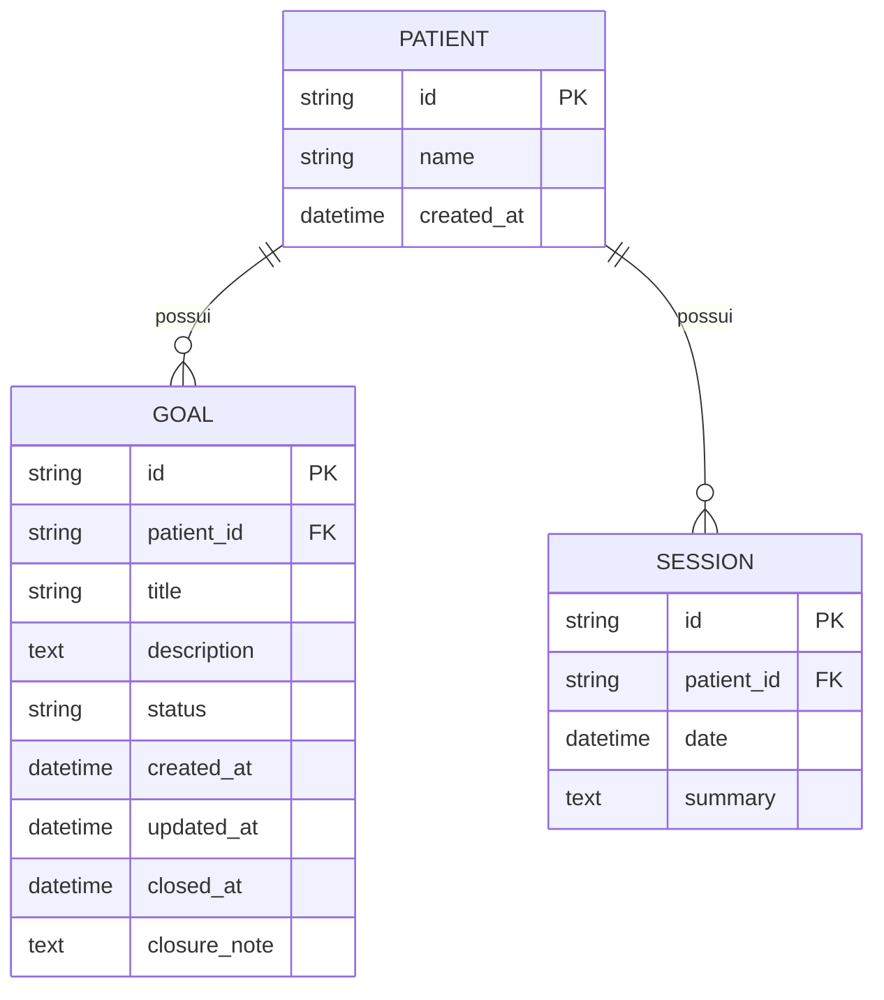

# REQ-01-05-01 — Planeamento Terapêutico e Definição de Metas

## Identificação

| Campo | Valor |
|-------|-------|
| **ID** | REQ-01-05-01 |
| **Capability** | CAP-01-05 Gestão de Plano Terapêutico |
| **Vision** | VISION-01 Registro da Prática Clínica |
| **Status** | ✅ implemented |
| **Prioridade** | Alta |
| **Data de Implementação** | 2024-01 |

---

## História do Usuário

Como **psicólogo clínico**,  
quero **definir um plano terapêutico com metas claras para cada paciente**,  
para **orientar a minha prática clínica e monitorizar o progresso de forma objetiva ao longo do tempo**.

---

## Contexto

O Arandu diferencia-se de um simples bloco de notas por ser um instrumento de reflexão estratégica. O Planeamento Terapêutico é o "mapa" desenhado após a avaliação inicial.

Ele permite que o terapeuta saiba exatamente para onde está a conduzir o processo, evitando que as sessões se tornem apenas conversas informais.

---

## Descrição Funcional

O sistema deve permitir a gestão de um plano de metas vinculado ao paciente:

- **Metas Atômicas**: Capacidade de criar objetivos específicos (ex: "Reduzir esquiva social", "Processar luto materno")
- **Estados da Meta**: Em Progresso, Alcançada ou Arquivada
- **Racional Clínico**: Um campo de texto longo para a fundamentação teórica do plano (Ex: Formulação de Caso)
- **Visibilidade na Sessão**: Durante o registro de uma nova sessão, o terapeuta deve poder visualizar as metas ativas num painel lateral sutil
- **Encerramento com Nota**: Ao alcançar uma meta, deve ser possível adicionar uma nota de encerramento documentando como foi atingida

### Fluxo de Gestão de Metas

```text
Terapeuta acessa o perfil do paciente
↓
Navega para seção "Plano Terapêutico"
↓
Pode criar novas metas (POST /patients/{id}/goals)
↓
Visualiza metas ativas em andamento
↓
Durante sessões, consulta metas no painel lateral
↓
Ao alcançar meta: POST /goals/{id}/close com nota de encerramento
↓
Sistema gera relatório de metas alcançadas
```

### Estados das Metas

| Estado | Descrição | Ação Permitida |
|--------|-----------|----------------|
| `in_progress` | Meta em andamento | Editar, Fechar |
| `achieved` | Meta alcançada | Visualizar, Reabrir |
| `archived` | Meta arquivada (não alcançada) | Visualizar, Reabrir |

---

## Interface de Usuário

### Lista de Metas Terapêuticas

Localização: `/patients/{id}/goals`

Componentes: `web/components/patient/goal_list.templ`, `web/components/patient/add_goal_form.templ`, `web/components/patient/goal_closure_modal.templ`

```
┌─────────────────────────────────────────────────┐
│ Plano Terapêutico                             │
├─────────────────────────────────────────────────┤
│                                                 │
│ 📝 Formulação de Caso                           │
│ ┌─────────────────────────────────────────┐     │
│ │ Paciente apresenta padrão de          │     │
│ │ ansiedade generalizada com...         │     │
│ └─────────────────────────────────────────┘     │
│                                                 │
│ ━━━━━━━━━━━━━━━━━━━━━━━━━━━━━━━━━━━━━━━━━━━━━━━ │
│                                                 │
│ 🎯 Metas Ativas                                 │
│                                                 │
│ ┌─────────────────────────────────────────┐     │
│ │ ⏳ Reduzir esquiva social               │     │
│ │    Reduzir comportamentos de evitação   │     │
│ │    em situações sociais em 50%        │     │
│ │    • Em progresso • Editar • Fechar   │     │
│ └─────────────────────────────────────────┘     │
│                                                 │
│ ┌─────────────────────────────────────────┐     │
│ │ ⏳ Processar luto materno               │     │
│ │    Trabalhar elaboração do luto...      │     │
│ │    • Em progresso • Editar • Fechar   │     │
│ └─────────────────────────────────────────┘     │
│                                                 │
│ [+ Adicionar Nova Meta]                         │
│                                                 │
│ ━━━━━━━━━━━━━━━━━━━━━━━━━━━━━━━━━━━━━━━━━━━━━━━ │
│                                                 │
│ ✅ Metas Alcançadas                             │
│ ┌─────────────────────────────────────────┐     │
│ │ ✓ Estabelecer vínculo terapêutico       │     │
│ │    Alcançada em: 15/01/2024            │     │
│ │    Nota: Vínculo consolidado após...    │     │
│ └─────────────────────────────────────────┘     │
│                                                 │
└─────────────────────────────────────────────────┘
```

### Modal de Fechamento de Meta

```
┌─────────────────────────────────────────────────┐
│ ✓ Fechar Meta                                   │
├─────────────────────────────────────────────────┤
│                                                 │
│ Meta: Reduzir esquiva social                    │
│ Status: Alcançada                               │
│                                                 │
│ Nota de Encerramento:                           │
│ ┌─────────────────────────────────────────┐     │
│ │ Descreva como a meta foi alcançada...   │     │
│ │                                         │     │
│ └─────────────────────────────────────────┘     │
│                                                 │
│ [Cancelar]              [Confirmar Fechamento]  │
│                                                 │
└─────────────────────────────────────────────────┘
```

### Estilo (Tecnologia Silenciosa)

Seguindo o Design System:

- **Estética**: Lista de metas com estilo de "check-list" elegante
- **Tipografia**:
  - Título da Meta: Inter (Sans)
  - Descrição/Racional: Source Serif 4 (Serif) para imersão técnica
- **Cores**: Fundo branco (--arandu-paper) sobre o papel de seda (--arandu-bg)
- **Estados Visuais**:
  - Em progresso: ícone de relógio ⏳
  - Alcançada: ícone de check verde ✓
  - Arquivada: ícone de arquivo cinza

---

## Diagrama de Arquitetura C4 (Nível Componentes)

```mermaid
C4Component
title Arquitetura de Planeamento Terapêutico - Nível Componentes

Container_Boundary(web, "Web Layer") {
    Component(sessionHandler, "SessionHandler", "Go Handler", "Processa requisições HTTP")
    Component(createGoal, "CreateGoal", "Method", "POST /patients/{id}/goals")
    Component(closeGoal, "CloseGoalWithNote", "Method", "POST /goals/{id}/close")
    Component(planReport, "TherapeuticPlanReport", "Method", "GET /patients/{id}/goals")
}

Container_Boundary(components, "UI Components") {
    Component(goalList, "GoalList", "Templ Component", "Lista de metas")
    Component(addGoalForm, "AddGoalForm", "Templ Component", "Formulário de nova meta")
    Component(goalClosureModal, "GoalClosureModal", "Templ Component", "Modal de fechamento")
}

Container_Boundary(application, "Application Layer") {
    Component(goalService, "GoalService", "Service", "Lógica de negócio")
    Component(goalInput, "GoalInput", "DTO", "Dados validados")
    Component(closureInput, "GoalClosureInput", "DTO", "Dados de fechamento")
}

Container_Boundary(domain, "Domain Layer") {
    Component(goalEntity, "Goal", "Entity", "Entidade de meta")
    Component(patientEntity, "Patient", "Entity", "Paciente pai")
}

Container_Boundary(infrastructure, "Infrastructure Layer") {
    Component(goalRepo, "GoalRepository", "Repository", "Persistência SQLite")
    Component(db, "SQLite DB", "Database", "Banco de dados")
}

Rel(web, sessionHandler, "Usa")
Rel(sessionHandler, createGoal, "Chama para POST /patients/{id}/goals")
Rel(sessionHandler, closeGoal, "Chama para POST /goals/{id}/close")
Rel(sessionHandler, planReport, "Chama para GET /patients/{id}/goals")
Rel(createGoal, goalService, "Chama para criar")
Rel(closeGoal, goalService, "Chama para fechar")
Rel(planReport, goalService, "Chama para listar")
Rel(goalService, goalInput, "Valida")
Rel(goalService, closureInput, "Valida")
Rel(goalService, goalEntity, "Cria/atualiza")
Rel(goalEntity, patientEntity, "Vinculada a")
Rel(goalService, goalRepo, "Persiste via")
Rel(goalRepo, db, "Executa SQL")
Rel(planReport, goalList, "Renderiza")
Rel(createGoal, addGoalForm, "Retorna após criar")
Rel(closeGoal, goalClosureModal, "Retorna após fechar")

UpdateLayoutConfig($c4ShapeInRow="3", $c4BoundaryInRow="1")
```

---

## Fluxo de Dados (Sequence Diagram)

```mermaid
sequenceDiagram
    actor Usuário
    participant Browser
    participant SessionHandler as SessionHandler\n(web/handlers)
    participant GoalList as GoalList\n(components/patient)
    participant GoalService as GoalService\n(application/services)
    component GoalInput as GoalInput\n(application/services)
    participant Goal as Goal\n(domain/goal)
    participant GoalRepo as GoalRepository\n(infrastructure/sqlite)
    participant SQLite as SQLite DB

    %% Fluxo POST /patients/{id}/goals (Criar meta)
    Usuário->>Browser: Acessa seção Plano Terapêutico
    Usuário->>Browser: Preenche formulário de nova meta
    Browser->>SessionHandler: POST /patients/{id}/goals
    SessionHandler->>SessionHandler: ParseForm()
    SessionHandler->>GoalService: CreateGoal(ctx, patientID, input)
    GoalService->>GoalInput: Sanitize() & Validate()
    GoalInput-->>GoalService: ✓ Dados válidos
    GoalService->>Goal: NewGoal(patientID, title, description)
    Goal->>Goal: uuid.New()
    Goal->>Goal: status = "in_progress"
    Goal->>Goal: Define timestamps
    Goal-->>GoalService: *Goal
    GoalService->>GoalRepo: Save(ctx, goal)
    GoalRepo->>SQLite: INSERT INTO therapeutic_goals (...)
    SQLite-->>GoalRepo: ✓ Sucesso
    GoalRepo-->>GoalService: nil
    GoalService-->>SessionHandler: *Goal, nil
    SessionHandler-->>Browser: Fragmento GoalList atualizado
    Browser-->>Usuário: Exibe nova meta na lista

    %% Fluxo POST /goals/{id}/close (Fechar meta)
    Usuário->>Browser: Clica "Fechar" em meta ativa
    Usuário->>Browser: Preenche nota de encerramento
    Browser->>SessionHandler: POST /goals/{id}/close
    SessionHandler->>GoalService: CloseGoalWithNote(ctx, goalID, note)
    GoalService->>GoalRepo: FindByID(ctx, goalID)
    GoalRepo-->>GoalService: *Goal
    GoalService->>Goal: Close(note)
    Goal->>Goal: status = "achieved"
    Goal->>Goal: closed_at = now()
    Goal->>Goal: closure_note = note
    Goal->>Goal: Atualiza UpdatedAt
    GoalService->>GoalRepo: Update(ctx, goal)
    GoalRepo->>SQLite: UPDATE therapeutic_goals SET status = 'achieved' ...
    SQLite-->>GoalRepo: ✓ Sucesso
    GoalRepo-->>GoalService: nil
    GoalService-->>SessionHandler: *Goal, nil
    SessionHandler-->>Browser: Fragmento atualizado
    Browser-->>Usuário: Meta movida para "Alcançadas" com nota
```

---

## Endpoints

| Método | Rota | Handler | Descrição |
|--------|------|---------|-----------|
| `GET` | `/patients/{id}/goals` | `TherapeuticPlanReport` | Visualiza plano terapêutico do paciente |
| `POST` | `/patients/{id}/goals` | `CreateGoal` | Cria nova meta terapêutica |
| `PUT` | `/goals/{id}` | `UpdateGoal` | Atualiza dados da meta |
| `POST` | `/goals/{id}/close` | `CloseGoalWithNote` | Fecha meta com nota de encerramento |
| `POST` | `/goals/{id}/reopen` | `ReopenGoal` | Reabre meta fechada |
| `DELETE` | `/goals/{id}` | `DeleteGoal` | Remove meta (soft delete) |

---

## Componentes UI

| Componente | Arquivo | Descrição |
|------------|---------|-----------|
| `GoalList` | `web/components/patient/goal_list.templ` | Lista completa de metas (ativas/alcançadas) |
| `GoalItem` | `web/components/patient/goal_item.templ` | Item individual de meta |
| `AddGoalForm` | `web/components/patient/add_goal_form.templ` | Formulário de criação de meta |
| `GoalClosureModal` | `web/components/patient/goal_closure_modal.templ` | Modal para fechamento com nota |
| `TherapeuticPlanPanel` | `web/components/patient/therapeutic_plan_panel.templ` | Painel completo do plano |
| `ActiveGoalsSidebar` | `web/components/session/active_goals_sidebar.templ` | Metas ativas durante sessão |

---

## Modelo de Dados

### Entidade de Domínio (internal/domain/goal/goal.go)

```go
type Goal struct {
    ID          string     `json:"id"`
    PatientID   string     `json:"patient_id"`
    Title       string     `json:"title"`
    Description string     `json:"description"`
    Status      string     `json:"status"` // in_progress, achieved, archived
    CreatedAt   time.Time  `json:"created_at"`
    UpdatedAt   time.Time  `json:"updated_at"`
    ClosedAt    *time.Time `json:"closed_at,omitempty"`
    ClosureNote string     `json:"closure_note,omitempty"`
}

func NewGoal(patientID, title, description string) *Goal {
    return &Goal{
        ID:          uuid.New().String(),
        PatientID:   patientID,
        Title:       title,
        Description: description,
        Status:      "in_progress",
        CreatedAt:   time.Now(),
        UpdatedAt:   time.Now(),
    }
}

func (g *Goal) Close(note string) {
    g.Status = "achieved"
    g.ClosureNote = note
    now := time.Now()
    g.ClosedAt = &now
    g.UpdatedAt = now
}

func (g *Goal) Reopen() {
    g.Status = "in_progress"
    g.ClosedAt = nil
    g.ClosureNote = ""
    g.UpdatedAt = time.Now()
}
```

### SQL Schema (SQLite)

```sql
-- Tabela de metas terapêuticas
CREATE TABLE IF NOT EXISTS therapeutic_goals (
    id TEXT PRIMARY KEY,
    patient_id TEXT NOT NULL,
    title TEXT NOT NULL,
    description TEXT,
    status TEXT DEFAULT 'in_progress', -- in_progress, achieved, archived
    created_at DATETIME NOT NULL,
    updated_at DATETIME NOT NULL,
    closed_at DATETIME,
    closure_note TEXT,
    FOREIGN KEY (patient_id) REFERENCES patients(id) ON DELETE CASCADE
);

-- Índices
CREATE INDEX idx_goals_patient_id ON therapeutic_goals(patient_id);
CREATE INDEX idx_goals_status ON therapeutic_goals(status);
CREATE INDEX idx_goals_created_at ON therapeutic_goals(created_at DESC);
```

---

## Diagrama ER



---

## Arquivos Implementados

| Caminho | Descrição |
|---------|-----------|
| `internal/web/handlers/session_handler.go` | Handler HTTP com métodos CreateGoal, CloseGoalWithNote, TherapeuticPlanReport |
| `internal/application/services/goal_service.go` | Serviço de gestão de metas |
| `internal/infrastructure/repository/sqlite/goal_repository.go` | Repositório de metas terapêuticas |
| `internal/domain/goal/goal.go` | Entidade de domínio Goal |
| `web/components/patient/goal_list.templ` | Componente UI da lista de metas |
| `web/components/patient/add_goal_form.templ` | Componente UI do formulário de nova meta |
| `web/components/patient/goal_closure_modal.templ` | Componente UI do modal de fechamento |
| `web/components/session/active_goals_sidebar.templ` | Metas ativas visíveis durante sessão |

---

## Critérios de Aceitação

### CA-01: CRUD via HTMX

- [x] O utilizador pode criar metas via HTMX sem recarregar a página
- [x] Edição de metas em andamento via HTMX
- [x] Fechamento de meta com registro de nota
- [x] Transições suaves entre estados

### CA-02: Transição Visual

- [x] A mudança de status deve ter uma transição visual suave
- [x] Meta alcançada: animação sutil de movimento para seção "Alcançadas"
- [x] Feedback visual claro do estado atual
- [x] Ícones indicativos de estado (⏳/✓)

### CA-03: Isolamento de Dados

- [x] O plano deve ser isolado no SQLite individual do utilizador
- [x] Dados por tenant (clinical_{user_uuid}.db)
- [x] Não há compartilhamento entre utilizadores

### CA-04: Tipografia

- [x] O campo de descrição deve suportar texto longo
- [x] Descrição renderizada em Source Serif 4
- [x] Títulos em Inter (Sans)
- [x] Nota de encerramento em Source Serif

### CA-05: Visibilidade em Sessão

- [x] Metas ativas visíveis durante o registro de sessão
- [x] Painel lateral sutil com lista de metas em progresso
- [x] Não interrompe o fluxo de documentação da sessão

### CA-06: Relatório de Plano

- [x] Visualização consolidada de todas as metas
- [x] Agrupamento por status (ativas/alcançadas/arquivadas)
- [x] Histórico de metas alcançadas com notas
- [x] Contagem de metas por status

### CA-07: Estados Válidos

- [x] Estados permitidos: in_progress, achieved, archived
- [x] Validação de transições de estado
- [x] Meta alcançada obrigatoriamente possui data de fechamento
- [x] Possibilidade de reabrir meta fechada

---

## Integração com Outros Requisitos

- **REQ-01-00-01**: Criar Paciente (Paciente pai deve existir)
- **REQ-01-01-01**: Criar Sessão (Metas visíveis durante sessão)
- **REQ-01-06-01**: Anamnese Clínica (Formulação de caso vinculada)
- **REQ-02-01-01**: Visualizar Histórico (Metas no contexto da timeline)
- **VISION-04**: Análise de Padrões (Intervenções relacionadas a metas)

---

## Fora do Escopo

Este requisito **não inclui**:

- [ ] Gráficos de progresso quantitativo
- [ ] Metas compartilhadas com o paciente (o Arandu é exclusivo para o terapeuta)
- [ ] Sistema de notificações de prazo de meta
- [ ] Metas com data limite obrigatória
- [ ] Sub-metas ou tarefas
- [ ] Associar automaticamente intervenções a metas (VISION-04)
- [ ] Percentual de progresso (0-100%)

---

## Resultado Esperado

Após a implementação deste requisito, o sistema permite:

✅ Definir metas terapêuticas claras e mensuráveis  
✅ Acompanhar o progresso de cada objetivo  
✅ Documentar o fechamento de metas com notas  
✅ Manter plano terapêutico visível durante as sessões  
✅ Orientar a prática clínica de forma estratégica

Isso transforma o Arandu em um **instrumento de reflexão estratégica**, não apenas um bloco de notas.

---

## Dependências

- REQ-01-00-01 (Criar Paciente) implementado
- Sistema de banco SQLite configurado
- Sistema de templates Templ compilado
- HTMX configurado para atualizações parciais

## Requisitos Habilitados

Este requisito habilita diretamente:

- REQ-01-01-01 (Criar Sessão) - Contexto de metas durante sessão
- REQ-02-01-01 (Visualizar Histórico) - Evolução das metas
- VISION-04 (Análise de Padrões) - Dados para análise de resultados
