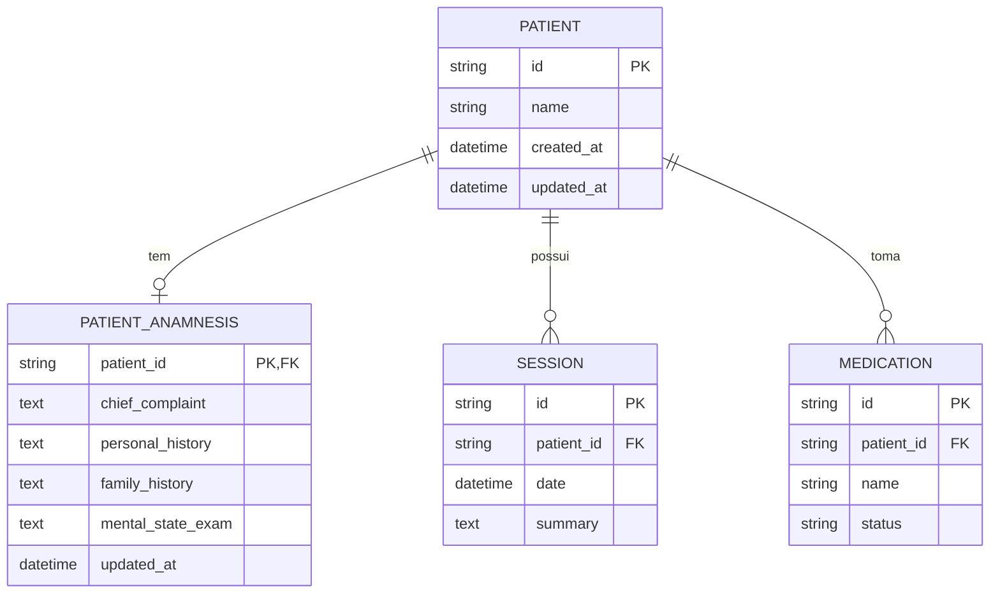

# REQ-01-06-01 — Anamnese Clínica Multidimensional

## Identificação

| Campo | Valor |
|-------|-------|
| **ID** | REQ-01-06-01 |
| **Capability** | CAP-01-06 Avaliação Inicial e Anamnese |
| **Vision** | VISION-01 Registro da Prática Clínica |
| **Status** | ✅ implemented |
| **Prioridade** | Alta |
| **Data de Implementação** | 2024-01 |

---

## História do Usuário

Como **psicólogo clínico**,  
quero **registrar a anamnese completa do paciente em campos estruturados** (história familiar, desenvolvimento, queixa principal),  
para **ter um mapa claro da subjetividade do sujeito desde o início do tratamento e facilitar consultas rápidas durante o processo terapêutico**.

---

## Contexto

Diferente das notas de sessão (que são temporais), a anamnese é a fundação estrutural do caso. No Arandu, ela não deve ser um formulário estático chato, mas uma **"Árvore de História"** que pode ser preenchida gradualmente (Progressive Disclosure).

O psicólogo pode ir adicionando informações ao longo das primeiras sessões, sem a pressão de preencher tudo de uma vez.

---

## Descrição Funcional

O sistema deve prover um módulo de Anamnese com as seguintes dimensões:

- **Queixa Principal**: Texto livre em Source Serif 4 descrevendo a demanda inicial
- **História Pessoal e Social**: Relacionamentos, escolaridade, lazer, história de vida
- **História Familiar**: Composição familiar e dinâmicas (Base para o Genograma futuro)
- **Exame das Funções Mentais**: Estado atual (atenção, humor, sono, apetite - integrado com REQ-01-04-01)

### Fluxo de Preenchimento

```text
Psicólogo acessa perfil do paciente
↓
Navega para aba "Anamnese"
↓
Visualiza seções expansíveis (accordion)
↓
Clica em seção para expandir
↓
Digita informações na área de texto
↓
Sistema salva automaticamente via HTMX (Silent Save)
↓
Indicador sutil confirma salvamento
```

### Seções da Anamnese

| Seção | Descrição | Chave (section) |
|-------|-----------|-----------------|
| Queixa Principal | Motivo da consulta e demanda inicial | `chief_complaint` |
| História Pessoal | Trajetória de vida, relacionamentos, escolaridade | `personal_history` |
| História Familiar | Composição familiar, dinâmicas, histórico | `family_history` |
| Funções Mentais | Estado atual, humor, cognição | `mental_state_exam` |

---

## Interface de Usuário

### Página de Anamnese

Localização: `/patients/{id}/anamnesis`

Componentes: `web/components/patient/anamnesis_page_v2.templ`, `web/components/patient/anamnesis_section.templ`, `web/components/patient/anamnesis_navigation.templ`

```
┌─────────────────────────────────────────────────┐
│ ← Anamnese de Maria da Silva                    │
├─────────────────────────────────────────────────┤
│                                                 │
│ ┌─────────────────────────────────────────┐     │
│ │ ▼ Queixa Principal                    │     │
│ │                                         │     │
│ │ ┌─────────────────────────────────┐     │     │
│ │ │ Paciente relata ansiedade       │     │     │
│ │ │ generalizada com preocupações   │     │     │
│ │ │ excessivas sobre diversas...    │     │     │
│ │ │                                 │     │     │
│ │ └─────────────────────────────────┘     │     │
│ │                             ✓ Salvo     │     │
│ └─────────────────────────────────────────┘     │
│                                                 │
│ ┌─────────────────────────────────────────┐     │
│ │ ▶ História Pessoal e Social           │     │
│ │   (Clique para expandir)                │     │
│ └─────────────────────────────────────────┘     │
│                                                 │
│ ┌─────────────────────────────────────────┐     │
│ │ ▶ História Familiar                   │     │
│ │   (Clique para expandir)                │     │
│ └─────────────────────────────────────────┘     │
│                                                 │
│ ┌─────────────────────────────────────────┐     │
│ │ ▼ Exame das Funções Mentais           │     │
│ │                                         │     │
│ │ ┌─────────────────────────────────┐     │     │
│ │ │ Humor: Ansioso, com humor       │     │     │
│ │ │ deprimido subjacente...         │     │     │
│ │ │                                 │     │     │
│ │ └─────────────────────────────────┘     │     │
│ │                             ✓ Salvo     │     │
│ └─────────────────────────────────────────┘     │
│                                                 │
└─────────────────────────────────────────────────┘
```

### Navegação de Seções

```
┌─────────────────────────────────────────────────┐
│ Navegação Rápida                              │
├─────────────────────────────────────────────────┤
│ [Queixa] [Pessoal] [Familiar] [Funções]       │
└─────────────────────────────────────────────────┘
```

### Estilo (Tecnologia Silenciosa)

Seguindo o Design System:

- **Navegação Lateral Interna**: Sub-menu no perfil do paciente: "Dados Cadastrais" | "Anamnese" | "Prontuário"
- **Silent Input**: Blocos de escrita fluida. Ao terminar um bloco, o sistema salva automaticamente via HTMX
- **Visual**: Seções expansíveis (Accordion) para não sobrecarregar o olhar do terapeuta
- **Feedback**: Indicador sutil "✓ Salvo" sem interromper o fluxo
- **Tipografia**: Todo texto clínico em Source Serif 4 (text-xl)

---

## Diagrama de Arquitetura C4 (Nível Componentes)

```mermaid
C4Component
title Arquitetura de Anamnese - Nível Componentes

Container_Boundary(web, "Web Layer") {
    Component(patientHandler, "PatientHandler", "Go Handler", "Processa requisições HTTP")
    Component(showAnamnesis, "ShowAnamnesis", "Method", "GET /patients/{id}/anamnesis")
    Component(updateSection, "UpdateAnamnesisSection", "Method", "PATCH /patients/{id}/anamnesis/{section}")
}

Container_Boundary(components, "UI Components") {
    Component(anamnesisPage, "AnamnesisPage", "Templ Component", "Página completa")
    Component(anamnesisSection, "AnamnesisSection", "Templ Component", "Seção editável")
    Component(anamnesisNav, "AnamnesisNavigation", "Templ Component", "Navegação entre seções")
}

Container_Boundary(application, "Application Layer") {
    Component(patientService, "PatientService", "Service", "Lógica de negócio")
    Component(anamnesisInput, "AnamnesisSectionInput", "DTO", "Dados validados")
}

Container_Boundary(domain, "Domain Layer") {
    Component(anamnesisEntity, "PatientAnamnesis", "Entity", "Entidade anamnese")
    Component(patientEntity, "Patient", "Entity", "Paciente pai")
}

Container_Boundary(infrastructure, "Infrastructure Layer") {
    Component(anamnesisRepo, "AnamnesisRepository", "Repository", "Persistência SQLite")
    Component(db, "SQLite DB", "Database", "Banco de dados")
}

Rel(web, patientHandler, "Usa")
Rel(patientHandler, showAnamnesis, "Chama para GET /patients/{id}/anamnesis")
Rel(patientHandler, updateSection, "Chama para PATCH /patients/{id}/anamnesis/{section}")
Rel(showAnamnesis, patientService, "Chama para obter")
Rel(updateSection, patientService, "Chama para atualizar")
Rel(patientService, anamnesisInput, "Valida e sanitiza")
Rel(patientService, anamnesisEntity, "Obtém/atualiza")
Rel(anamnesisEntity, patientEntity, "Vinculada a")
Rel(patientService, anamnesisRepo, "Persiste via")
Rel(anamnesisRepo, db, "Executa SQL")
Rel(showAnamnesis, anamnesisPage, "Renderiza")
Rel(anamnesisPage, anamnesisSection, "Renderiza seções")
Rel(anamnesisPage, anamnesisNav, "Renderiza navegação")
Rel(updateSection, anamnesisSection, "Retorna fragmento atualizado")

UpdateLayoutConfig($c4ShapeInRow="3", $c4BoundaryInRow="1")
```

---

## Fluxo de Dados (Sequence Diagram)

```mermaid
sequenceDiagram
    actor Usuário
    participant Browser
    participant PatientHandler as PatientHandler\n(web/handlers)
    participant AnamnesisPage as AnamnesisPage\n(components/patient)
    participant PatientService as PatientService\n(application/services)
    component AnamnesisInput as AnamnesisSectionInput\n(application/services)
    participant Anamnesis as PatientAnamnesis\n(domain/anamnesis)
    participant AnamnesisRepo as AnamnesisRepository\n(infrastructure/sqlite)
    participant SQLite as SQLite DB

    %% Fluxo GET /patients/{id}/anamnesis (Visualização)
    Usuário->>Browser: Clica em aba "Anamnese"
    Browser->>PatientHandler: GET /patients/{id}/anamnesis
    PatientHandler->>PatientService: GetPatientAnamnesis(ctx, patientID)
    PatientService->>AnamnesisRepo: FindByPatientID(ctx, patientID)
    AnamnesisRepo->>SQLite: SELECT * FROM patient_anamnesis WHERE patient_id = ?
    SQLite-->>AnamnesisRepo: Row (ou NULL se não existe)
    AnamnesisRepo-->>PatientService: *PatientAnamnesis (ou criar novo)
    PatientService-->>PatientHandler: *PatientAnamnesis
    PatientHandler->>AnamnesisPage: Render(AnamnesisPageData)
    AnamnesisPage-->>Browser: HTML completo com seções
    Browser-->>Usuário: Exibe página de anamnese

    %% Fluxo PATCH /patients/{id}/anamnesis/{section} (Salvar seção)
    Usuário->>Browser: Digita em seção e sai do campo
    Browser->>PatientHandler: PATCH /patients/{id}/anamnesis/chief_complaint
    PatientHandler->>PatientHandler: Parse JSON body
    PatientHandler->>PatientService: UpdateAnamnesisSection(ctx, patientID, section, content)
    PatientService->>AnamnesisInput: Sanitize() & Validate()
    AnamnesisInput-->>PatientService: ✓ Dados válidos
    PatientService->>AnamnesisRepo: FindByPatientID(ctx, patientID)
    AnamnesisRepo-->>PatientService: *PatientAnamnesis
    PatientService->>Anamnesis: UpdateSection(section, content)
    Anamnesis->>Anamnesis: Atualiza campo específico
    Anamnesis->>Anamnesis: Atualiza UpdatedAt
    PatientService->>AnamnesisRepo: Update(ctx, anamnesis)
    AnamnesisRepo->>SQLite: INSERT OR REPLACE INTO patient_anamnesis ...
    SQLite-->>AnamnesisRepo: ✓ Sucesso
    AnamnesisRepo-->>PatientService: nil
    PatientService-->>PatientHandler: *PatientAnamnesis, nil
    PatientHandler-->>Browser: 200 OK + indicador "✓ Salvo"
    Browser-->>Browser: Exibe indicador sutil de salvamento
```

---

## Endpoints

| Método | Rota | Handler | Descrição |
|--------|------|---------|-----------|
| `GET` | `/patients/{id}/anamnesis` | `ShowAnamnesis` | Página completa de anamnese |
| `GET` | `/patients/{id}/anamnesis/{section}` | `GetAnamnesisSection` | Fragmento de seção específica |
| `PATCH` | `/patients/{id}/anamnesis/{section}` | `UpdateAnamnesisSection` | Atualiza seção (silent save) |
| `GET` | `/patients/{id}` | `Show` | Perfil com link para anamnese |

### Seções Válidas

| Section Key | Descrição |
|-------------|-----------|
| `chief_complaint` | Queixa principal |
| `personal_history` | História pessoal e social |
| `family_history` | História familiar |
| `mental_state_exam` | Exame das funções mentais |

---

## Componentes UI

| Componente | Arquivo | Descrição |
|------------|---------|-----------|
| `AnamnesisPage` | `web/components/patient/anamnesis_page_v2.templ` | Página completa de anamnese |
| `AnamnesisSection` | `web/components/patient/anamnesis_section.templ` | Seção editável individual |
| `AnamnesisNavigation` | `web/components/patient/anamnesis_navigation.templ` | Navegação entre seções |
| `AnamnesisSummary` | `web/components/patient/anamnesis_summary.templ` | Resumo da anamnese |
| `Shell` | `web/components/layout/shell_layout.templ` | Layout principal |

---

## Modelo de Dados

### Entidade de Domínio (internal/domain/anamnesis/patient_anamnesis.go)

```go
type PatientAnamnesis struct {
    PatientID       string    `json:"patient_id"`
    ChiefComplaint  string    `json:"chief_complaint"`
    PersonalHistory string    `json:"personal_history"`
    FamilyHistory   string    `json:"family_history"`
    MentalStateExam string    `json:"mental_state_exam"`
    UpdatedAt       time.Time `json:"updated_at"`
}

func NewPatientAnamnesis(patientID string) *PatientAnamnesis {
    return &PatientAnamnesis{
        PatientID: patientID,
        UpdatedAt: time.Now(),
    }
}

func (a *PatientAnamnesis) UpdateSection(section, content string) error {
    switch section {
    case "chief_complaint":
        a.ChiefComplaint = content
    case "personal_history":
        a.PersonalHistory = content
    case "family_history":
        a.FamilyHistory = content
    case "mental_state_exam":
        a.MentalStateExam = content
    default:
        return errors.New("seção inválida")
    }
    a.UpdatedAt = time.Now()
    return nil
}
```

### SQL Schema (SQLite)

```sql
-- Tabela de anamnese (1:1 com patients)
CREATE TABLE IF NOT EXISTS patient_anamnesis (
    patient_id TEXT PRIMARY KEY,
    chief_complaint TEXT,
    personal_history TEXT,
    family_history TEXT,
    mental_state_exam TEXT,
    updated_at DATETIME NOT NULL,
    FOREIGN KEY (patient_id) REFERENCES patients(id) ON DELETE CASCADE
);

-- Índice para busca
CREATE INDEX idx_anamnesis_updated_at ON patient_anamnesis(updated_at DESC);
```

---

## Diagrama ER



---

## Arquivos Implementados

| Caminho | Descrição |
|---------|-----------|
| `internal/web/handlers/patient_handler.go` | Handler HTTP com métodos ShowAnamnesis e UpdateAnamnesisSection |
| `internal/application/services/patient_service.go` | Serviço com métodos de anamnese |
| `internal/infrastructure/repository/sqlite/anamnesis_repository.go` | Repositório de anamnese |
| `internal/domain/anamnesis/patient_anamnesis.go` | Entidade de domínio PatientAnamnesis |
| `web/components/patient/anamnesis_page_v2.templ` | Componente UI da página de anamnese |
| `web/components/patient/anamnesis_section.templ` | Componente UI de seção editável |
| `web/components/patient/anamnesis_navigation.templ` | Componente UI de navegação |

---

## Critérios de Aceitação

### CA-01: Navegação

- [x] O utilizador pode navegar para a anamnese a partir do perfil do paciente
- [x] Abas claras: "Dados Cadastrais" | "Anamnese" | "Prontuário"
- [x] URL amigável: `/patients/{id}/anamnesis`

### CA-02: Tipografia

- [x] Todo o texto clínico deve obrigatoriamente usar Source Serif 4
- [x] Tamanho text-xl para áreas de digitação
- [x] Títulos de seção em Inter (Sans)

### CA-03: Salvamento Atômico

- [x] O salvamento deve ser atômico por seção via HTMX (Silent Save)
- [x] Trigger em blur do campo (ao sair da área de texto)
- [x] Sem botão "Salvar" explícito
- [x] Feedback sutil: indicador "✓ Salvo"

### CA-04: Isolamento de Dados

- [x] Os dados devem estar isolados no SQLite do tenant
- [x] clinical_{user_uuid}.db
- [x] Relação 1:1 com tabela patients

### CA-05: Progressive Disclosure

- [x] Seções começam colapsadas (accordion)
- [x] Usuário expande conforme necessidade
- [x] Não sobrecarrega visualmente na primeira visita
- [x] Indicador de preenchimento por seção

### CA-06: Seções Obrigatórias

- [x] Queixa Principal (chief_complaint)
- [x] História Pessoal e Social (personal_history)
- [x] História Familiar (family_history)
- [x] Exame das Funções Mentais (mental_state_exam)

### CA-07: Validação

- [x] Validação de section key (evita injection)
- [x] Sanitização de conteúdo
- [x] Limite de caracteres por seção (se aplicável)

### CA-08: Performance

- [x] Carregamento rápido da página
- [x] Salvamento não bloqueia interface
- [x] Otimização para textos longos

---

## Integração com Outros Requisitos

- **REQ-01-00-01**: Criar Paciente (Paciente pai deve existir)
- **REQ-01-04-01**: Biopsicossocial (Dados de sono/apetite integrados)
- **REQ-01-05-01**: Planejamento Terapêutico (Formulação baseada na anamnese)
- **REQ-02-01-01**: Visualizar Histórico (Contexto anamnésico na timeline)
- **VISION-09**: Inteligência Clínica (IA pode analisar dados da anamnese)

---

## Fora do Escopo

Este requisito **não inclui**:

- [ ] Questionários estruturados automatizados
- [ ] Importação de anamnese de outros sistemas
- [ ] Genograma visual interativo (será CAP-09-01)
- [ ] Árvore genealógica editável
- [ ] Timeline visual da história de vida
- [ ] Anexos de documentos (exames, laudos)
- [ ] Validação clínica automática
- [ ] Sugestões de formulação baseadas em padrões

---

## Resultado Esperado

Após a implementação deste requisito, o sistema permite:

✅ Registrar anamnese completa em seções estruturadas  
✅ Preenchimento progressivo ao longo das sessões  
✅ Salvamento automático sem interromper o fluxo  
✅ Navegação fluida entre seções  
✅ Fundação clínica sólida para cada paciente

Isso estabelece a **base estrutural do caso**, permitindo que o terapeuta construa um mapa completo da subjetividade do paciente.

---

## Dependências

- REQ-01-00-01 (Criar Paciente) implementado
- Sistema de banco SQLite configurado
- Sistema de templates Templ compilado
- HTMX configurado para silent save

## Requisitos Habilitados

Este requisito habilita diretamente:

- REQ-01-04-01 (Biopsicossocial) - Dados complementares
- REQ-01-05-01 (Planejamento) - Base para formulação
- REQ-02-01-01 (Visualizar Histórico) - Contexto completo
- VISION-09 (Inteligência Clínica) - Dados para análise IA
