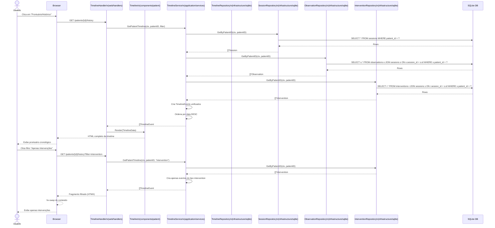
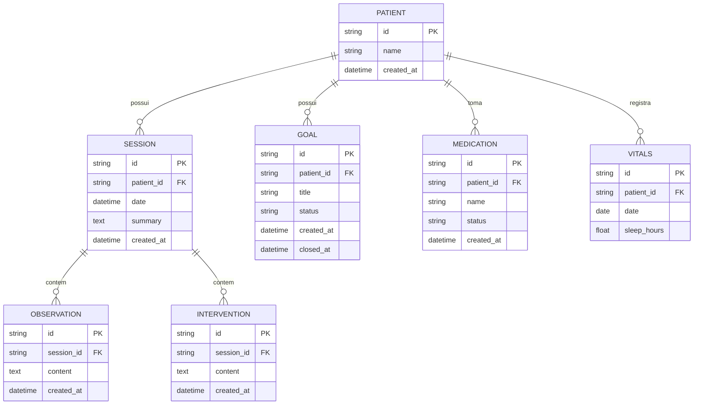

# REQ-02-01-01 — Visualizar Histórico do Paciente (Prontuário)

## Identificação

| Campo | Valor |
|-------|-------|
| **ID** | REQ-02-01-01 |
| **Capability** | CAP-02-01 Histórico do Paciente |
| **Vision** | VISION-02 Memória Clínica Longitudinal |
| **Status** | ✅ implemented |
| **Prioridade** | Alta |
| **Data de Implementação** | 2024-01 |

---

## História do Usuário

Como **psicólogo clínico**,  
quero **visualizar todos os eventos clínicos de um paciente** (sessões, notas e intervenções) organizados cronologicamente,  
para **identificar a evolução do caso e preparar-me para os próximos encontros com uma visão de longo prazo**.

---

## Contexto

Este requisito representa a transição do Arandu de um "diário de sessão" para um "sistema de inteligência clínica". O prontuário não deve ser uma lista de ficheiros, mas uma **narrativa contínua** onde o terapeuta faz o "scroll" pela história do paciente.

É a visão consolidada que permite ver padrões, identificar ciclos e compreender a trajetória terapêutica completa.

---

## Descrição Funcional

O sistema deve consolidar todos os registros atômicos de um paciente numa visão única de linha do tempo.

- **Agregação**: Unir dados das tabelas `sessions`, `observations`, `interventions`, `goals`, `vitals`, `medications`
- **Cronologia**: Exibição do mais recente para o mais antigo
- **Filtros Iniciais**: Capacidade de alternar a visualização para ver "Apenas Intervenções" ou "Apenas Observações" (via HTMX)
- **Navegação**: Cada evento na linha do tempo deve permitir o salto direto para a edição da sessão correspondente

### Tipos de Eventos na Timeline

| Tipo | Ícone | Descrição | Origem |
|------|-------|-----------|--------|
| `session` | 📅 | Sessão terapêutica | Tabela `sessions` |
| `observation` | 👁️ | Observação clínica | Tabela `observations` |
| `intervention` | 🛠️ | Intervenção técnica | Tabela `interventions` |
| `goal_created` | 🎯 | Meta criada | Tabela `therapeutic_goals` |
| `goal_achieved` | ✅ | Meta alcançada | Tabela `therapeutic_goals` |
| `medication_added` | 💊 | Medicação adicionada | Tabela `patient_medications` |
| `vital_recorded` | 📊 | Sinais vitais registrados | Tabela `patient_vitals` |

### Fluxo de Visualização

```text
Utilizador seleciona um paciente
↓
Clica na aba ou secção "Prontuário/Histórico"
↓
Sistema executa query complexa para reunir dados de múltiplas tabelas
↓
Serviço de Timeline orquestra a intercalação cronológica
↓
Componente .templ processa os eventos
↓
Página renderizada com foco na legibilidade
↓
Utilizador pode filtrar por tipo de evento
↓
Clique em evento leva ao contexto original
```

---

## Interface de Usuário

### Timeline do Prontuário

Localização: `/patients/{id}/history`

Componente: `web/components/patient/timeline.templ`

```
┌─────────────────────────────────────────────────┐
│ ← Prontuário de Maria da Silva                  │
├─────────────────────────────────────────────────┤
│                                                 │
│ [Tudo] [Sessões] [Observações] [Intervenções] │
│                                                 │
│ ──── Hoje ──────────────────────────────────────│
│                                                 │
│ ● 15/01/2024, 14:00                           │
│ ┌─────────────────────────────────────────┐     │
│ │ 📅 Sessão #23                           │     │
│ │                                         │     │
│ │ Sessão de follow-up sobre ansiedade...  │     │
│ │                                         │     │
│ │ ┌───────────────────────────────────┐   │     │
│ │ │ 👁️ Observação: Paciente demonstrou│   │     │
│ │ │ ansiedade ao falar sobre trabalho  │   │     │
│ │ └───────────────────────────────────┘   │     │
│ │                                         │     │
│ │ ┌───────────────────────────────────┐   │     │
│ │ │ 🛠️ Intervenção: Realizada técnica │   │     │
│ │ │ de exposição gradual              │   │     │
│ │ └───────────────────────────────────┘   │     │
│ │                                         │     │
│ │ [Ver sessão completa]                   │     │
│ └─────────────────────────────────────────┘     │
│                                                 │
│ ● 15/01/2024, 10:30                           │
│ ┌─────────────────────────────────────────┐     │
│ │ ✅ Meta Alcançada: Estabelecer vínculo  │     │
│ │    Alcançada em: 15/01/2024            │     │
│ │    Nota: Vínculo consolidado após...     │     │
│ └─────────────────────────────────────────┘     │
│                                                 │
│ ──── Janeiro 2024 ────────────────────────────────│
│                                                 │
│ ● 08/01/2024, 14:00                           │
│ ┌─────────────────────────────────────────┐     │
│ │ 📅 Sessão #22                           │     │
│ │                                         │     │
│ │ Primeira sessão após retorno de férias  │     │
│ └─────────────────────────────────────────┘     │
│                                                 │
│ ● 05/01/2024                                │
│ ┌─────────────────────────────────────────┐     │
│ │ 💊 Medicação adicionada: Sertralina     │     │
│ │    50mg, 1x/dia                         │     │
│ └─────────────────────────────────────────┘     │
│                                                 │
└─────────────────────────────────────────────────┘
```

### Estilo (Tecnologia Silenciosa)

Seguindo o design de Caderno Clínico:

- **Layout de Linha do Tempo**: Uma linha vertical subtil que liga os eventos
- **Diferenciação Visual**:
  - Observações: Renderizadas como notas de margem ou blocos de texto puro
  - Intervenções: Destacadas com um marcador técnico ou cor de acento sutil (ex: o azul primário do Arandu)
- **Tipografia**: Todo o conteúdo clínico DEVE usar Source Serif 4 em tamanho generoso (text-xl)
- **Performance**: Carregamento progressivo (Lazy Loading) à medida que o utilizador faz scroll para baixo
- **Filtros**: Pills selecionáveis no topo para filtrar tipos de evento

---

## Diagrama de Arquitetura C4 (Nível Componentes)

```mermaid
C4Component
title Arquitetura de Timeline/Histórico - Nível Componentes

Container_Boundary(web, "Web Layer") {
    Component(timelineHandler, "TimelineHandler", "Go Handler", "Processa requisições HTTP")
    Component(showHistory, "ShowPatientHistory", "Method", "GET /patients/{id}/history")
}

Container_Boundary(components, "UI Components") {
    Component(timeline, "Timeline", "Templ Component", "Timeline completa")
    Component(timelineEvent, "TimelineEvent", "Templ Component", "Evento individual")
    Component(timelineFilter, "TimelineFilter", "Templ Component", "Filtros de tipo")
}

Container_Boundary(application, "Application Layer") {
    Component(timelineService, "TimelineService", "Service", "Orquestra dados")
    Component(timelineEvent, "TimelineEvent", "DTO", "Evento unificado")
}

Container_Boundary(domain, "Domain Layer") {
    Component(sessionEntity, "Session", "Entity", "Entidade sessão")
    Component(observationEntity, "Observation", "Entity", "Entidade observação")
    Component(interventionEntity, "Intervention", "Entity", "Entidade intervenção")
    Component(goalEntity, "Goal", "Entity", "Entidade meta")
}

Container_Boundary(infrastructure, "Infrastructure Layer") {
    Component(timelineRepo, "TimelineRepository", "Repository", "Query multi-tabela")
    Component(sessionRepo, "SessionRepository", "Repository", "Sessões")
    Component(obsRepo, "ObservationRepository", "Repository", "Observações")
    Component(intRepo, "InterventionRepository", "Repository", "Intervenções")
    Component(goalRepo, "GoalRepository", "Repository", "Metas")
    Component(db, "SQLite DB", "Database", "Banco de dados")
}

Rel(web, timelineHandler, "Usa")
Rel(timelineHandler, showHistory, "Chama para GET /patients/{id}/history")
Rel(showHistory, timelineService, "Chama para obter timeline")
Rel(timelineService, timelineRepo, "Busca via")
Rel(timelineRepo, sessionRepo, "Query sessões")
Rel(timelineRepo, obsRepo, "Query observações")
Rel(timelineRepo, intRepo, "Query intervenções")
Rel(timelineRepo, goalRepo, "Query metas")
Rel(sessionRepo, db, "Executa SQL")
Rel(obsRepo, db, "Executa SQL")
Rel(intRepo, db, "Executa SQL")
Rel(goalRepo, db, "Executa SQL")
Rel(timelineRepo, timelineService, "Retorna dados brutos")
Rel(timelineService, timelineEvent, "Cria eventos unificados")
Rel(timelineService, showHistory, "Retorna timeline ordenada")
Rel(showHistory, timeline, "Renderiza")
Rel(timeline, timelineFilter, "Renderiza filtros")
Rel(timeline, timelineEvent, "Renderiza eventos")

UpdateLayoutConfig($c4ShapeInRow="3", $c4BoundaryInRow="1")
```

---

## Fluxo de Dados (Sequence Diagram)



---

## Endpoints

| Método | Rota | Handler | Descrição |
|--------|------|---------|-----------|
| `GET` | `/patients/{id}/history` | `ShowPatientHistory` | Timeline completa do paciente |
| `GET` | `/patients/{id}/history?filter={type}` | `ShowPatientHistory` | Timeline filtrada por tipo |
| `GET` | `/patients/{id}/history?from={date}&to={date}` | `ShowPatientHistory` | Timeline por período |
| `GET` | `/patients/{id}` | `Show` | Perfil com acesso ao histórico |

### Parâmetros de Query

| Parâmetro | Valores | Descrição |
|-----------|---------|-----------|
| `filter` | `session`, `observation`, `intervention`, `goal`, `medication`, `vital` | Filtra por tipo de evento |
| `from` | Data ISO (2024-01-01) | Data inicial |
| `to` | Data ISO (2024-12-31) | Data final |

---

## Componentes UI

| Componente | Arquivo | Descrição |
|------------|---------|-----------|
| `Timeline` | `web/components/patient/timeline.templ` | Timeline completa do paciente |
| `TimelineEvent` | `web/components/patient/timeline_event.templ` | Evento individual da timeline |
| `TimelineFilter` | `web/components/patient/timeline_filter.templ` | Pills de filtro por tipo |
| `TimelineSessionEvent` | `web/components/patient/timeline_session_event.templ` | Evento de sessão |
| `TimelineObservationEvent` | `web/components/patient/timeline_observation_event.templ` | Evento de observação |
| `TimelineInterventionEvent` | `web/components/patient/timeline_intervention_event.templ` | Evento de intervenção |
| `Shell` | `web/components/layout/shell_layout.templ` | Layout principal |

---

## Modelo de Dados

### DTO TimelineEvent (internal/application/services/timeline_event.go)

```go
type TimelineEvent struct {
    ID          string    `json:"id"`
    Type        string    `json:"type"`        // session, observation, intervention, etc.
    Date        time.Time `json:"date"`
    Title       string    `json:"title"`
    Content     string    `json:"content"`
    PatientID   string    `json:"patient_id"`
    SessionID   *string   `json:"session_id,omitempty"`
    Icon        string    `json:"icon"`
    Color       string    `json:"color"`       // para diferenciação visual
    Link        string    `json:"link"`        // URL para navegação
    Metadata    map[string]interface{} `json:"metadata,omitempty"`
}

// Factory methods para cada tipo
func NewSessionTimelineEvent(s *Session) *TimelineEvent
func NewObservationTimelineEvent(o *Observation) *TimelineEvent
func NewInterventionTimelineEvent(i *Intervention) *TimelineEvent
func NewGoalTimelineEvent(g *Goal) *TimelineEvent
```

### SQL Queries (Lógica de União)

```sql
-- Query unificada para timeline (exemplo)
-- Sessões
SELECT 
    'session' as type,
    s.id,
    s.date as event_date,
    'Sessão' as title,
    s.summary as content,
    s.patient_id
FROM sessions s
WHERE s.patient_id = ?

UNION ALL

-- Observações (com data da sessão)
SELECT 
    'observation' as type,
    o.id,
    s.date as event_date,
    'Observação' as title,
    o.content,
    s.patient_id
FROM observations o
JOIN sessions s ON o.session_id = s.id
WHERE s.patient_id = ?

UNION ALL

-- Intervenções
SELECT 
    'intervention' as type,
    i.id,
    s.date as event_date,
    'Intervenção' as title,
    i.content,
    s.patient_id
FROM interventions i
JOIN sessions s ON i.session_id = s.id
WHERE s.patient_id = ?

ORDER BY event_date DESC
LIMIT 50 OFFSET ?
```

---

## Diagrama ER



---

## Arquivos Implementados

| Caminho | Descrição |
|---------|-----------|
| `internal/web/handlers/timeline_handler.go` | Handler HTTP com método ShowPatientHistory |
| `internal/application/services/timeline_service.go` | Serviço com método GetPatientTimeline |
| `internal/infrastructure/repository/sqlite/timeline_repository.go` | Repositório de queries multi-tabela |
| `internal/application/services/timeline_event.go` | DTO TimelineEvent e factories |
| `web/components/patient/timeline.templ` | Componente UI da timeline |
| `web/components/patient/timeline_event.templ` | Componente UI de evento individual |
| `web/components/patient/timeline_filter.templ` | Componente UI de filtros |

---

## Critérios de Aceitação

### CA-01: Agregação Completa

- [x] Todos os eventos clínicos (sessões, observações e intervenções) devem aparecer na ordem correta
- [x] Eventos de metas (criação e fechamento) incluídos
- [x] Eventos de contexto biopsicossocial incluídos
- [x] Ordenação cronológica precisa (do mais recente para o mais antigo)

### CA-02: Imersão Visual

- [x] O sistema deve manter a imersão visual, escondendo menus desnecessários durante a leitura profunda
- [x] Layout limpo com foco no conteúdo
- [x] Linha do tempo subtil não intrusiva
- [x] Tipografia Source Serif para todo conteúdo clínico

### CA-03: Filtros HTMX

- [x] A troca de filtros (ex: ver apenas intervenções) deve ser instantânea via HTMX
- [x] Pills de filtro selecionáveis
- [x] Atualização parcial da timeline
- [x] URL atualizada para permitir bookmark

### CA-04: Responsividade

- [x] O layout deve ser responsivo, permitindo a leitura confortável no telemóvel
- [x] Mobile-first design
- [x] Touch targets adequados
- [x] Scroll suave

### CA-05: Otimização Visual

- [x] Registos sem conteúdo não devem ocupar espaço visual
- [x] Colapso inteligente de sessões vazias
- [x] Lazy loading de eventos antigos
- [x] Performance em timelines longas (>100 eventos)

### CA-06: Navegação

- [x] Cada evento deve permitir salto direto para edição
- [x] Links para sessões completas
- [x] Contexto preservado na navegação
- [x] Botão "Voltar à timeline" após edição

### CA-07: Diferenciação Visual

- [x] Cada tipo de evento com ícone distintivo
- [x] Cores sutis para diferenciação
- [x] Observações: estilo nota de margem
- [x] Intervenções: destaque técnico
- [x] Sessões: container principal

---

## Integração com Outros Requisitos

- **REQ-01-00-01**: Criar Paciente (Paciente pai)
- **REQ-01-01-01**: Criar Sessão (Eventos de sessão)
- **REQ-01-02-01**: Adicionar Observação (Eventos de observação)
- **REQ-01-03-01**: Registrar Intervenção (Eventos de intervenção)
- **REQ-01-04-01**: Biopsicossocial (Eventos de medicação e sinais vitais)
- **REQ-01-05-01**: Planejamento (Eventos de metas)
- **REQ-01-06-01**: Anamnese (Contexto anamnésico visível)
- **VISION-02**: Memória Clínica Longitudinal (Visão consolidada)

---

## Fora do Escopo

Este requisito **não inclui**:

- [ ] Pesquisa por palavras-chave dentro do histórico (REQ-09-01-01)
- [ ] Impressão em PDF (será tratado na Vision-07)
- [ ] Gráficos de evolução quantitativa
- [ ] Exportação para outros formatos
- [ ] Comparação entre períodos
- [ ] Detecção automática de padrões por IA
- [ ] Timeline de múltiplos pacientes (estudos de caso)
- [ ] Integração com calendário externo

---

## Resultado Esperado

Após a implementação deste requisito, o sistema permite:

✅ Visualizar narrativa clínica contínua do paciente  
✅ Identificar padrões e ciclos ao longo do tempo  
✅ Navegar fluidamente entre eventos históricos  
✅ Filtrar visualização por tipo de evento  
✅ Preparar-se para sessões com visão longitudinal  

Isso transforma o Arandu de um **diário de sessão** em um **sistema de inteligência clínica**.

---

## Dependências

- REQ-01-00-01 (Criar Paciente) implementado
- REQ-01-01-01 (Criar Sessão) implementado
- REQ-01-02-01 (Adicionar Observação) implementado
- REQ-01-03-01 (Registrar Intervenção) implementado
- REQ-01-04-01 (Biopsicossocial) implementado
- REQ-01-05-01 (Planejamento) implementado
- REQ-01-06-01 (Anamnese) implementado
- Sistema de banco SQLite configurado
- Sistema de templates Templ compilado
- HTMX configurado para atualizações parciais

## Requisitos Habilitados

Este requisito habilita diretamente:

- VISION-02 (Memória Clínica Longitudinal) - Visão consolidada
- VISION-05 (Assistência Reflexiva) - Contexto completo para IA
- Análise clínica supervisionada
- Preparação para sessões futuras
