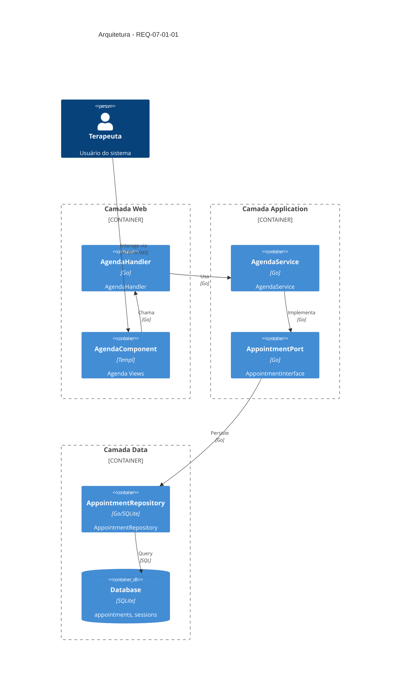
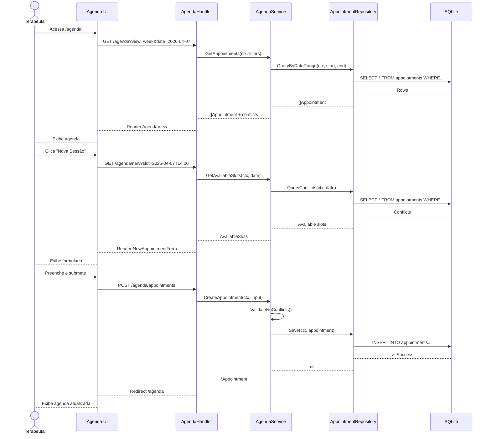
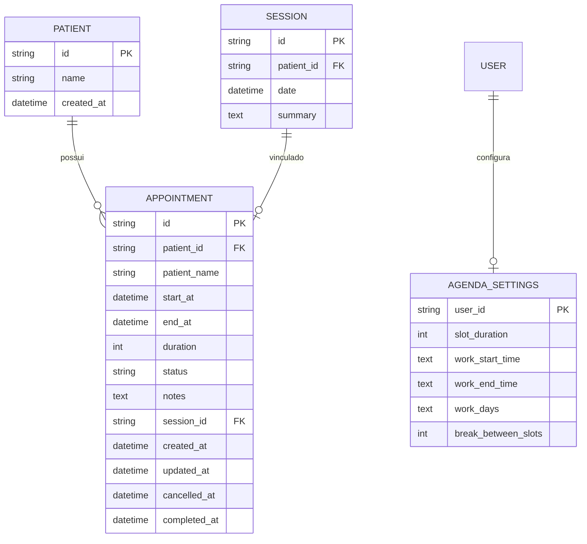

# REQ-07-01-01 — Gerenciar Agenda Clínica

## Identificação

| Campo | Valor |
|-------|-------|
| **ID** | REQ-07-01-01 |
| **Capability** | CAP-07-01 — Gestão de Agenda Clínica |
| **Vision** | VISION-07 — Organização Operacional do Consultório |
| **Status** | 🟡 Parcialmente Implementado |
| **Prioridade** | Alta |
| **Data de Implementação** | 2026-Q1/Q2 |

---

## História do Usuário

Como psicólogo clínico,
quero gerenciar minha agenda de atendimentos de forma centralizada,
para organizar meu tempo, evitar conflitos de horário e manter controle sobre meus compromissos profissionais.

---

## Contexto

A agenda clínica é o componente operacional central do consultório. Diferente de sistemas administrativos genéricos, a agenda do Arandu deve:

- **Integrar-se com sessões clínicas** — Cada compromisso na agenda pode ser vinculado a uma sessão registrada
- **Respeitar o fluxo clínico** — Não é apenas um calendário, é parte do prontuário longitudinal
- **Manter soberania dos dados** — A agenda reside no banco SQLite individual do terapeuta (multi-tenancy)
- **Seguir Tecnologia Silenciosa** — Interface discreta que não compete com o trabalho clínico

**Problema que resolve:**
- Terapeutas frequentemente usam agendas externas (Google Calendar, papel) desconectadas do prontuário
- Dificuldade em visualizar histórico de atendimentos por paciente
- Conflitos de horário não detectados
- Falta de integração entre agendamento e registro clínico

---

## Descrição Funcional

### Comportamento Esperado

O sistema deve prover uma interface de agenda com as seguintes capacidades:

| Funcionalidade | Descrição |
|---------------|-----------|
| **Visualização por Período** | Dia, semana e mês com navegação fluida |
| **Agendamento de Sessões** | Criar compromissos vinculados a pacientes |
| **Detecção de Conflitos** | Alertar sobre horários sobrepostos |
| **Status de Sessão** | Confirmada, realizada, cancelada, não compareceu |
| **Lembretes** | Notificações visuais para sessões próximas |
| **Reagendamento** | Mover sessões com histórico de alterações |
| **Integração com Prontuário** | Clique no compromisso abre a sessão/prontuário |

### Fluxo de Trabalho

```
Terapeuta acessa Agenda
↓
Visualiza período (dia/semana/mês)
↓
Clica em slot vazio ou "Nova Sessão"
↓
Seleciona paciente (autocomplete)
↓
Define data/hora/duração
↓
Sistema verifica conflitos
↓
Confirma agendamento
↓
Compromisso aparece na agenda
↓
No dia da sessão: Marca como "Realizada"
↓
Vincula ao registro clínico da sessão
```

---

## Arquitetura da Implementação

### C4 Container



### Fluxo de Dados



---

## Endpoints/Rotas

| Método | Rota | Descrição | Handler |
|--------|------|-----------|---------|
| GET | `/agenda` | Visualiza agenda (padrão: semana) | `AgendaHandler.View` |
| GET | `/agenda?view={day\|week\|month}&date={YYYY-MM-DD}` | Agenda com filtros | `AgendaHandler.View` |
| GET | `/agenda/new` | Formulário de nova sessão | `AgendaHandler.NewForm` |
| GET | `/agenda/slots?date={YYYY-MM-DD}` | Slots disponíveis | `AgendaHandler.GetSlots` |
| POST | `/agenda/appointments` | Cria novo compromisso | `AgendaHandler.Create` |
| GET | `/agenda/appointments/{id}` | Detalhe do compromisso | `AgendaHandler.Show` |
| PUT | `/agenda/appointments/{id}` | Atualiza compromisso | `AgendaHandler.Update` |
| DELETE | `/agenda/appointments/{id}` | Cancela compromisso | `AgendaHandler.Cancel` |
| POST | `/agenda/appointments/{id}/reschedule` | Reagenda compromisso | `AgendaHandler.Reschedule` |
| POST | `/agenda/appointments/{id}/complete` | Marca como realizada | `AgendaHandler.Complete` |

---

## Componentes UI

| Componente | Arquivo | Descrição |
|-----------|---------|-----------|
| `AgendaView` | `web/components/agenda/agenda_view.templ` | Container principal da agenda |
| `AgendaHeader` | `web/components/agenda/agenda_header.templ` | Navegação de período (dia/semana/mês) |
| `AgendaDayView` | `web/components/agenda/day_view.templ` | Visualização diária com slots horários |
| `AgendaWeekView` | `web/components/agenda/week_view.templ` | Visualização semanal (7 colunas) |
| `AgendaMonthView` | `web/components/agenda/month_view.templ` | Visualização mensal (grid 5x7) |
| `AppointmentCard` | `web/components/agenda/appointment_card.templ` | Card individual de compromisso |
| `NewAppointmentForm` | `web/components/agenda/new_appointment_form.templ` | Formulário de agendamento |
| `AppointmentModal` | `web/components/agenda/appointment_modal.templ` | Modal de detalhe/edição |
| `ConflictWarning` | `web/components/agenda/conflict_warning.templ` | Alerta de conflito de horário |
| `PatientAutocomplete` | `web/components/agenda/patient_autocomplete.templ` | Busca de pacientes |

---

## Modelos de Dados

### Entidades

```go
// internal/domain/appointment/appointment.go
type Appointment struct {
    ID          string          `json:"id"`
    PatientID   string          `json:"patient_id"`
    PatientName string          `json:"patient_name"` // Denormalized for performance
    StartAt     time.Time       `json:"start_at"`
    EndAt       time.Time       `json:"end_at"`
    Duration    int             `json:"duration"` // minutes
    Status      AppointmentStatus `json:"status"`
    Notes       string          `json:"notes"`
    SessionID   *string         `json:"session_id,omitempty"` // Link to clinical session
    CreatedAt   time.Time       `json:"created_at"`
    UpdatedAt   time.Time       `json:"updated_at"`
    CancelledAt *time.Time      `json:"cancelled_at,omitempty"`
    CompletedAt *time.Time      `json:"completed_at,omitempty"`
}

type AppointmentStatus string

const (
    AppointmentStatusScheduled   AppointmentStatus = "scheduled"
    AppointmentStatusConfirmed   AppointmentStatus = "confirmed"
    AppointmentStatusCompleted   AppointmentStatus = "completed"
    AppointmentStatusCancelled   AppointmentStatus = "cancelled"
    AppointmentStatusNoShow      AppointmentStatus = "no_show"
)

type AppointmentFilter struct {
    View      string // day, week, month
    Date      time.Time
    PatientID string // optional filter
    Status    []AppointmentStatus // optional filter
}

type TimeSlot struct {
    Start     time.Time
    End       time.Time
    Available bool
    Conflict  *Appointment // if not available
}
```

### Tabelas do Banco

```sql
-- Tabela de compromissos da agenda
CREATE TABLE IF NOT EXISTS appointments (
    id TEXT PRIMARY KEY,
    patient_id TEXT NOT NULL,
    patient_name TEXT NOT NULL, -- Denormalized for quick display
    start_at DATETIME NOT NULL,
    end_at DATETIME NOT NULL,
    duration INTEGER NOT NULL DEFAULT 50, -- minutes
    status TEXT NOT NULL DEFAULT 'scheduled',
    notes TEXT,
    session_id TEXT, -- Link to sessions table
    created_at DATETIME NOT NULL,
    updated_at DATETIME NOT NULL,
    cancelled_at DATETIME,
    completed_at DATETIME,
    FOREIGN KEY (patient_id) REFERENCES patients(id) ON DELETE CASCADE,
    FOREIGN KEY (session_id) REFERENCES sessions(id) ON DELETE SET NULL
);

-- Índices para performance
CREATE INDEX idx_appointments_start_at ON appointments(start_at);
CREATE INDEX idx_appointments_patient_id ON appointments(patient_id);
CREATE INDEX idx_appointments_status ON appointments(status);
CREATE INDEX idx_appointments_date_range ON appointments(start_at, end_at);

-- Tabela de configurações de agenda do terapeuta
CREATE TABLE IF NOT EXISTS agenda_settings (
    user_id TEXT PRIMARY KEY,
    slot_duration INTEGER DEFAULT 50, -- minutes
    work_start_time TEXT DEFAULT '08:00',
    work_end_time TEXT DEFAULT '18:00',
    work_days TEXT DEFAULT '1,2,3,4,5', -- 0=Sunday, 6=Saturday
    break_between_slots INTEGER DEFAULT 10, -- minutes
    created_at DATETIME NOT NULL,
    updated_at DATETIME NOT NULL
);
```

### Diagrama ER



---

## Arquivos Implementados

| Camada | Arquivo | Descrição |
|--------|---------|-----------|
| **Handler** | `internal/web/handlers/agenda_handler.go` | Handler HTTP com métodos View, NewForm, Create, Update, Cancel, Complete, Reschedule |
| **Service** | `internal/application/services/agenda_service.go` | Serviço com lógica de negócio, validação de conflitos, geração de slots |
| **Repository** | `internal/infrastructure/repository/sqlite/appointment_repository.go` | Repositório com queries de agenda |
| **Domain** | `internal/domain/appointment/appointment.go` | Entidade de domínio Appointment |
| **Domain** | `internal/domain/appointment/settings.go` | Entidade AgendaSettings |
| **UI** | `web/components/agenda/agenda_view.templ` | Componente principal da agenda |
| **UI** | `web/components/agenda/agenda_header.templ` | Header com navegação de período |
| **UI** | `web/components/agenda/day_view.templ` | View diária |
| **UI** | `web/components/agenda/week_view.templ` | View semanal |
| **UI** | `web/components/agenda/month_view.templ` | View mensal |
| **UI** | `web/components/agenda/appointment_card.templ` | Card de compromisso |
| **UI** | `web/components/agenda/new_appointment_form.templ` | Formulário de agendamento |
| **UI** | `web/components/agenda/appointment_modal.templ` | Modal de detalhe |
| **UI** | `web/components/agenda/conflict_warning.templ` | Alerta de conflito |
| **Migration** | `internal/infrastructure/repository/sqlite/migrations/0013_add_appointments.up.sql` | Criação das tabelas |
| **Migration** | `internal/infrastructure/repository/sqlite/migrations/0013_add_appointments.down.sql` | Rollback |
| **Routes** | `cmd/arandu/main.go` | Registro das rotas |

---

## Critérios de Aceitação

### CA-01: Visualização por Período
- [ ] Agenda exibe visualização diária com slots horários
- [ ] Agenda exibe visualização semanal com 7 colunas
- [ ] Agenda exibe visualização mensal com grid 5x7
- [ ] Navegação entre períodos funciona via HTMX (sem reload)
- [ ] Data atual é destacada visualmente

### CA-02: Agendamento de Sessões
- [ ] Formulário de nova sessão acessível via botão "Nova Sessão"
- [ ] Autocomplete de pacientes funciona com busca parcial
- [ ] Seleção de data/hora valida formato
- [ ] Duração padrão de 50 minutos (configurável)
- [ ] Compromisso criado aparece imediatamente na agenda

### CA-03: Detecção de Conflitos
- [ ] Sistema alerta sobre horário sobreposto antes de confirmar
- [ ] Conflito visualizado na UI (card vermelho/aviso)
- [ ] Não permite criar compromisso com conflito (validação server-side)
- [ ] Sugere slots alternativos próximos

### CA-04: Status de Sessão
- [ ] Status "Confirmada" visível na agenda
- [ ] Status "Realizada" marca compromisso como concluído
- [ ] Status "Cancelada" mostra visual diferente (riscado/cinza)
- [ ] Status "Não Compareceu" registrado separadamente
- [ ] Mudança de status via HTMX inline

### CA-05: Integração com Prontuário
- [ ] Clique no compromisso abre detalhe da sessão
- [ ] Sessão criada a partir da agenda vincula automaticamente
- [ ] Histórico de agendamentos visível no perfil do paciente
- [ ] Link bidirecional agenda ↔ sessão

### CA-06: Reagendamento
- [ ] Arrastar-e-soltar para reagendar (opcional, fase 2)
- [ ] Formulário de reagendamento com nova data/hora
- [ ] Histórico de alterações registrado
- [ ] Paciente notificado sobre mudança (fase 2)

### CA-07: Responsividade
- [ ] Agenda funcional em mobile (1 coluna)
- [ ] Agenda funcional em tablet (2-3 colunas)
- [ ] Agenda funcional em desktop (7 colunas semana)
- [ ] Touch targets adequados (mínimo 44px)

### CA-08: Performance
- [ ] Carregamento de semana < 500ms
- [ ] Carregamento de mês < 1000ms
- [ ] Busca de pacientes < 200ms
- [ ] Validação de conflitos < 100ms

---

## Regras de Negócio

| Regra | Descrição |
|-------|-----------|
| **RN-01** | Um paciente não pode ter dois compromissos no mesmo horário |
| **RN-02** | Compromissos devem respeitar horário de trabalho configurado |
| **RN-03** | Duração mínima de sessão: 30 minutos |
| **RN-04** | Duração máxima de sessão: 120 minutos |
| **RN-05** | Cancelamento com menos de 24h de antecedência registra "late_cancel" |
| **RN-06** | Compromisso só pode ser marcado como "Realizada" após data/hora do compromisso |
| **RN-07** | Reagendamento preserva histórico de alterações |
| **RN-08** | Agenda é isolada por tenant (multi-tenancy) |

---

## Integrações

### Habilitado Por
- [x] REQ-01-00-01 — Criar Paciente (pacientes devem existir para agendar)
- [x] REQ-07-03-01 — Autenticação de Usuário (agenda é por terapeuta)
- [x] REQ-07-03-02 — Orquestração de Conexão DB (isolamento multi-tenant)

### Habilita
- [ ] REQ-07-02-01 — Registrar Atendimento (fluxo completo de sessão)
- [ ] REQ-01-01-01 — Criar Sessão (agendamento → sessão clínica)
- [ ] VISION-07 — Organização Operacional do Consultório
- [ ] CAP-07-02 — Gestão de Atendimentos

### Relacionados
- REQ-01-01-03 — Listar Sessões (sessões podem vir da agenda)
- REQ-02-01-01 — Visualizar Histórico (agenda é parte do histórico)

---

## Fora do Escopo

Este requisito **NÃO** inclui:

- [ ] Integração com Google Calendar / Outlook (fase 2)
- [ ] Notificações por email/SMS para pacientes (fase 2)
- [ ] Agenda compartilhada com secretária (fase 3)
- [ ] Recorrência automática de sessões (fase 2)
- [ ] Bloqueio de férias/feriados (fase 2)
- [ ] Relatórios de ocupação da agenda (fase 2)
- [ ] Integração com pagamento/faturamento (fora do escopo Arandu)
- [ ] App mobile nativo (fora do escopo)

---

## Notas de Implementação

### Decisões Técnicas

1. **Denormalização do Nome do Paciente**
   - `patient_name` armazenado em `appointments` para performance
   - Atualizado via trigger quando paciente muda de nome
   - Evita JOIN em queries frequentes de agenda

2. **Slots de Tempo Fixos**
   - Padrão: 50 minutos de sessão + 10 minutos de intervalo
   - Configurável via `agenda_settings`
   - Validação server-side de sobreposição

3. **HTMX para Interações**
   - Navegação de período: `hx-get` com swap do container da agenda
   - Novo compromisso: modal com `hx-post`
   - Mudança de status: inline com `hx-put`

4. **Multi-Tenancy**
   - Agenda reside no SQLite individual do terapeuta
   - Nenhum dado de agenda é compartilhado entre tenants
   - Middleware injeta tenant_db no context

### Anti-Padrões Evitados

| Anti-Padrão | Como Evitado |
|-------------|--------------|
| JavaScript pesado para calendário | HTMX + CSS Grid para renderização |
| Polling constante para updates | HTMX triggers sob demanda |
| Hardcoded de horários | Configuração em `agenda_settings` |
| Timezone ignorado | Todos timestamps em UTC, conversão no frontend |
| Conflitos validados apenas no client | Validação server-side obrigatória |

---

## Histórico de Alterações

| Data | Autor | Alteração |
|------|-------|-----------|
| 2026-04-04 | Arandu Team | Criação do documento |
| - | - | - |

---

## Checklist de Implementação

- [x] Handler criado com todos os métodos (`internal/web/handlers/agenda_handler.go`)
- [x] Service implementado com validações (`internal/application/services/agenda_service.go`)
- [x] Repository com queries otimizadas (`internal/infrastructure/repository/sqlite/appointment_repository.go`)
- [x] Domain entity (`internal/domain/appointment/appointment.go`)
- [x] Migrações criadas e testadas (`0013_add_appointments.up.sql`)
- [x] Rotas registradas no `cmd/arandu/main.go`
- [x] Componente agenda_layout.templ (container principal)
- [x] Componente appointment_detail.templ (detalhe/modal)
- [x] Componente new_appointment_form.templ (formulário)
- [ ] View diária com slots horários
- [ ] View semanal (7 colunas)
- [ ] View mensal (grid 5x7)
- [ ] Card individual de compromisso
- [ ] Alerta de conflito de horário
- [ ] Testes unitários (service, repository)
- [ ] Testes de integração (handler)
- [ ] Testes E2E (agenda flow)

---

**Template Version:** 1.0  
**Last Updated:** 2026-04-04  
**Status:** 🟡 Draft (Pronto para Implementação)