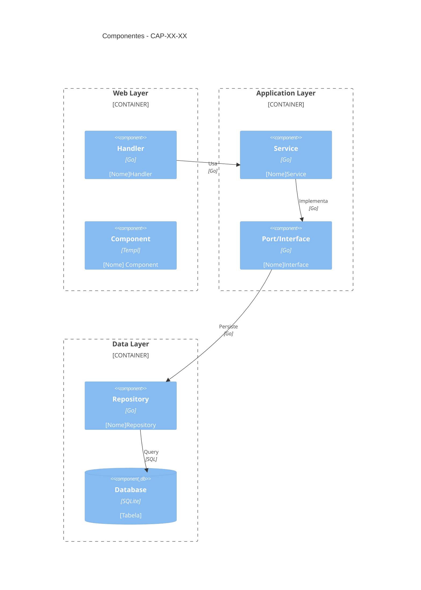

# CAP-XX-XX — [Nome da Capability]

## Identificação

| Campo | Valor |
|-------|-------|
| **ID** | CAP-XX-XX |
| **Vision** | VISION-XX — [Nome da Vision] |
| **Status** | 🟡 Draft / 🟠 Partial / ✅ Implemented |
| **Área** | [Área do sistema] |

---

## Descrição

[Descrição completa da capability - o que ela permite fazer no sistema]

### Propósito

[Por que existe esta capability? Qual problema resolve?]

### Escopo

[O que está incluído nesta capability]

---

## Funcionalidades

| Funcionalidade | Descrição | Status |
|----------------|-----------|--------|
| [Nome] | [Descrição] | ✅ Implementado / 🟡 Parcial / ❌ Pendente |
| [Nome] | [Descrição] | ✅ Implementado |

---

## Requirements Relacionados

| ID | Nome | Status | Descrição |
|----|------|--------|-----------|
| REQ-XX-XX-XX | [Nome] | ✅ | [Descrição breve] |

---

## Arquitetura

### Componentes

```
internal/
├── web/
│   └── handlers/
│       └── [nome]_handler.go
├── application/
│   └── services/
│       └── [nome]_service.go
└── infrastructure/
    └── repository/
        └── sqlite/
            └── [nome]_repository.go

web/components/
└── [pasta]/
    ├── [componente].templ
    └── ...
```

### Diagrama de Componentes



---

## Interfaces

### Service Interface

```go
type [Nome]Service interface {
    [Método](ctx context.Context, ...) (...)
    // ...
}
```

### Repository Interface

```go
type [Nome]Repository interface {
    [Método](ctx context.Context, ...) (...)
    // ...
}
```

---

## Dependências

### Requer
- [CAP-XX-XX] — [Nome da capability]
- [Biblioteca/Package] — [Descrição]

### Habilita
- [CAP-XX-XX] — [Nome da capability]

---

## Métricas

| Métrica | Valor |
|---------|-------|
| Requirements implementados | X/Y |
| Percentual de conclusão | XX% |
| Componentes criados | X |
| Linhas de código | ~X |

---

## Status de Implementação

### ✅ Concluído
- [Item concluído]

### 🟠 Em Andamento
- [Item em andamento]

### ❌ Pendente
- [Item pendente]

---

## Evolução Planejada

### Fase 1: [Nome] (Concluída)
- [x] [Item concluído]

### Fase 2: [Nome] (Atual)
- [ ] [Item pendente]

### Fase 3: [Nome] (Futuro)
- [ ] [Item futuro]

---

## Notas

### Decisões de Design
- [Nota sobre decisão arquitetural]

### Restrições
- [Restrição técnica ou de negócio]

---

## Referências

- [Link para documentação relacionada]
- [Link para ADR]

---

## Histórico

| Data | Autor | Alteração |
|------|-------|-----------|
| YYYY-MM-DD | Nome | Criação |

---

**Template Version:** 1.0  
**Last Updated:** 2026-04-04
