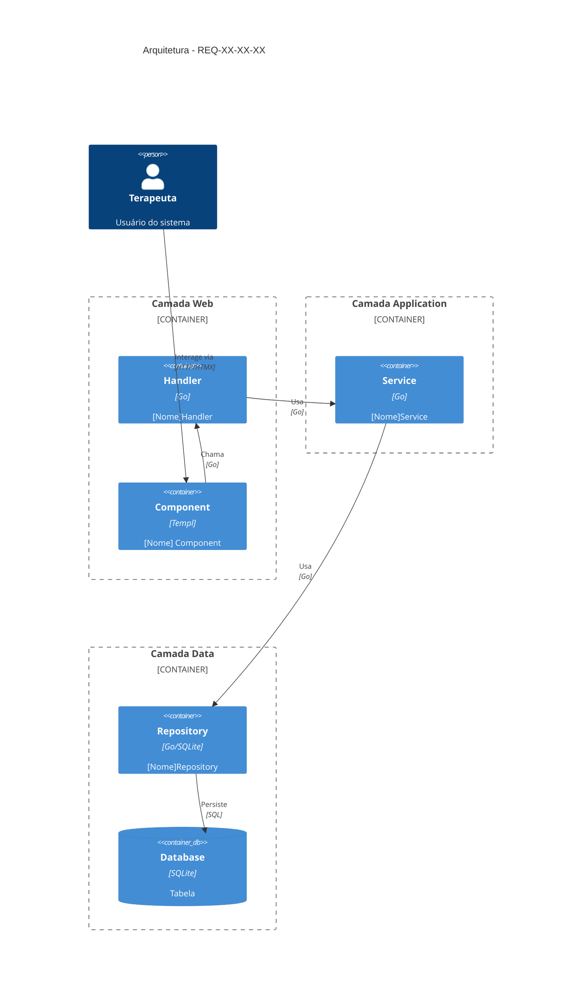
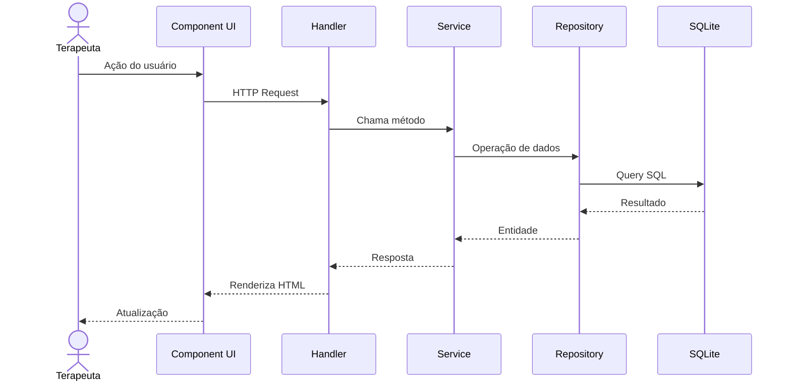

# REQ-XX-XX-XX — [Título do Requisito]

## Identificação

| Campo | Valor |
|-------|-------|
| **ID** | REQ-XX-XX-XX |
| **Capability** | CAP-XX-XX — [Nome da Capability] |
| **Vision** | VISION-XX — [Nome da Vision] |
| **Status** | 🟡 Draft / 🟠 Partial / ✅ Implemented |
| **Prioridade** | Alta / Média / Baixa |

---

## História do Usuário

Como **[tipo de usuário]**,  
quero **[ação desejada]**,  
para **[benefício/objetivo]**.

---

## Descrição Funcional

### Contexto

[Descrever o contexto e importância deste requisito]

### Comportamento Esperado

[Descrever o que o sistema deve fazer]

---

## Arquitetura da Implementação



---

## Fluxo de Dados



---

## Endpoints/Routes

| Método | Rota | Descrição | Handler |
|--------|------|-----------|---------|
| GET | `/[rota]` | Descrição | `HandlerName` |
| POST | `/[rota]` | Descrição | `HandlerName` |

---

## Componentes UI

| Componente | Arquivo | Descrição |
|--------------|---------|------------|
| [Nome] | `web/components/[pasta]/[arquivo].templ` | Descrição |

---

## Modelos de Dados

### Entidades

```go
type [Entidade] struct {
    ID        string    `json:"id"`
    // ... campos
    CreatedAt time.Time `json:"created_at"`
    UpdatedAt time.Time `json:"updated_at"`
}
```

### Tabelas do Banco

```sql
CREATE TABLE IF NOT EXISTS [tabela] (
    id TEXT PRIMARY KEY,
    -- ... campos
    created_at DATETIME NOT NULL,
    updated_at DATETIME
);
```

---

## Arquivos Implementados

### Handler
- `internal/web/handlers/[nome]_handler.go`

### Service
- `internal/application/services/[nome]_service.go`

### Repository
- `internal/infrastructure/repository/sqlite/[nome]_repository.go`

### Componentes UI
- `web/components/[pasta]/[arquivo].templ`

---

## Critérios de Aceitação

### CA-01: [Descrição do critério]

**Dado que** [contexto]  
**Quando** [ação]  
**Então** [resultado esperado]

- [ ] Implementado
- [ ] Testado
- [ ] Documentado

### CA-02: [Descrição do critério]

- [ ] Implementado
- [ ] Testado
- [ ] Documentado

---

## Regras de Negócio

1. [Regra 1]
2. [Regra 2]
3. [Regra 3]

---

## Integrações

### Habilitado por
- [REQ-XX-XX-XX] — [Nome do requirement]

### Habilita
- [REQ-XX-XX-XX] — [Nome do requirement]

---

## Fora do Escopo

Este requisito **não inclui**:
- [Item fora de escopo]

---

## Notas de Implementação

### Decisões Técnicas
- [Nota técnica 1]
- [Nota técnica 2]

### Anti-Padrões Evitados
- [Anti-padrão evitado]

---

## Histórico de Alterações

| Data | Autor | Alteração |
|------|-------|-----------|
| YYYY-MM-DD | Nome | Criação do documento |
| YYYY-MM-DD | Nome | [Descrição da alteração] |

---

## Checklist de Implementação

- [ ] Handler criado
- [ ] Service implementado
- [ ] Repository implementado
- [ ] Componentes UI criados
- [ ] Migrações criadas
- [ ] Rotas registradas
- [ ] Testes escritos
- [ ] Documentação atualizada
- [ ] Revisão de código
- [ ] Deploy em staging

---

**Template Version:** 1.0  
**Last Updated:** 2026-04-04
