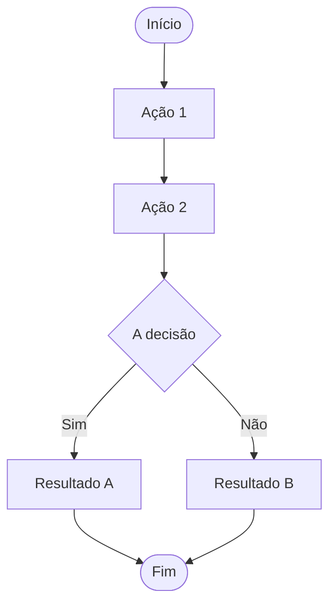
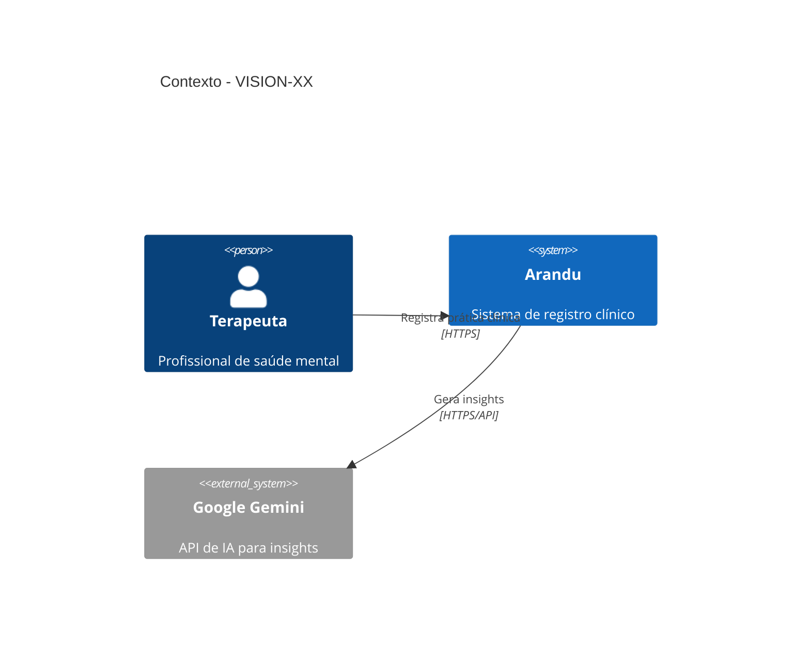

# VISION-XX — [Nome da Vision]

## Identificação

| Campo | Valor |
|-------|-------|
| **ID** | VISION-XX |
| **Nome** | [Nome da Vision] |
| **Status** | 🟡 Draft / 🟠 Active / ✅ Implemented |
| **Prioridade** | Alta / Média / Baixa |

---

## Propósito

[Descrição do propósito desta vision - por que ela existe e qual valor entrega]

### Declaração de Visão

> [Citação ou frase que capture a essência desta vision]

---

## Problema

### Situação Atual

[Descrever como as coisas são hoje, antes da implementação]

### Dores Identificadas

```text
- [Dor 1]
- [Dor 2]
- [Dor 3]
```

### Consequências

[Quais são as consequências de não resolver este problema]

---

## Visão de Solução

### Conceito

[Como o sistema deve resolver o problema]

### Características Desejadas

```text
- [Característica 1]
- [Característica 2]
- [Característica 3]
```

---

## Elementos Fundamentais

### Entidades Principais

```
[Entidade Raiz]
├── [Entidade Filha 1]
│   ├── [Sub-entidade]
│   └── [Sub-entidade]
└── [Entidade Filha 2]
```

### Fluxo de Trabalho



---

## Valor para o Usuário

### Benefícios Diretos

- [Benefício 1]
- [Benefício 2]
- [Benefício 3]

### Benefícios Indiretos

- [Benefício 1]
- [Benefício 2]

### Métricas de Sucesso

| Métrica | Alvo | Atual |
|---------|------|-------|
| [Métrica 1] | [Alvo] | [Valor] |

---

## Capabilities Derivadas

```mermaid
graph TD
    V[VISION-XX<br/>[Nome]] --> C1[CAP-XX-XX<br/>[Nome]]
    V --> C2[CAP-XX-XX<br/>[Nome]]
    V --> C3[CAP-XX-XX<br/>[Nome]]
    
    C1 --> R1[REQ-XX-XX-XX]
    C2 --> R2[REQ-XX-XX-XX]
    C3 --> R3[REQ-XX-XX-XX]
```

| ID | Nome | Status | Descrição |
|----|------|--------|-----------|
| CAP-XX-XX | [Nome] | ✅ | [Descrição breve] |

---

## Relação com Outras Visions

### Visions que Habilitam Esta
- [VISION-XX] — [Nome] — [Descrição da relação]

### Visions Habilitadas por Esta
- [VISION-XX] — [Nome] — [Descrição da relação]

### Visions Relacionadas
- [VISION-XX] — [Nome]

---

## Fora do Escopo

Esta vision **não inclui**:

```text
- [Item fora de escopo 1]
- [Item fora de escopo 2]
```

Essas funcionalidades pertencem a outras visions.

---

## Status de Implementação

### Progresso Geral


### Capabilities Implementadas

| Capability | Status | Progresso |
|------------|--------|-----------|
| CAP-XX-XX | ✅ | 100% |
| CAP-XX-XX | 🟠 | XX% |
| CAP-XX-XX | ❌ | 0% |

---

## Roadmap

### Concluído (Fase X)
- [x] [Item concluído]

### Em Execução (Fase X)
- [ ] [Item em andamento]

### Planejado (Fase X)
- [ ] [Item planejado]

### Futuro
- [ ] [Item futuro]

---

## Resultado Esperado

Quando esta vision estiver completamente implementada:

```text
- [Resultado 1]
- [Resultado 2]
- [Resultado 3]
```

---

## Arquitetura de Referência



---

## Notas Estratégicas

### Considerações Importantes
- [Nota estratégica]

### Riscos
- [Risco identificado]

### Oportunidades
- [Oportunidade]

---

## Referências

- [Link para documentação externa]
- [Link para pesquisa ou benchmark]

---

## Histórico

| Data | Autor | Alteração |
|------|-------|-----------|
| YYYY-MM-DD | Nome | Criação da vision |
| YYYY-MM-DD | Nome | [Alteração] |

---

**Template Version:** 1.0  
**Last Updated:** 2026-04-04
