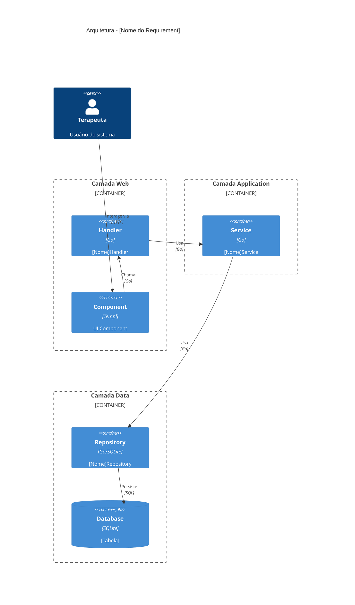
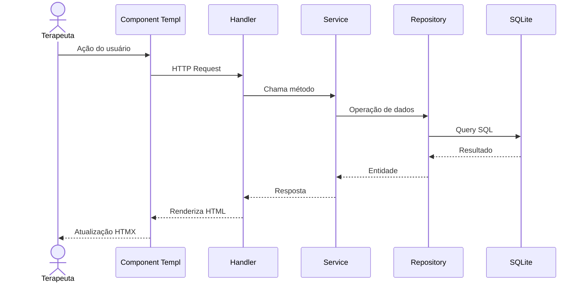
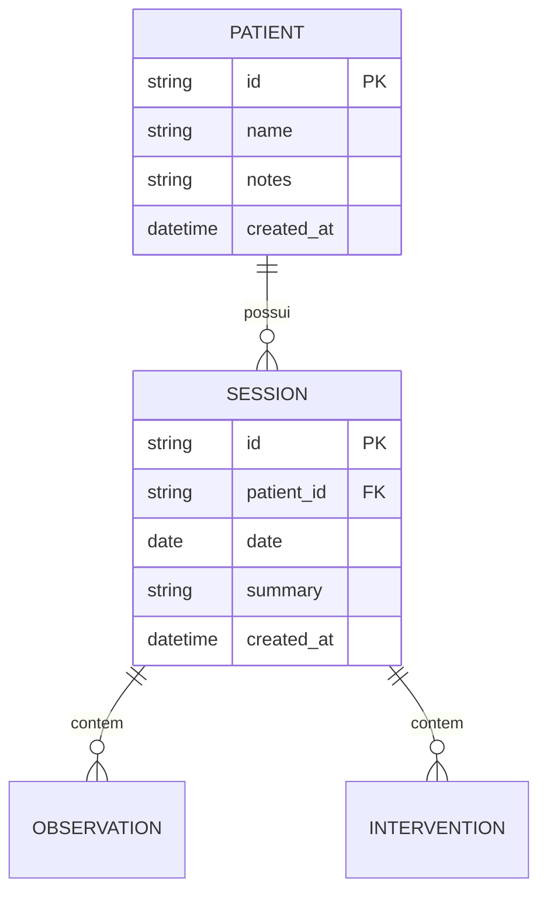

# Plano de Ação: Atualização da Documentação do Arandu

## 📊 Resumo Executivo

**Data:** 04/04/2026  
**Total Requirements:** 32  
**Implementados:** 22 (69%)  
**Pendentes:** 10 (31%)  

---

## 🎯 Objetivos

1. **Auditar** toda documentação existente vs código implementado
2. **Atualizar** status de visions, capabilities e requirements
3. **Criar** diagramas Mermaid para requisitos implementados
4. **Estabelecer** padrão de documentação consistente

---

## 📋 Inventário Atual

### Status Geral

| Tipo | Total | Implementados | Draft | Status |
|------|-------|---------------|-------|--------|
| **Visions** | 10 | 3 completas | 7 | 🟡 Em progresso |
| **Capabilities** | 23 | 15 implementadas | 8 | 🟡 Em progresso |
| **Requirements** | 32 | 22 implementados | 10 | 🟡 Em progresso |

### Categorias Implementadas (100%)

| Categoria | Requirements | Status |
|-----------|--------------|--------|
| Core Clínico (REQ-01) | 7/7 | ✅ Completo |
| Histórico (REQ-02) | 2/2 | ✅ Completo |
| Multi-tenancy (REQ-07-03) | 3/3 | ✅ Completo |
| Recuperação (REQ-07-04) | 2/2 | ✅ Completo |

### Categorias Parciais

| Categoria | Implementados | Total | Status |
|-----------|---------------|-------|--------|
| Classificação | 1/2 | 50% | 🟡 REQ-03-02-01 pendente |
| Análise/IA | 2/3 | 67% | 🟡 REQ-06-01-01 pendente |
| Operacional | 4/6 | 67% | 🟡 Agenda pendente |
| Infraestrutura | 2/4 | 50% | 🟡 Auditoria parcial |

### Não Implementadas (0%)

| Categoria | Status |
|-----------|--------|
| IA Avançada (REQ-09) | 🔴 Não iniciado |
| Pesquisa (REQ-10) | 🔴 Não iniciado |

---

## 🗓️ Plano de Execução

### Fase 1: Estrutura e Templates (1-2 horas)

#### 1.1 Criar Template Padrão para Requirements
**Arquivo:** `docs/templates/requirement_template.md`

Seções obrigatórias:
- Header com metadata (ID, Capability, Vision, Status)
- Descrição funcional
- Diagrama de arquitetura (Mermaid)
- Fluxo de dados
- Endpoints/Rotas
- Componentes UI
- Tabelas de banco
- Critérios de aceitação com checklist
- Matriz de rastreabilidade

#### 1.2 Criar Template Padrão para Capabilities
**Arquivo:** `docs/templates/capability_template.md`

Seções obrigatórias:
- Header com metadata
- Descrição
- Funcionalidades (tabela)
- Requirements relacionados
- Arquitetura
- Dependências
- Status de implementação

#### 1.3 Criar Template Padrão para Visions
**Arquivo:** `docs/templates/vision_template.md`

Seções obrigatórias:
- Header com metadata
- Propósito
- Problema
- Visão de solução
- Valor para usuário
- Capabilities derivadas
- Status de implementação

### Fase 2: Atualizar Requirements Implementados (6-8 horas)

Prioridade: Core → Histórico → Classificação → Análise

| Prioridade | Requirement | Status Atual | Ação |
|------------|-------------|--------------|------|
| 1 | REQ-01-00-01 | draft | ⬆️ Atualizar + Mermaid |
| 1 | REQ-01-00-02 | draft | ⬆️ Atualizar + Mermaid |
| 1 | REQ-01-00-03 | draft | ⬆️ Atualizar + Mermaid |
| 1 | REQ-01-01-01 | draft | ⬆️ Atualizar + Mermaid |
| 1 | REQ-01-01-02 | draft | ⬆️ Atualizar + Mermaid |
| 1 | REQ-01-01-03 | draft | ⬆️ Atualizar + Mermaid |
| 1 | REQ-01-02-01 | draft | ⬆️ Atualizar + Mermaid |
| 1 | REQ-01-02-02 | draft | ⬆️ Atualizar + Mermaid |
| 1 | REQ-01-03-01 | draft | ⬆️ Atualizar + Mermaid |
| 1 | REQ-01-04-01 | draft | ⬆️ Atualizar + Mermaid |
| 1 | REQ-01-05-01 | draft | ⬆️ Atualizar + Mermaid |
| 1 | REQ-01-06-01 | draft | ⬆️ Atualizar + Mermaid |
| 2 | REQ-02-01-01 | draft | ⬆️ Atualizar + Mermaid |
| 2 | REQ-02-02-01 | draft | ⬆️ Atualizar + Mermaid |
| 3 | REQ-03-01-01 | implemented | ✅ Já atualizado |
| 4 | REQ-04-01-01 | draft | ⬆️ Atualizar + Mermaid |
| 5 | REQ-05-01-01 | draft | ⬆️ Atualizar + Mermaid |
| 6 | REQ-07-03-01 | draft | ⬆️ Atualizar + Mermaid |
| 6 | REQ-07-03-02 | draft | ⬆️ Atualizar + Mermaid |
| 6 | REQ-07-03-03 | draft | ⬆️ Atualizar + Mermaid |
| 6 | REQ-07-04-01 | draft | ⬆️ Atualizar + Mermaid |
| 6 | REQ-07-04-02 | draft | ⬆️ Atualizar + Mermaid |

### Fase 3: Atualizar Capabilities (2-3 horas)

| Capability | Status | Ação |
|------------|--------|------|
| CAP-01-00 | draft | ⬆️ Atualizar |
| CAP-01-01 | draft | ⬆️ Atualizar |
| CAP-01-02 | draft | ⬆️ Atualizar |
| CAP-01-03 | draft | ⬆️ Atualizar |
| CAP-01-04 | draft | ⬆️ Atualizar |
| CAP-01-05 | draft | ⬆️ Atualizar |
| CAP-01-06 | draft | ⬆️ Atualizar |
| CAP-02-01 | draft | ⬆️ Atualizar |
| CAP-02-02 | draft | ⬆️ Atualizar |
| CAP-03-01 | implemented | ✅ Já atualizado |
| CAP-04-01 | draft | ⬆️ Atualizar |
| CAP-05-01 | draft | ⬆️ Atualizar |
| CAP-07-03 | draft | ⬆️ Atualizar |
| CAP-07-04 | draft | ⬆️ Atualizar |
| CAP-08-02 | draft | ⬆️ Atualizar |

### Fase 4: Atualizar Visions (2-3 horas)

| Vision | Status | Ação |
|--------|--------|------|
| VISION-01 | ativo | ⬆️ Atualizar progresso |
| VISION-02 | draft | ⬆️ Atualizar |
| VISION-03 | draft | ⬆️ Atualizar |
| VISION-04 | draft | ⬆️ Atualizar |
| VISION-05 | draft | ⬆️ Atualizar |
| VISION-07 | draft | ⬆️ Atualizar |
| VISION-08 | draft | ⬆️ Atualizar |

### Fase 5: Documentar Pendentes (2 horas)

Para requirements em draft, criar documentação de especificação:

| Requirement | Notas |
|-------------|-------|
| REQ-03-02-01 | Classificação de intervenções (similar a observações) |
| REQ-06-01-01 | Comparação entre casos (tela de análise cruzada) |
| REQ-07-01-01 | Agenda clínica (calendário de atendimentos) |
| REQ-07-02-01 | Registrar atendimento (check-in/check-out) |
| REQ-08-01-01 | Evolução da base (migrações/schema versioning) |
| REQ-08-03-01 | Auditoria completa (logs de acesso) |
| REQ-09-01-01 | Análise IA avançada (insights automáticos) |
| REQ-10-01-01 | Base anonimizada (export para pesquisa) |

### Fase 6: Criar Índice e Roadmap (1 hora)

Criar documentos:
1. `docs/IMPLEMENTATION_INDEX.md` - Índice de implementação
2. `docs/ROADMAP.md` - Roadmap de desenvolvimento
3. `docs/ARCHITECTURE_OVERVIEW.md` - Visão geral da arquitetura

---

## 📝 Padrões de Diagramas Mermaid

### 1. Arquitetura de Componentes (C4 - Container)



### 2. Fluxo de Dados



### 3. Modelo de Dados



---

## ✅ Checklist de Qualidade

Para cada documento atualizado:

- [ ] Metadata atualizado (ID, Status, Datas)
- [ ] Descrição clara e completa
- [ ] Diagrama Mermaid incluído
- [ ] Rotas/endpoints documentados
- [ ] Componentes UI listados
- [ ] Tabelas de BD especificadas
- [ ] Critérios de aceitação com checkboxes
- [ ] Links para docs relacionados
- [ ] Seção de implementação com arquivos

---

## 📁 Estrutura de Arquivos Final

```
docs/
├── templates/
│   ├── requirement_template.md
│   ├── capability_template.md
│   └── vision_template.md
├── vision/
│   ├── vision-01-registro-pratica-clinica.md ✅
│   ├── vision-02-memoria-clinica-longitudinal.md ⬆️
│   └── ... (7 more)
├── capabilities/
│   ├── cap-01-00-gestao-pacientes.md ⬆️
│   ├── cap-01-01-registro-sessoes.md ⬆️
│   └── ... (21 more)
├── requirements/
│   ├── req-01-00-01-criar-paciente.md ⬆️
│   ├── req-01-00-02-editar-paciente.md ⬆️
│   └── ... (29 more)
├── IMPLEMENTATION_INDEX.md (novo)
├── ROADMAP.md (novo)
└── ARCHITECTURE_OVERVIEW.md (novo)
```

---

## 📊 Métricas de Sucesso

- [ ] 100% dos requirements implementados documentados com Mermaid
- [ ] 100% das capabilities atualizadas
- [ ] 100% das visions ativas atualizadas
- [ ] Templates padronizados criados
- [ ] Índice de implementação criado
- [ ] Roadmap de desenvolvimento definido

---

## ⏱️ Estimativa de Tempo Total

| Fase | Tempo Estimado |
|------|----------------|
| Fase 1: Templates | 2 horas |
| Fase 2: Requirements | 8 horas |
| Fase 3: Capabilities | 3 horas |
| Fase 4: Visions | 3 horas |
| Fase 5: Pendentes | 2 horas |
| Fase 6: Índice | 1 hora |
| **TOTAL** | **~19 horas** |

---

## 🎯 Próximos Passos Imediatos

1. ✅ **COMPLETO:** Matriz de rastreabilidade
2. 🔄 **EM ANDAMENTO:** Criar templates
3. ⏳ **PENDENTE:** Atualizar requirements core
4. ⏳ **PENDENTE:** Atualizar capabilities
5. ⏳ **PENDENTE:** Atualizar visions

---

*Documento criado em: 04/04/2026*  
*Responsável: Agent Arandu*  
*Status: Em execução*
